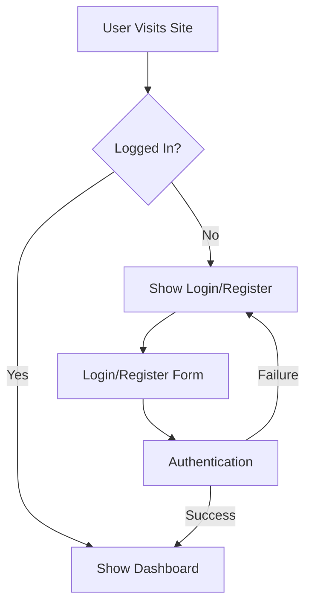
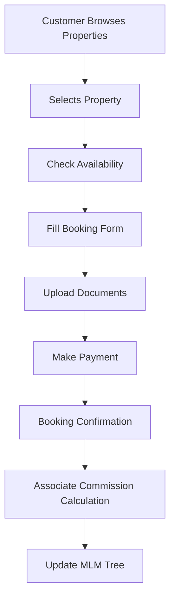
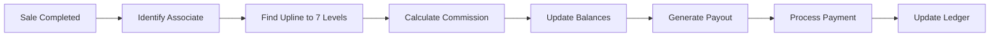
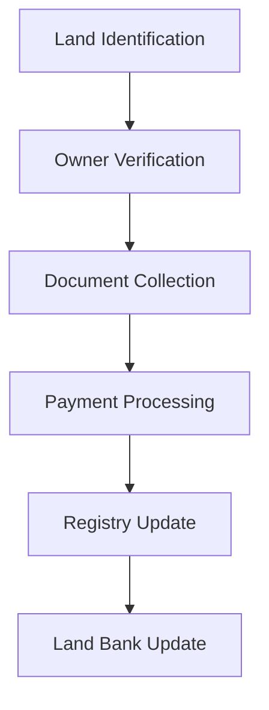
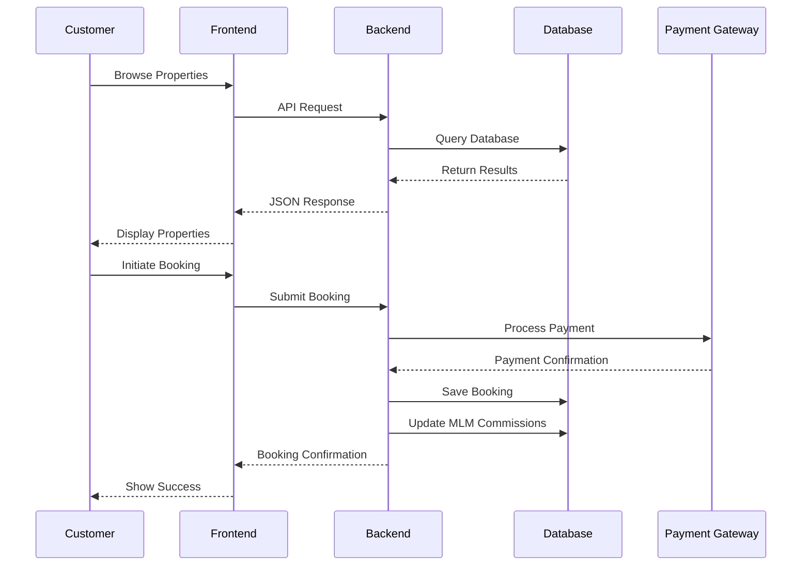
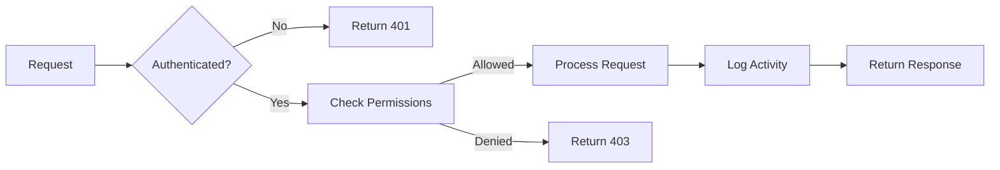
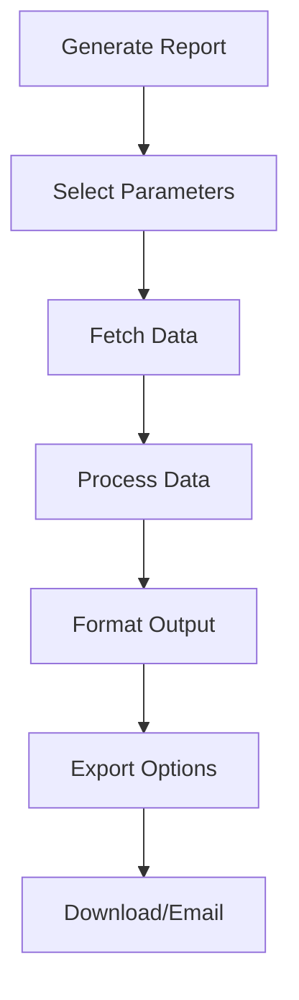
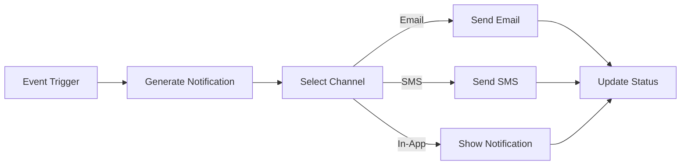
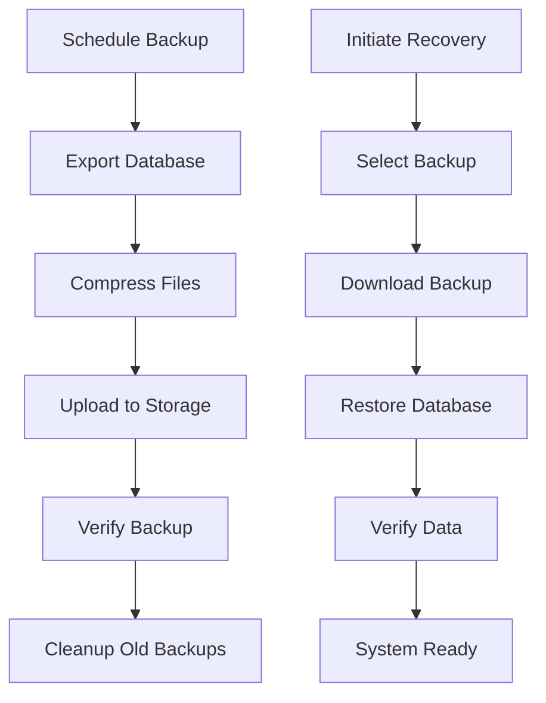

# APS Dream Home - System Flow

## 1. User Authentication Flow


## 2. Property Booking Flow


## 3. MLM Commission Flow


## 4. Land Acquisition Flow


## 5. System Architecture
```
+-------------------+     +---------------------+     +-------------------+
|                   |     |                     |     |                   |
|    Frontend       |<--->|    API Layer        |<--->|    Database        |
|  (HTML/CSS/JS)    |     |  (PHP/Laravel)     |     |   (MySQL)         |
+-------------------+     +---------------------+     +-------------------+
         ^                         ^                               ^
         |                         |                               |
         v                         v                               v
+----------------+      +---------------------+           +-------------------+
|                |      |                     |           |                   |
|  Customers     |      |  Admin/Agents      |           |  External APIs    |
|  (Web/Mobile)  |      |  (Web Dashboard)   |           |  (Payment, SMS)   |
+----------------+      +---------------------+           +-------------------+
```

## 6. Data Flow


## 7. Security Flow


## 8. Reporting Flow


## 9. Notification Flow


## 10. Backup & Recovery Flow


---
*Last Updated: 18th May 2025*
