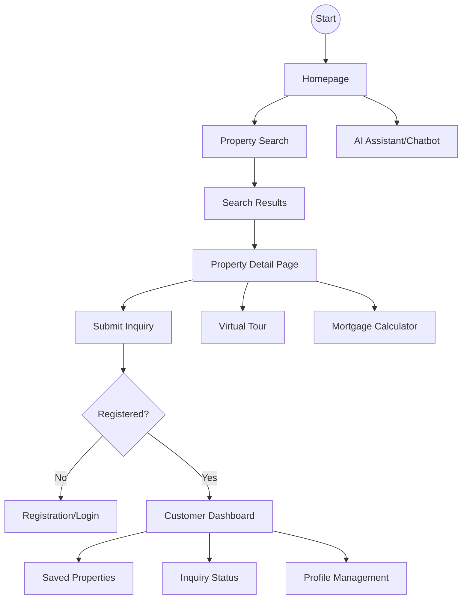
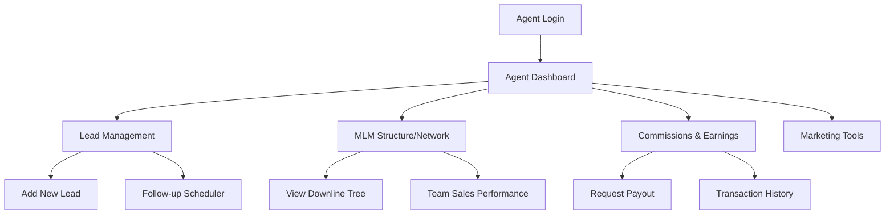
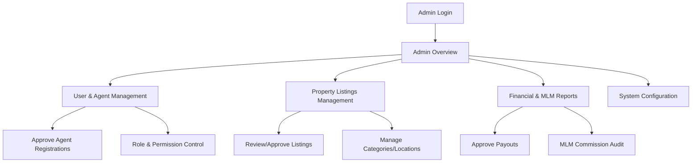

# APS Dream Home - User Flow Diagrams & Journey Mapping

This document outlines the primary user journeys and interaction patterns for the APS Dream Home platform, ensuring a seamless experience across all roles.

## 1. Customer Journey Flow

The customer journey focuses on property discovery, inquiry, and management.

## 2. Agent (Associate) Journey Flow

The agent flow focuses on lead management, commission tracking, and business growth.

## 3. Admin Journey Flow

The admin journey focuses on system-wide management, property moderation, and financial oversight.

## 4. Interaction Patterns & State Transitions

### Navigation Hierarchy
- **Top Bar**: User profile, notifications, search.
- **Side Bar**: Module-specific navigation (Dashboard, MLM, Properties).
- **Breadcrumbs**: Context-aware path tracking.

### State Transitions
- **Loading**: Pulse animation on cards, skeleton screens for dashboards.
- **Empty States**: Helpful illustrations and "Add New" calls-to-action.
- **Success/Error**: Toast notifications with color-coded feedback (Success: Green, Error: Red).
- **Modals**: Smooth fade-in/slide-down transitions for forms and detail views.

## 5. Data Flow Mapping
1. **Property Submission**: Agent/Admin -> Validation -> Database -> CDN (Images) -> Live Site.
2. **Inquiry Flow**: Customer -> Lead Management System -> Agent Notification -> CRM Log.
3. **MLM Calculation**: Transaction -> Business Volume Update -> Commission Trigger -> Wallet Update.
