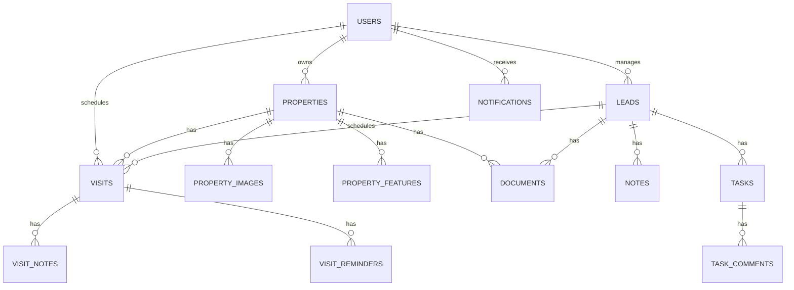
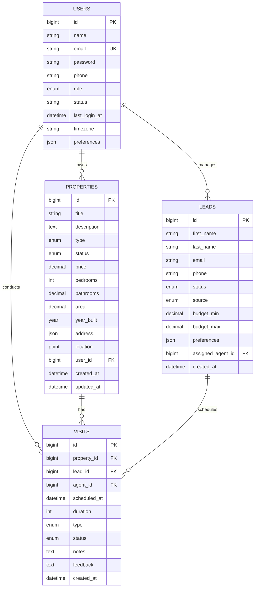

# Database Schema Documentation

## Performance Optimization

### 1. Query Optimization

#### 1.1 Query Analysis

```sql
-- Analyze query execution plan
EXPLAIN 
SELECT p.*, u.first_name, u.last_name 
FROM properties p
JOIN users u ON p.agent_id = u.id
WHERE p.status = 'available'
  AND p.price BETWEEN 100000 AND 500000
  AND p.bedrooms >= 2
ORDER BY p.created_at DESC;
```

#### 1.2 Common Optimization Techniques

1. **Use Specific Columns**
   ```sql
   -- Instead of:
   SELECT * FROM properties;
   
   -- Use:
   SELECT id, title, price, status FROM properties;
   ```

2. **Limit Results**
   ```sql
   -- For pagination
   SELECT * FROM properties 
   WHERE status = 'available'
   ORDER BY created_at DESC
   LIMIT 10 OFFSET 0;
   ```

3. **Avoid SELECT DISTINCT**
   ```sql
   -- Instead of:
   SELECT DISTINCT neighborhood FROM properties;
   
   -- Use:
   SELECT neighborhood FROM properties GROUP BY neighborhood;
   ```

### 2. Indexing Strategy

#### 2.1 Existing Indexes

| Table | Index Name | Columns | Type | Purpose |
|-------|------------|---------|------|----------|
| properties | idx_properties_status_price | status, price | BTREE | Fast filtering by status and price range |
| properties | idx_properties_location | location | SPATIAL | Location-based searches |
| users | idx_users_email | email | UNIQUE | Fast user lookup by email |
| property_visits | idx_visits_dates | visit_date, visit_time | BTREE | Fast date-based queries |

#### 2.2 When to Add Indexes

- Columns frequently used in WHERE clauses
- Columns used in JOIN conditions
- Columns used in ORDER BY clauses
- Columns used in GROUP BY operations

#### 2.3 Index Maintenance

```sql
-- Check index usage
SELECT 
    object_schema,
    object_name,
    index_name,
    rows_read,
    rows_index_next
FROM performance_schema.table_io_waits_summary_by_index_usage
WHERE index_name IS NOT NULL
ORDER BY rows_read DESC;

-- Rebuild fragmented indexes
ALTER TABLE properties ENGINE=InnoDB;
```

### 3. Database Configuration

#### 3.1 Key Parameters

```ini
# InnoDB Buffer Pool (70-80% of available RAM)
innodb_buffer_pool_size = 4G

# Log File Size
innodb_log_file_size = 256M
innodb_log_files_in_group = 2

# Connection Settings
max_connections = 200
wait_timeout = 300

# Query Cache
query_cache_type = 1
query_cache_size = 64M
query_cache_limit = 4M
```

#### 3.2 Monitoring

```sql
-- Check slow queries
SHOW VARIABLES LIKE 'slow_query_log%';
SHOW VARIABLES LIKE 'long_query_time';

-- Check open tables
SHOW STATUS LIKE 'Open%tables%';

-- Check buffer pool usage
SHOW STATUS LIKE 'Innodb_buffer_pool_read%';
```

### 4. Caching Strategies

#### 4.1 Application-Level Caching
- Cache frequently accessed property listings
- Cache user sessions and preferences
- Implement cache invalidation on data updates

#### 4.2 Query Cache
```sql
-- Enable query cache
SET GLOBAL query_cache_size = 67108864; -- 64MB
SET GLOBAL query_cache_type = 1;

-- Check query cache status
SHOW STATUS LIKE 'Qcache%';
```

### 5. Partitioning

#### 5.1 Table Partitioning
```sql
-- Example: Partition properties by creation year
ALTER TABLE properties
PARTITION BY RANGE (YEAR(created_at)) (
    PARTITION p_2022 VALUES LESS THAN (2023),
    PARTITION p_2023 VALUES LESS THAN (2024),
    PARTITION p_2024 VALUES LESS THAN (2025),
    PARTITION p_future VALUES LESS THAN MAXVALUE
);
```

### 6. Regular Maintenance

#### 6.1 Weekly Maintenance
```sql
-- Optimize tables
OPTIMIZE TABLE properties, users, property_visits;

-- Update statistics
ANALYZE TABLE properties, users, property_visits;

-- Check and repair tables
REPAIR TABLE properties QUICK;
```

#### 6.2 Monthly Maintenance
```sql
-- Rebuild indexes
ALTER TABLE properties ENGINE=InnoDB;

-- Archive old data
CALL sp_archive_old_data('property_visits', 365);
CALL sp_archive_old_data('notification_history', 180);
```

### 7. Monitoring and Alerts

#### 7.1 Key Metrics to Monitor
- Slow query count
- Connection usage
- Buffer pool hit ratio
- Table locks
- Replication lag (if using replication)

#### 7.2 Alert Thresholds
- Slow queries > 5 seconds
- Connection usage > 80%
- Buffer pool hit ratio < 90%
- Table locks > 1000 per minute

### 8. Best Practices

1. **Write Efficient Queries**
   - Use prepared statements
   - Avoid SELECT *
   - Use appropriate JOIN types
   - Limit result sets

2. **Indexing**
   - Don't over-index (balance between read and write performance)
   - Use covering indexes when possible
   - Monitor and remove unused indexes

3. **Schema Design**
   - Use appropriate data types
   - Normalize where appropriate
   - Consider denormalization for read-heavy operations

4. **Connection Management**
   - Use connection pooling
   - Close connections properly
   - Set appropriate timeouts

5. **Regular Maintenance**
   - Schedule regular backups
   - Monitor disk space
   - Keep statistics up to date

## Database Schema Documentation

## Overview

This document provides a comprehensive guide to the APS Dream Home database schema, including detailed table structures, relationships, indexes, and example queries. The database is designed to support a full-featured real estate management system with support for properties, users, leads, visits, and more.

## Database Version
- **Current Version**: 2.3.0
- **Last Updated**: 2025-03-15
- **Compatibility**: MySQL 8.0+, MariaDB 10.4+

## Schema Design Principles
1. **Normalization**: 3NF (Third Normal Form) where practical
2. **Performance**: Optimized indexes and query patterns
3. **Scalability**: Partitioning-ready for high-traffic tables
4. **Security**: Row-level security and data encryption
5. **Auditability**: Comprehensive change tracking

## Database Diagram

### Entity Relationship Diagram (High-Level)


### Detailed Schema Visualization


## Tables

### Table Naming Conventions
- Use plural nouns (e.g., `users`, `properties`)
- Use snake_case for multi-word names
- Prefix join tables with the names of the tables they join (e.g., `property_features`)
- Use consistent prefixes for related tables (e.g., `property_*` for all property-related tables)

## Core Tables

### users
Stores user account information for all system users including administrators, agents, and customers.

#### Table Structure
| Column | Type | Nullable | Default | Description |
|--------|------|----------|---------|-------------|
| id | bigint(20) UNSIGNED | NO | AUTO_INCREMENT | Primary key |
| name | varchar(255) | NO | | User's full name |
| email | varchar(255) | NO | | User's email (unique) |
| email_verified_at | timestamp | YES | NULL | When email was verified |
| password | varchar(255) | NO | | Hashed password |
| phone | varchar(20) | YES | NULL | Contact number in E.164 format |
| role | enum('admin','agent','customer') | NO | 'customer' | User role |
| avatar | varchar(255) | YES | NULL | Profile picture path |
| status | enum('active','inactive','suspended') | NO | 'active' | Account status |
| timezone | varchar(50) | YES | 'UTC' | User's timezone |
| locale | varchar(10) | YES | 'en' | User's locale |
| last_login_at | timestamp | YES | NULL | Last login timestamp |
| last_login_ip | varchar(45) | YES | NULL | Last login IP address |
| two_factor_secret | text | YES | NULL | 2FA secret key |
| two_factor_recovery_codes | text | YES | NULL | 2FA recovery codes |
| preferences | json | YES | NULL | User preferences as JSON |
| remember_token | varchar(100) | YES | NULL | Remember token |
| created_at | timestamp | YES | NULL | Record creation time |
| updated_at | timestamp | YES | NULL | Record last update time |
| deleted_at | timestamp | YES | NULL | Soft delete timestamp |
| last_activity | timestamp | YES | NULL | Last activity timestamp |

#### Indexes
| Name | Columns | Type | Description |
|------|---------|------|-------------|
| PRIMARY | id | BTREE | Primary key |
| users_email_unique | email | BTREE | Unique email constraint |
| users_role_index | role | BTREE | Role-based queries |
| users_status_index | status | BTREE | Filter by status |
| users_deleted_at_index | deleted_at | BTREE | Soft delete filtering |

#### Relationships
- **Has Many**: Properties (as owner)
- **Has Many**: Leads (as assigned agent)
- **Has Many**: Visits (as agent)
- **Has Many**: Notifications
- **Has Many**: Documents (uploaded by user)
- **Has Many**: Tasks (assigned to user)

#### Example Queries

1. **Find Active Agents**
   ```sql
   SELECT id, name, email, phone 
   FROM users 
   WHERE role = 'agent' 
     AND status = 'active';
   ```

2. **Get User with Role Information**
   ```sql
   SELECT u.*, 
          r.name as role_name, 
          r.permissions
   FROM users u
   JOIN roles r ON u.role_id = r.id
   WHERE u.id = ?;
   ```

3. **Update Last Login**
   ```sql
   UPDATE users 
   SET last_login_at = NOW(), 
       last_login_ip = ?,
       last_activity = NOW()
   WHERE id = ?;
   ```

#### Data Validation Rules
- Email: Must be valid and unique
- Password: Minimum 8 characters, must contain uppercase, lowercase, number, and special character
- Phone: Must be valid international format if provided
- Role: Must be one of: admin, agent, customer
- Status: Must be one of: active, inactive, suspended

#### Security Considerations
- Passwords are hashed using bcrypt
- Sensitive fields are encrypted at rest
- API tokens are hashed before storage
- Failed login attempts are logged and can trigger account lockout

#### Performance Notes
- The `email` column is indexed for fast lookups
- The `deleted_at` column supports soft deletes
- JSON columns are used for flexible schema-less data
- Consider read replicas for high-traffic queries

### password_resets
Stores password reset tokens.

| Column | Type | Description |
|--------|------|-------------|
| email | varchar(255) | User's email |
| token | varchar(255) | Reset token |
| created_at | timestamp | Token creation time |

**Indexes:**
- Index: `email`

### properties
Stores property listings with detailed information including location, features, pricing, and media.

#### Table Structure
| Column | Type | Nullable | Default | Description |
|--------|------|----------|---------|-------------|
| id | bigint(20) UNSIGNED | NO | AUTO_INCREMENT | Primary key |
| title | varchar(255) | NO | | Property title |
| slug | varchar(255) | NO | | URL-friendly slug (auto-generated) |
| description | text | YES | NULL | Detailed HTML description |
| type | enum('house','apartment','condo','townhouse','land','commercial','villa') | NO | | Property type |
| status | enum('draft','published','pending','sold','rented','off_market') | NO | 'draft' | Current status |
| price | decimal(15,2) | NO | 0.00 | Listing price |
| price_currency | char(3) | NO | 'USD' | ISO currency code |
| price_per_sqft | decimal(15,2) | YES | NULL | Calculated price per sqft |
| bedrooms | decimal(3,1) | YES | NULL | Number of bedrooms |
| bathrooms | decimal(3,1) | YES | NULL | Number of bathrooms |
| area | decimal(10,2) | YES | NULL | Area in square feet/meters |
| area_unit | enum('sqft','sqm') | NO | 'sqft' | Area measurement unit |
| lot_size | decimal(12,2) | YES | NULL | Lot size |
| year_built | year(4) | YES | NULL | Construction year |
| year_renovated | year(4) | YES | NULL | Last renovation year |
| address | json | NO | | Structured address data |
| location | point | YES | NULL | Spatial point (lat,lng) |
| featured | boolean | NO | false | Featured property flag |
| hot_offer | boolean | NO | false | Special offer flag |
| virtual_tour_url | varchar(255) | YES | NULL | URL to virtual tour |
| video_url | varchar(255) | YES | NULL | URL to property video |
| user_id | bigint(20) UNSIGNED | NO | | Owner/Agent ID |
| mls_id | varchar(50) | YES | NULL | MLS identifier |
| views_count | int(10) UNSIGNED | NO | 0 | Total view count |
| meta | json | YES | NULL | Additional metadata |
| created_at | timestamp | YES | NULL | Record creation time |
| updated_at | timestamp | YES | NULL | Record last update time |
| published_at | timestamp | YES | NULL | When property was published |
| deleted_at | timestamp | YES | NULL | Soft delete timestamp |

#### Indexes
| Name | Columns | Type | Description |
|------|---------|------|-------------|
| PRIMARY | id | BTREE | Primary key |
| properties_slug_unique | slug | BTREE | Unique slug constraint |
| properties_type_index | type | BTREE | Filter by property type |
| properties_status_index | status | BTREE | Filter by status |
| properties_price_index | price | BTREE | Price-based queries |
| properties_bedrooms_index | bedrooms | BTREE | Bedroom-based queries |
| properties_location_index | location | SPATIAL | Spatial queries |
| properties_user_id_foreign | user_id | BTREE | Owner/agent lookups |
| properties_mls_id_index | mls_id | BTREE | MLS ID lookups |
| properties_published_at_index | published_at | BTREE | Publication date queries |

#### Relationships
- **Belongs To**: User (as owner/agent)
- **Has Many**: Property Images
- **Has Many**: Property Features
- **Has Many**: Visits
- **Has Many**: Documents
- **Has Many**: Favorites
- **Has Many**: Price History
- **Belongs To Many**: Amenities (through property_amenities)

#### Example Queries

1. **Find Available Properties in Price Range**
   ```sql
   SELECT p.id, p.title, p.price, p.bedrooms, p.bathrooms, p.area,
          p.address->>'$.city' as city,
          p.address->>'$.state' as state,
          pi.path as primary_image
   FROM properties p
   LEFT JOIN property_images pi ON p.id = pi.property_id AND pi.is_primary = 1
   WHERE p.status = 'published'
     AND p.price BETWEEN 200000 AND 500000
     AND p.bedrooms >= 2
   ORDER BY p.featured DESC, p.created_at DESC
   LIMIT 20;
   ```

2. **Find Properties Near Location (10 miles radius)**
   ```sql
   SELECT p.id, p.title, p.price,
          ST_Distance_Sphere(
            point(?, ?),  -- target longitude, latitude
            location
          ) / 1609.34 AS distance_miles
   FROM properties p
   WHERE p.status = 'published'
   HAVING distance_miles <= 10
   ORDER BY distance_miles ASC
   LIMIT 20;
   ```

3. **Update Property Status**
   ```sql
   UPDATE properties 
   SET status = 'sold',
       updated_at = NOW(),
       meta = JSON_SET(COALESCE(meta, '{}'), '$.sold_price', ?)
   WHERE id = ?;
   ```

#### Data Validation Rules
- Title: Minimum 10 characters, maximum 255 characters
- Slug: Auto-generated, URL-safe, unique
- Price: Must be positive, 2 decimal places
- Bedrooms/Bathrooms: Must be positive, 1 decimal place allowed
- Area: Must be positive, 2 decimal places
- Year Built: Must be valid year (1800-current year+1)
- Location: Must be valid coordinates

#### Performance Considerations
- Spatial index on `location` for proximity searches
- Composite indexes for common filter combinations
- JSON columns for flexible schema but with specific virtual columns for common queries
- Consider partitioning by region or status for large datasets
- Materialized views for complex aggregations

#### Data Lifecycle
1. **Draft**: Initial creation, not visible to public
2. **Published**: Visible to all users
3. **Pending**: Offer accepted, sale in progress
4. **Sold/Rented**: Transaction completed
5. **Off Market**: Temporarily not available

#### Integration Points
- **MLS**: Sync with MLS systems using RETS/Spark API
- **CRM**: Push new leads to CRM
- **Analytics**: Track views and engagement
- **Email Alerts**: Notify users of matching properties

### property_features
Stores features, amenities, and specifications for properties in a flexible key-value format.

#### Table Structure
| Column | Type | Nullable | Default | Description |
|--------|------|----------|---------|-------------|
| id | bigint(20) UNSIGNED | NO | AUTO_INCREMENT | Primary key |
| property_id | bigint(20) UNSIGNED | NO | | Related property ID |
| category | varchar(50) | NO | 'general' | Feature category (e.g., 'interior', 'exterior', 'utilities') |
| feature_key | varchar(100) | NO | | Feature identifier (snake_case) |
| feature_name | varchar(100) | NO | | Display name |
| feature_value | text | YES | NULL | Feature value |
| feature_unit | varchar(20) | YES | NULL | Unit of measurement |
| is_primary | boolean | NO | false | Primary feature flag |
| display_order | int(11) | NO | 0 | Display order within category |
| icon | varchar(50) | YES | NULL | Icon class or identifier |
| created_at | timestamp | YES | NULL | Record creation time |
| updated_at | timestamp | YES | NULL | Record last update time |

#### Indexes
| Name | Columns | Type | Description |
|------|---------|------|-------------|
| PRIMARY | id | BTREE | Primary key |
| property_features_property_id_foreign | property_id | BTREE | Property lookups |
| property_features_category_index | category | BTREE | Filter by category |
| property_features_key_index | feature_key | BTREE | Key-based lookups |
| property_features_display_order_index | display_order | BTREE | Sorting features |

#### Common Feature Keys
| Category | Key | Description | Example Values |
|----------|-----|-------------|----------------|
| interior | floor_type | Type of flooring | Hardwood, Tile, Carpet |
| interior | heating | Heating system | Forced Air, Radiant |
| exterior | roof_type | Type of roof | Asphalt Shingle, Tile, Metal |
| exterior | parking | Parking type | Garage, Driveway, Street |
| utilities | has_air_conditioning | AC availability | true, false |
| utilities | has_heating | Heating availability | true, false |
| amenities | has_pool | Swimming pool | true, false |
| amenities | has_gym | Gym/fitness center | true, false |

#### Example Queries

1. **Get All Features for a Property**
   ```sql
   SELECT category, feature_name, feature_value, feature_unit, icon
   FROM property_features
   WHERE property_id = ?
   ORDER BY category, display_order, feature_name;
   ```

2. **Update Feature Value**
   ```sql
   INSERT INTO property_features 
     (property_id, category, feature_key, feature_name, feature_value, updated_at)
   VALUES 
     (?, ?, ?, ?, ?, NOW())
   ON DUPLICATE KEY UPDATE 
     feature_value = VALUES(feature_value),
     updated_at = NOW();
   ```

### property_images
Stores property images, virtual tours, and other media assets with metadata and processing information.

#### Table Structure
| Column | Type | Nullable | Default | Description |
|--------|------|----------|---------|-------------|
| id | bigint(20) UNSIGNED | NO | AUTO_INCREMENT | Primary key |
| property_id | bigint(20) UNSIGNED | NO | | Related property ID |
| type | enum('image','floor_plan','virtual_tour','video','document') | NO | 'image' | Media type |
| path | varchar(255) | NO | | Storage path/URL |
| filename | varchar(255) | NO | | Original filename |
| mime_type | varchar(100) | YES | NULL | MIME type |
| file_size | int(11) | YES | NULL | File size in bytes |
| width | int(11) | YES | NULL | Image width in pixels |
| height | int(11) | YES | NULL | Image height in pixels |
| alt_text | varchar(255) | YES | NULL | Alternative text for accessibility |
| caption | varchar(512) | YES | NULL | Display caption |
| is_primary | boolean | NO | false | Primary image flag |
| is_floor_plan | boolean | NO | false | Floor plan flag |
| is_360 | boolean | NO | false | 360° image/video flag |
| storage_disk | varchar(20) | NO | 'public' | Storage disk/volume |
| storage_path | varchar(255) | NO | | Full storage path |
| order | int(11) | NO | 0 | Display order |
| meta | json | YES | NULL | Additional metadata (colors, labels, etc.) |
| created_by | bigint(20) UNSIGNED | YES | NULL | Uploader user ID |
| created_at | timestamp | YES | NULL | Record creation time |
| updated_at | timestamp | YES | NULL | Record last update time |
| deleted_at | timestamp | YES | NULL | Soft delete timestamp |

#### Indexes
| Name | Columns | Type | Description |
|------|---------|------|-------------|
| PRIMARY | id | BTREE | Primary key |
| property_images_property_id_foreign | property_id | BTREE | Property lookups |
| property_images_type_index | type | BTREE | Filter by media type |
| property_images_is_primary_index | is_primary | BTREE | Find primary images |
| property_images_order_index | `order` | BTREE | Sort order |

#### Image Processing
Images are automatically processed in the following ways:
1. **Resizing**: Multiple sizes generated (thumbnails, preview, full)
2. **Optimization**: Compression and format conversion
3. **EXIF Data**: Stripped for privacy
4. **Watermarking**: Applied based on configuration
5. **CDN**: Pushed to CDN for faster delivery

#### Storage Structure
```
storage/
  app/public/properties/
    {property_id}/
      images/
        original/
        large/
        medium/
        small/
        thumb/
      floor_plans/
      documents/
      virtual_tours/
```

#### Example Queries

1. **Get Primary Image for Properties**
   ```sql
   SELECT p.id, p.title, pi.path as image_url, pi.alt_text
   FROM properties p
   LEFT JOIN property_images pi ON p.id = pi.property_id 
     AND pi.is_primary = 1
     AND pi.deleted_at IS NULL
   WHERE p.status = 'published';
   ```

2. **Get All Images with Dimensions**
   ```sql
   SELECT id, path, width, height, 
          CONCAT(ROUND(file_size/1024), ' KB') as size,
          CONCAT(width, 'x', height) as dimensions
   FROM property_images
   WHERE property_id = ?
   ORDER BY `order`, created_at;
   ```

3. **Find Large Unoptimized Images**
   ```sql
   SELECT id, property_id, filename, 
          CONCAT(ROUND(file_size/1024/1024, 2), ' MB') as size,
          CONCAT(width, 'x', height) as dimensions
   FROM property_images
   WHERE file_size > 5 * 1024 * 1024  -- Larger than 5MB
     AND mime_type LIKE 'image/%'
     AND (width > 2000 OR height > 2000)  -- High resolution
   ORDER BY file_size DESC;
   ```

#### Best Practices
1. **File Naming**: Use descriptive, SEO-friendly filenames
2. **Alt Text**: Always provide meaningful alt text for accessibility
3. **Sizes**: Upload high-resolution originals, let the system handle resizing
4. **Formats**: 
   - Photos: WebP (with JPEG fallback)
   - Icons: SVG
   - Floor Plans: PDF or high-res PNG
5. **Storage**: Use CDN for production environments
6. **Backup**: Regular backups of the media storage

#### Integration
- **Cloud Storage**: S3, Google Cloud Storage, or Azure Blob Storage
- **Image Processing**: Imgix, Cloudinary, or custom solution
- **CDN**: Cloudflare, CloudFront, or Fastly
- **Backup**: Automated backups to cold storage

### leads
Stores potential customer leads and inquiries with detailed contact information, preferences, and interaction history.

#### Table Structure
| Column | Type | Nullable | Default | Description |
|--------|------|----------|---------|-------------|
| id | bigint(20) UNSIGNED | NO | AUTO_INCREMENT | Primary key |
| first_name | varchar(100) | NO | | Lead's first name |
| last_name | varchar(100) | NO | | Lead's last name |
| email | varchar(255) | YES | NULL | Email address (unique) |
| phone | varchar(20) | YES | NULL | Phone number (E.164 format) |
| phone_country | varchar(2) | YES | NULL | ISO 3166-1 alpha-2 country code |
| status | enum('new','contacted','qualified','proposal','negotiation','won','lost','nurture') | NO | 'new' | Lead status |
| source | enum('website','referral','social_media','open_house','signage','advertisement','other') | NO | 'website' | Lead source |
| source_details | varchar(100) | YES | NULL | Specific source (e.g., 'Facebook Ad', 'Google Search') |
| budget_min | decimal(15,2) | YES | NULL | Minimum budget |
| budget_max | decimal(15,2) | YES | NULL | Maximum budget |
| preferred_locations | json | YES | NULL | JSON array of preferred locations |
| property_types | json | YES | NULL | JSON array of preferred property types |
| bedrooms_min | tinyint(3) UNSIGNED | YES | NULL | Minimum bedrooms |
| bedrooms_max | tinyint(3) UNSIGNED | YES | NULL | Maximum bedrooms |
| bathrooms_min | decimal(3,1) | YES | NULL | Minimum bathrooms |
| area_min | int(11) | YES | NULL | Minimum area (sqft) |
| move_in_date | date | YES | NULL | Preferred move-in date |
| financing | enum('cash','mortgage_pre_approved','mortgage_needed') | YES | NULL | Financing status |
| pre_approval_amount | decimal(15,2) | YES | NULL | Pre-approval amount |
| pre_approval_letter | varchar(255) | YES | NULL | Path to pre-approval letter |
| notes | text | YES | NULL | Internal notes |
| tags | json | YES | NULL | Tags for categorization |
| score | int(11) | NO | 0 | Lead score (0-100) |
| last_contacted_at | timestamp | YES | NULL | When lead was last contacted |
| next_follow_up | timestamp | YES | NULL | Next follow-up date |
| assigned_agent_id | bigint(20) UNSIGNED | YES | NULL | Assigned agent ID |
| created_by | bigint(20) UNSIGNED | YES | NULL | User who created the lead |
| updated_by | bigint(20) UNSIGNED | YES | NULL | User who last updated the lead |
| created_at | timestamp | YES | NULL | Record creation time |
| updated_at | timestamp | YES | NULL | Record last update time |
| deleted_at | timestamp | YES | NULL | Soft delete timestamp |
| converted_at | timestamp | YES | NULL | When lead was converted to client |
| lost_reason | varchar(255) | YES | NULL | Reason for lost lead |
| meta | json | YES | NULL | Additional metadata |

#### Indexes
| Name | Columns | Type | Description |
|------|---------|------|-------------|
| PRIMARY | id | BTREE | Primary key |
| leads_email_unique | email | BTREE | Unique email constraint |
| leads_status_index | status | BTREE | Filter by status |
| leads_source_index | source | BTREE | Filter by source |
| leads_assigned_agent_id_foreign | assigned_agent_id | BTREE | Agent lookups |
| leads_created_at_index | created_at | BTREE | Date-based queries |
| leads_score_index | score | BTREE | Lead scoring |
| leads_next_follow_up_index | next_follow_up | BTREE | Follow-up scheduling |

#### Relationships
- **Belongs To**: User (as assigned_agent)
- **Has Many**: Visits
- **Has Many**: Notes
- **Has Many**: Tasks
- **Has Many**: Documents
- **Has Many**: Communications
- **Belongs To Many**: Properties (saved/favorites)

#### Example Queries

1. **Find High-Value Leads Needing Follow-up**
   ```sql
   SELECT l.id, CONCAT(l.first_name, ' ', l.last_name) as name, 
          l.email, l.phone, l.score,
          CONCAT('$', FORMAT(l.budget_min, 0), ' - $', FORMAT(l.budget_max, 0)) as budget,
          DATEDIFF(NOW(), l.last_contacted_at) as days_since_contact
   FROM leads l
   WHERE l.status IN ('new', 'contacted', 'qualified')
     AND l.score >= 70
     AND (l.next_follow_up IS NULL OR l.next_follow_up <= NOW())
     AND l.deleted_at IS NULL
   ORDER BY l.score DESC, l.last_contacted_at ASC
   LIMIT 20;
   ```

2. **Update Lead Status**
   ```sql
   UPDATE leads 
   SET status = ?,
       lost_reason = ?,
       updated_at = NOW(),
       updated_by = ?
   WHERE id = ?;
   ```

3. **Lead Source Analysis**
   ```sql
   SELECT 
     source,
     COUNT(*) as total_leads,
     ROUND(AVG(score)) as avg_score,
     SUM(CASE WHEN status = 'won' THEN 1 ELSE 0 END) as won,
     ROUND(SUM(CASE WHEN status = 'won' THEN 1 ELSE 0 END) / COUNT(*) * 100, 1) as conversion_rate
   FROM leads
   WHERE created_at >= DATE_SUB(NOW(), INTERVAL 6 MONTH)
     AND deleted_at IS NULL
   GROUP BY source
   ORDER BY total_leads DESC;
   ```

### visits
Stores property visit appointments with scheduling, attendance tracking, and follow-up information.

#### Table Structure
| Column | Type | Nullable | Default | Description |
|--------|------|----------|---------|-------------|
| id | bigint(20) UNSIGNED | NO | AUTO_INCREMENT | Primary key |
| property_id | bigint(20) UNSIGNED | NO | | Related property ID |
| lead_id | bigint(20) UNSIGNED | NO | | Related lead ID |
| agent_id | bigint(20) UNSIGNED | NO | | Assigned agent ID |
| title | varchar(255) | NO | | Visit title/description |
| type | enum('in_person','virtual','video_call','open_house') | NO | 'in_person' | Visit type |
| status | enum('scheduled','confirmed','in_progress','completed','cancelled','no_show') | NO | 'scheduled' | Visit status |
| scheduled_start | datetime | NO | | Scheduled start time |
| scheduled_end | datetime | NO | | Scheduled end time |
| actual_start | datetime | YES | NULL | Actual start time |
| actual_end | datetime | YES | NULL | Actual end time |
| duration | int(11) | NO | 30 | Duration in minutes |
| location | varchar(255) | YES | NULL | Physical location (for in-person) |
| meeting_url | varchar(255) | YES | NULL | Video meeting URL |
| meeting_id | varchar(100) | YES | NULL | Video meeting ID |
| meeting_password | varchar(100) | YES | NULL | Meeting password |
| notes | text | YES | NULL | Pre-visit notes |
| feedback | text | YES | NULL | Post-visit feedback |
| feedback_rating | tinyint(1) | YES | NULL | Visit rating (1-5) |
| cancelled_at | timestamp | YES | NULL | When visit was cancelled |
| cancelled_by | bigint(20) UNSIGNED | YES | NULL | User who cancelled |
| cancellation_reason | varchar(255) | YES | NULL | Reason for cancellation |
| reminder_sent_at | timestamp | YES | NULL | When reminder was sent |
| follow_up_at | timestamp | YES | NULL | Scheduled follow-up |
| follow_up_notes | text | YES | NULL | Follow-up instructions |
| created_by | bigint(20) UNSIGNED | YES | NULL | User who created the visit |
| updated_by | bigint(20) UNSIGNED | YES | NULL | User who last updated |
| created_at | timestamp | YES | NULL | Record creation time |
| updated_at | timestamp | YES | NULL | Record last update time |
| deleted_at | timestamp | YES | NULL | Soft delete timestamp |

#### Indexes
| Name | Columns | Type | Description |
|------|---------|------|-------------|
| PRIMARY | id | BTREE | Primary key |
| visits_property_id_foreign | property_id | BTREE | Property lookups |
| visits_lead_id_foreign | lead_id | BTREE | Lead lookups |
| visits_agent_id_foreign | agent_id | BTREE | Agent lookups |
| visits_scheduled_start_index | scheduled_start | BTREE | Date-based queries |
| visits_status_index | status | BTREE | Filter by status |
| visits_type_index | type | BTREE | Filter by type |
| visits_created_at_index | created_at | BTREE | Creation date queries |

#### Relationships
- **Belongs To**: Property
- **Belongs To**: Lead
- **Belongs To**: User (as agent)
- **Has Many**: Visit Notes
- **Has Many**: Visit Reminders
- **Has Many**: Documents
- **Has One**: Follow-up Task

#### Example Queries

1. **Today's Visits for Agent**
   ```sql
   SELECT v.id, v.scheduled_start, v.type, v.status,
          p.title as property_title,
          CONCAT(l.first_name, ' ', l.last_name) as lead_name,
          l.phone, l.email
   FROM visits v
   JOIN properties p ON v.property_id = p.id
   JOIN leads l ON v.lead_id = l.id
   WHERE v.agent_id = ?
     AND DATE(v.scheduled_start) = CURDATE()
     AND v.status IN ('scheduled', 'confirmed')
     AND v.deleted_at IS NULL
   ORDER BY v.scheduled_start;
   ```

2. **Visit Conversion Rate**
   ```sql
   SELECT 
     MONTH(scheduled_start) as month,
     COUNT(*) as total_visits,
     SUM(CASE WHEN p.status = 'sold' AND p.sold_at >= v.scheduled_start 
              AND p.sold_at <= DATE_ADD(v.scheduled_start, INTERVAL 90 DAY) 
              THEN 1 ELSE 0 END) as converted_to_sale,
     ROUND(SUM(CASE WHEN p.status = 'sold' AND p.sold_at >= v.scheduled_start 
                  AND p.sold_at <= DATE_ADD(v.scheduled_start, INTERVAL 90 DAY) 
                  THEN 1 ELSE 0 END) / COUNT(*) * 100, 1) as conversion_rate
   FROM visits v
   LEFT JOIN properties p ON v.property_id = p.id
   WHERE v.scheduled_start >= DATE_SUB(NOW(), INTERVAL 6 MONTH)
     AND v.status = 'completed'
     AND v.deleted_at IS NULL
   GROUP BY MONTH(scheduled_start)
   ORDER BY month;
   ```

3. **Schedule Follow-up Task**
   ```sql
   START TRANSACTION;
   
   -- Update visit status
   UPDATE visits 
   SET status = 'completed',
       actual_end = NOW(),
       feedback = ?,
       feedback_rating = ?,
       updated_at = NOW()
   WHERE id = ?;
   
   -- Create follow-up task
   INSERT INTO tasks (
     title, description, due_date, priority, status, 
     related_type, related_id, assigned_to, created_by, created_at, updated_at
   ) VALUES (
     'Follow up on visit',
     CONCAT('Follow up with ', (SELECT CONCAT(first_name, ' ', last_name) FROM leads WHERE id = ?), 
            ' regarding their visit to property #', ?),
     DATE_ADD(NOW(), INTERVAL 2 DAY),
     'high',
     'pending',
     'visit',
     ?,
     ?,
     ?,
     NOW(),
     NOW()
   );
   
   COMMIT;
   ```

#### Visit Workflow

1. **Scheduling**:
   - Agent or system schedules visit with lead
   - Confirmation email/SMS sent to lead
   - Calendar invites generated

2. **Pre-Visit**:
   - Reminder sent 24h and 1h before
   - Property details shared with lead
   - Directions and access instructions provided

3. **During Visit**:
   - Check-in/out tracking
   - Notes and photos captured
   - Lead engagement and questions documented

4. **Post-Visit**:
   - Feedback collected
   - Next steps scheduled
   - Lead score updated
   - Follow-up tasks created

#### Integration
- **Calendar**: Google Calendar, Outlook, iCal
- **Video**: Zoom, Google Meet, Microsoft Teams
- **Messaging**: SMS, WhatsApp, Email
- **CRM**: Lead status updates, activity logging
- **Analytics**: Visit effectiveness, conversion tracking

### notes
Stores notes and comments related to various entities like leads, properties, and visits, supporting rich text formatting and file attachments.

#### Table Structure
| Column | Type | Nullable | Default | Description |
|--------|------|----------|---------|-------------|
| id | bigint(20) UNSIGNED | NO | AUTO_INCREMENT | Primary key |
| user_id | bigint(20) UNSIGNED | NO | | User who created the note |
| noteable_type | varchar(50) | NO | | Type of the related model (e.g., 'App\\Models\\Lead', 'App\\Models\\Property') |
| noteable_id | bigint(20) UNSIGNED | NO | | ID of the related model |
| parent_id | bigint(20) UNSIGNED | YES | NULL | For threaded comments |
| title | varchar(255) | YES | NULL | Note title/heading |
| content | longtext | NO | | Note content (HTML/rich text) |
| content_text | text | YES | NULL | Plain text version for search |
| type | enum('note','comment','internal','system') | NO | 'note' | Note type |
| priority | enum('low','normal','high') | NO | 'normal' | Note priority |
| status | enum('draft','published','archived') | NO | 'published' | Note status |
| is_pinned | tinyint(1) | NO | 0 | Whether the note is pinned |
| is_private | tinyint(1) | NO | 0 | Whether the note is private |
| metadata | json | YES | NULL | Additional metadata |
| created_at | timestamp | YES | NULL | Record creation time |
| updated_at | timestamp | YES | NULL | Record last update time |
| deleted_at | timestamp | YES | NULL | Soft delete timestamp |

#### Indexes
| Name | Columns | Type | Description |
|------|---------|------|-------------|
| PRIMARY | id | BTREE | Primary key |
| notes_user_id_foreign | user_id | BTREE | User lookups |
| notes_noteable_type_noteable_id_index | noteable_type, noteable_id | BTREE | Polymorphic relationship |
| notes_parent_id_foreign | parent_id | BTREE | Threaded comments |
| notes_type_index | type | BTREE | Filter by note type |
| notes_status_index | status | BTREE | Filter by status |
| notes_is_pinned_index | is_pinned | BTREE | Pinned notes |
| notes_created_at_index | created_at | BTREE | Date-based queries |

#### Relationships
- **Belongs To**: User (as author)
- **Morph To**: noteable (polymorphic relationship)
- **Has Many**: Attachments
- **Has Many**: Comments (as parent)
- **Belongs To**: Parent Note (for threaded comments)

#### Example Queries

1. **Get Recent Notes for a Lead**
   ```sql
   SELECT n.id, n.title, n.content, n.created_at,
          CONCAT(u.first_name, ' ', u.last_name) as author,
          u.avatar
   FROM notes n
   JOIN users u ON n.user_id = u.id
   WHERE n.noteable_type = 'App\\Models\\Lead'
     AND n.noteable_id = ?
     AND (n.is_private = 0 OR n.user_id = ?)
     AND n.deleted_at IS NULL
   ORDER BY n.is_pinned DESC, n.created_at DESC
   LIMIT 10;
   ```

2. **Search Notes by Content**
   ```sql
   SELECT n.id, n.title, 
          SUBSTRING(n.content_text, 1, 200) as snippet,
          n.noteable_type, n.noteable_id,
          CONCAT(u.first_name, ' ', u.last_name) as author,
          n.created_at
   FROM notes n
   JOIN users u ON n.user_id = u.id
   WHERE n.content_text LIKE ?
     AND n.deleted_at IS NULL
   ORDER BY 
     CASE 
       WHEN n.content_text LIKE ? THEN 10
       WHEN n.content_text LIKE ? THEN 5
       ELSE 1
     END DESC,
     n.created_at DESC
   LIMIT 20;
   ```

3. **Get Notes with Attachments**
   ```sql
   SELECT n.id, n.title, n.content, n.created_at,
          a.id as attachment_id, 
          a.filename, 
          a.mime_type,
          a.size
   FROM notes n
   LEFT JOIN attachments a ON a.attachable_type = 'App\\Models\\Note' 
                         AND a.attachable_id = n.id
   WHERE n.noteable_type = ?
     AND n.noteable_id = ?
     AND n.deleted_at IS NULL
   ORDER BY n.created_at DESC;
   ```

#### Note Types
1. **Note** (default)
   - General notes and documentation
   - Rich text formatting supported
   - Can include file attachments

2. **Comment**
   - Discussion threads
   - Can be nested (replies)
   - @mentions support

3. **Internal**
   - Private team communication
   - Not visible to customers
   - Can include sensitive information

4. **System**
   - Auto-generated notes
   - Audit trail entries
   - Status change logs

#### Best Practices
1. **Content Management**
   - Use markdown for formatting
   - Keep notes focused and concise
   - Update notes instead of creating new ones for the same topic

2. **Privacy**
   - Mark sensitive information as private
   - Use appropriate note types
   - Be mindful of @mentions

3. **Organization**
   - Use titles effectively
   - Pin important notes
   - Archive old notes when no longer needed

#### Integration
- **Rich Text Editor**: TinyMCE, Quill, or Trix
- **File Uploads**: Local storage or cloud storage (S3)

## Enums

### User Roles
| Role | Description | Permissions |
|------|-------------|-------------|
| `super_admin` | System administrator | Full system access, user management, system configuration |
| `admin` | Administrator | Full access to all features except system settings |
| `agent` | Real estate agent | Can manage properties, leads, and schedule visits |
| `assistant` | Agent's assistant | Limited access to assigned leads and properties |
| `customer` | Property buyer/renter | Can view properties, save favorites, and submit inquiries |
| `vendor` | Property seller/landlord | Can list properties and manage listings |
| `viewer` | Read-only access | Can view but not modify data |

### Property Statuses
| Status | Description | Next Possible Statuses |
|--------|-------------|------------------------|
| `draft` | Property being prepared | `pending_review`, `archived` |
| `pending_review` | Awaiting approval | `published`, `rejected`, `draft` |
| `published` | Active listing | `under_offer`, `under_contract`, `off_market`, `archived` |
| `under_offer` | Offer received | `under_contract`, `published`, `sold_conditional` |
| `under_contract` | Contract signed | `sold`, `back_on_market` |
| `sold_conditional` | Sale pending conditions | `sold`, `back_on_market` |
| `sold` | Property sold | `archived` |
| `rented` | Property rented | `available_soon`, `archived` |
| `off_market` | Temporarily unavailable | `published`, `archived` |
| `back_on_market` | Available again | `published`, `under_offer` |
| `withdrawn` | Removed from market | `published`, `archived` |
| `archived` | No longer active | (none) |

### Lead Statuses
| Status | Description | Actions |
|--------|-------------|---------|
| `new` | New lead received | Contact, Qualify |
| `contacted` | Initial contact made | Follow up, Qualify |
| `qualified` | Lead meets criteria | Send info, Schedule visit |
| `proposal` | Proposal sent | Negotiate, Follow up |
| `negotiation` | In negotiations | Close deal, Counter-offer |
| `won` | Lead converted | Onboard customer |
| `lost` | Not interested | Follow up, Nurture |
| `nurture` | Long-term follow up | Re-engage, Update info |
| `unqualified` | Doesn't meet criteria | Archive, Nurture |
| `junk` | Spam/Invalid | Delete |

### Visit Statuses
| Status | Description | Next Actions |
|--------|-------------|--------------|
| `scheduled` | Visit is scheduled | Confirm, Reschedule |
| `confirmed` | Visit confirmed | Prepare, Remind |
| `in_progress` | Visit started | Complete, Cancel |
| `completed` | Visit finished | Follow up, Get feedback |
| `cancelled` | Visit cancelled | Reschedule, Follow up |
| `no_show` | Lead didn't show up | Reschedule, Follow up |
| `rescheduled` | Visit moved | Confirm new time |

### Notification Types
| Type | Description | Default Channel | Priority |
|------|-------------|-----------------|----------|
| `lead_assigned` | New lead assigned | email + in_app | high |
| `lead_status_changed` | Lead status updated | in_app | normal |
| `visit_scheduled` | New visit scheduled | email + sms | high |
| `visit_reminder` | Upcoming visit | push + email | normal |
| `property_match` | New matching property | email | low |
| `price_reduction` | Price drop on saved property | email | normal |
| `document_ready` | New document available | email + in_app | normal |
| `task_assigned` | New task assigned | email + in_app | high |
| `task_due_soon` | Upcoming task deadline | email | normal |
| `system_alert` | Important system notice | email + in_app | urgent |

### Document Types
| Type | Description | Categories |
|------|-------------|------------|
| `contract` | Legal agreements | purchase_agreement, lease_agreement, nda |
| `id_proof` | Identification | passport, driver_license, national_id |
| `financial` | Financial documents | bank_statement, pre_approval, tax_return |
| `property` | Property documents | title_deed, survey, floor_plan |
| `inspection` | Inspection reports | building, pest, electrical |
| `disclosure` | Disclosure forms | property, lead, material_facts |
| `photo` | Property photos | interior, exterior, aerial |
| `video` | Property videos | walkthrough, neighborhood, drone |
| `other` | Other documents | miscellaneous, notes, correspondence |

### Task Priorities
| Priority | Color | Response Time | Description |
|----------|-------|--------------|-------------|
| `critical` | #dc3545 | 1 hour | Immediate attention required |
| `high` | #fd7e14 | 4 hours | Important, handle soon |
| `normal` | #ffc107 | 24 hours | Standard priority |
| `low` | #28a745 | 72 hours | Can wait if needed |

### Task Statuses
| Status | Description | Meaning |
|--------|-------------|---------|
| `pending` | Not started | Needs action |
| `in_progress` | Work in progress | Being worked on |
| `on_hold` | Waiting on something | Blocked |
| `completed` | Finished work | Done |
| `cancelled` | Won't be done | Abandoned |
| `deferred` | Postponed | Will do later |

## Views

### vw_property_listings
A comprehensive view that combines property information with related data for listings, optimized for search and display.

#### Purpose
- Provides a single source of truth for property listings
- Optimized for search performance
- Includes calculated fields and aggregates
- Used by the property search API and listing pages

#### Schema
| Column | Type | Source | Description |
|--------|------|--------|-------------|
| id | bigint | properties.id | Property ID |
| title | varchar | properties.title | Property title |
| description | text | properties.description | Full property description |
| excerpt | varchar | properties.excerpt | Short description excerpt |
| property_type | enum | properties.property_type | Type of property |
| property_status | enum | properties.status | Current status |
| price | decimal | properties.price | Listing price |
| price_formatted | varchar | (computed) | Formatted price with currency |
| price_per_sqft | decimal | (computed) | Price per square foot |
| bedrooms | int | properties.bedrooms | Number of bedrooms |
| bathrooms | decimal | properties.bathrooms | Number of bathrooms |
| area | int | properties.area | Total area in sqft |
| area_unit | varchar | (constant) | 'sqft' or 'm²' |
| year_built | year | properties.year_built | Construction year |
| address | varchar | properties.address | Full address |
| city | varchar | properties.city | City |
| state | varchar | properties.state | State/Province |
| postal_code | varchar | properties.postal_code | ZIP/Postal code |
| country | varchar | properties.country | Country |
| latitude | decimal | properties.latitude | GPS latitude |
| longitude | decimal | properties.longitude | GPS longitude |
| featured | boolean | properties.is_featured | Featured property flag |
| hot_offer | boolean | properties.is_hot | Hot offer flag |
| open_house | boolean | (computed) | Has upcoming open house |
| virtual_tour | varchar | properties.virtual_tour_url | Virtual tour URL |
| video_url | varchar | properties.video_url | Property video URL |
| agent_id | bigint | users.id | Assigned agent ID |
| agent_name | varchar | users.name | Agent's full name |
| agent_email | varchar | users.email | Agent's email |
| agent_phone | varchar | users.phone | Agent's phone |
| agent_avatar | varchar | users.avatar | Agent's photo |
| agency_id | bigint | users.agency_id | Agency ID |
| agency_name | varchar | agencies.name | Agency name |
| agency_logo | varchar | agencies.logo | Agency logo URL |
| primary_image | varchar | property_images.path | Primary photo URL |
| image_count | int | (subquery) | Total number of images |
| features | text | (subquery) | Comma-separated features |
| amenities | json | (subquery) | JSON array of amenities |
| tags | json | (subquery) | Property tags |
| created_at | timestamp | properties.created_at | Listing creation date |
| updated_at | timestamp | properties.updated_at | Last update date |
| status | enum | properties.status | Listing status |
| views_count | int | properties.views | Total view count |
| favorites_count | int | (subquery) | Number of favorites |
| last_viewed_at | timestamp | properties.last_viewed | Last view timestamp |
| seo_title | varchar | properties.seo_title | SEO title |
| seo_description | text | properties.seo_description | SEO description |
| seo_keywords | varchar | properties.seo_keywords | SEO keywords |
| slug | varchar | properties.slug | URL slug |

#### SQL Definition
```sql
CREATE VIEW vw_property_listings AS
SELECT 
    p.*,
    FORMAT(p.price, 0) as price_formatted,
    CASE 
        WHEN p.area > 0 THEN ROUND(p.price / p.area, 2) 
        ELSE NULL 
    END as price_per_sqft,
    'sqft' as area_unit,
    CONCAT_WS(', ', 
        NULLIF(p.address, ''), 
        NULLIF(p.city, ''), 
        NULLIF(p.state, ''), 
        NULLIF(p.postal_code, '')
    ) as full_address,
    u.id as agent_id,
    u.name as agent_name,
    u.email as agent_email,
    u.phone as agent_phone,
    u.avatar as agent_avatar,
    u.agency_id,
    a.name as agency_name,
    a.logo as agency_logo,
    (SELECT path FROM property_images 
     WHERE property_id = p.id AND is_primary = 1 
     LIMIT 1) as primary_image,
    (SELECT COUNT(*) FROM property_images 
     WHERE property_id = p.id) as image_count,
    (SELECT GROUP_CONCAT(DISTINCT feature) 
     FROM property_features 
     WHERE property_id = p.id) as features,
    (SELECT JSON_OBJECT(
        'has_pool', MAX(CASE WHEN pf.feature = 'has_pool' THEN 1 ELSE 0 END) = 1,
        'has_garage', MAX(CASE WHEN pf.feature = 'has_garage' THEN 1 ELSE 0 END) = 1,
        'has_garden', MAX(CASE WHEN pf.feature = 'has_garden' THEN 1 ELSE 0 END) = 1,
        'has_aircon', MAX(CASE WHEN pf.feature = 'has_aircon' THEN 1 ELSE 0 END) = 1
     ) FROM property_features pf 
     WHERE pf.property_id = p.id) as amenities,
    (SELECT JSON_ARRAYAGG(tag) 
     FROM property_tags 
     WHERE property_id = p.id) as tags,
    (SELECT COUNT(*) 
     FROM user_favorites 
     WHERE property_id = p.id) as favorites_count,
    EXISTS (
        SELECT 1 FROM open_houses 
        WHERE property_id = p.id 
        AND start_time > NOW()
    ) as has_upcoming_open_house
FROM 
    properties p
    LEFT JOIN users u ON p.user_id = u.id
    LEFT JOIN agencies a ON u.agency_id = a.id
WHERE 
    p.deleted_at IS NULL
    AND p.status IN ('published', 'under_offer');
```

#### Usage Examples

1. **Basic Property Search**
   ```sql
   SELECT id, title, price_formatted, bedrooms, bathrooms, area, primary_image
   FROM vw_property_listings
   WHERE city = 'New York'
     AND property_type = 'apartment'
     AND price BETWEEN 300000 AND 800000
     AND bedrooms >= 2
   ORDER BY created_at DESC
   LIMIT 20;
   ```

2. **Featured Listings**
   ```sql
   SELECT id, title, price_formatted, primary_image, 
          CONCAT(bedrooms, 'bd | ', bathrooms, 'ba | ', area, ' ', area_unit) as details
   FROM vw_property_listings
   WHERE featured = 1
     AND status = 'published'
   ORDER BY RAND()
   LIMIT 6;
   ```

3. **Agent's Portfolio**
   ```sql
   SELECT p.id, p.title, p.price_formatted, p.property_status,
          p.primary_image, p.views_count, p.favorites_count,
          DATE_FORMAT(p.created_at, '%M %Y') as listed_date
   FROM vw_property_listings p
   WHERE p.agent_id = ?
   ORDER BY 
     CASE 
       WHEN p.property_status = 'published' THEN 1
       WHEN p.property_status = 'under_offer' THEN 2
       WHEN p.property_status = 'sold' THEN 3
       ELSE 4
     END,
     p.created_at DESC;
   ```

4. **Market Analysis**
   ```sql
   SELECT 
     city,
     COUNT(*) as total_listings,
     FORMAT(AVG(price), 0) as avg_price,
     FORMAT(MIN(price), 0) as min_price,
     FORMAT(MAX(price), 0) as max_price,
     ROUND(AVG(price / NULLIF(area, 0)), 2) as price_per_sqft
   FROM vw_property_listings
   WHERE status = 'published'
   GROUP BY city
   HAVING COUNT(*) >= 10
   ORDER BY avg_price DESC;
   ```

#### Performance Considerations
1. **Indexes**: Ensure proper indexes on all join and filter columns
2. **Caching**: Cache results for at least 15 minutes
3. **Pagination**: Always use LIMIT and OFFSET for large result sets
4. **Selective Loading**: Only select required columns
5. **Materialized Views**: Consider materializing for complex queries

#### Dependencies
- `properties` table
- `users` table
- `agencies` table
- `property_images` table
- `property_features` table
- `property_tags` table
- `open_houses` table
- `user_favorites` table
```

## Stored Procedures

### sp_update_lead_status

#### Purpose
Manages the lifecycle of leads by updating their status, enforcing business rules for status transitions, and triggering related actions such as notifications, task creation, and follow-up scheduling.

#### Parameters
| Parameter | Type | Required | Default | Description |
|-----------|------|----------|---------|-------------|
| p_lead_id | BIGINT | Yes | - | ID of the lead to update |
| p_new_status | VARCHAR(50) | Yes | - | New status for the lead |
| p_updated_by | BIGINT | Yes | - | User ID making the change |
| p_notes | TEXT | No | NULL | Optional notes about the status change |
| p_priority | VARCHAR(20) | No | 'medium' | Priority for any created tasks |
| p_assign_to | BIGINT | No | NULL | User ID to assign the lead to (optional) |

#### Status Transition Rules
| From Status | Allowed To Statuses | Conditions |
|-------------|---------------------|------------|
| new | contacted, qualified, disqualified | - |
| contacted | qualified, proposal_sent, disqualified | - |
| qualified | proposal_sent, under_contract, disqualified | - |
| proposal_sent | under_contract, negotiation, disqualified | - |
| negotiation | under_contract, disqualified | - |
| under_contract | closed_won, closed_lost | - |
| closed_won | - | Final state |
| closed_lost | - | Final state |
| disqualified | - | Final state |

#### Business Logic
1. Validates the status transition based on current status
2. Updates the lead status and related timestamps
3. Logs the status change for audit purposes
4. Creates follow-up tasks based on the new status
5. Sends notifications to relevant parties
6. Updates associated records (appointments, properties, etc.)
7. Triggers any automated workflows

#### SQL Definition
```sql
DELIMITER //
CREATE PROCEDURE sp_update_lead_status(
    IN p_lead_id BIGINT,
    IN p_new_status VARCHAR(50),
    IN p_updated_by BIGINT,
    IN p_notes TEXT,
    IN p_priority VARCHAR(20),
    IN p_assign_to BIGINT
)
BEGIN
    DECLARE v_old_status VARCHAR(50);
    DECLARE v_agent_id BIGINT;
    DECLARE v_customer_id BIGINT;
    DECLARE v_property_id BIGINT;
    DECLARE v_lead_source VARCHAR(50);
    DECLARE v_status_changed BOOLEAN DEFAULT FALSE;
    
    -- Get current lead details
    SELECT 
        status, 
        assigned_agent_id, 
        customer_id, 
        property_id,
        source
    INTO 
        v_old_status, 
        v_agent_id, 
        v_customer_id,
        v_property_id,
        v_lead_source
    FROM leads 
    WHERE id = p_lead_id
    FOR UPDATE;
    
    -- Check if status is actually changing
    IF v_old_status != p_new_status THEN
        SET v_status_changed = TRUE;
        
        -- Validate status transition
        IF NOT EXISTS (
            SELECT 1 FROM lead_status_transitions 
            WHERE from_status = v_old_status AND to_status = p_new_status
        ) THEN
            SIGNAL SQLSTATE '45000' 
            SET MESSAGE_TEXT = 'Invalid status transition';
        END IF;
        
        -- Update lead status
        UPDATE leads 
        SET 
            status = p_new_status,
            status_changed_at = NOW(),
            updated_at = NOW(),
            updated_by = p_updated_by,
            assigned_agent_id = COALESCE(p_assign_to, assigned_agent_id)
        WHERE id = p_lead_id;
        
        -- Log status change
        INSERT INTO lead_status_history (
            lead_id, 
            from_status, 
            to_status, 
            changed_by, 
            notes,
            created_at
        ) VALUES (
            p_lead_id,
            v_old_status,
            p_new_status,
            p_updated_by,
            p_notes,
            NOW()
        );
    END IF;
    
    -- Handle assignment if changed
    IF p_assign_to IS NOT NULL AND v_agent_id != p_assign_to THEN
        -- Update assignment
        UPDATE leads 
        SET assigned_agent_id = p_assign_to,
            assigned_at = NOW(),
            updated_at = NOW(),
            updated_by = p_updated_by
        WHERE id = p_lead_id;
        
        -- Log assignment
        INSERT INTO lead_assignments (
            lead_id,
            from_agent_id,
            to_agent_id,
            assigned_by,
            notes,
            created_at
        ) VALUES (
            p_lead_id,
            v_agent_id,
            p_assign_to,
            p_updated_by,
            CONCAT('Lead reassigned during status change to ', p_new_status),
            NOW()
        );
        
        -- Notify new agent
        INSERT INTO notifications (
            user_id,
            type,
            title,
            message,
            related_type,
            related_id,
            created_at
        ) VALUES (
            p_assign_to,
            'lead_assigned',
            'New Lead Assigned',
            CONCAT('You have been assigned a new lead (ID: ', p_lead_id, ')'),
            'lead',
            p_lead_id,
            NOW()
        );
    END IF;
    
    -- Handle status-based actions
    IF v_status_changed THEN
        CASE p_new_status
            WHEN 'contacted' THEN
                -- Schedule follow-up task
                INSERT INTO tasks (
                    title,
                    description,
                    due_date,
                    priority,
                    status,
                    assigned_to,
                    related_type,
                    related_id,
                    created_by,
                    created_at
                ) VALUES (
                    'Follow up with lead',
                    CONCAT('Initial contact made. Follow up with the lead.'),
                    DATE_ADD(NOW(), INTERVAL 2 DAY),
                    COALESCE(p_priority, 'high'),
                    'pending',
                    COALESCE(p_assign_to, v_agent_id, p_updated_by),
                    'lead',
                    p_lead_id,
                    p_updated_by,
                    NOW()
                );
                
            WHEN 'proposal_sent' THEN
                -- Schedule proposal follow-up
                INSERT INTO tasks (
                    title,
                    description,
                    due_date,
                    priority,
                    status,
                    assigned_to,
                    related_type,
                    related_id,
                    created_by,
                    created_at
                ) VALUES (
                    'Follow up on proposal',
                    'Proposal sent. Follow up with the lead.',
                    DATE_ADD(NOW(), INTERVAL 3 DAY),
                    COALESCE(p_priority, 'high'),
                    'pending',
                    COALESCE(p_assign_to, v_agent_id, p_updated_by),
                    'lead',
                    p_lead_id,
                    p_updated_by,
                    NOW()
                );
                
            WHEN 'under_contract' THEN
                -- Create closing tasks
                INSERT INTO tasks (
                    title,
                    description,
                    due_date,
                    priority,
                    status,
                    assigned_to,
                    related_type,
                    related_id,
                    created_by,
                    created_at
                ) VALUES 
                (
                    'Schedule closing date',
                    'Contact all parties to schedule the closing.',
                    DATE_ADD(NOW(), INTERVAL 1 DAY),
                    'high',
                    'pending',
                    COALESCE(p_assign_to, v_agent_id, p_updated_by),
                    'lead',
                    p_lead_id,
                    p_updated_by,
                    NOW()
                ),
                (
                    'Order title search',
                    'Initiate title search and order title insurance.',
                    DATE_ADD(NOW(), INTERVAL 1 DAY),
                    'high',
                    'pending',
                    COALESCE(p_assign_to, v_agent_id, p_updated_by),
                    'lead',
                    p_lead_id,
                    p_updated_by,
                    NOW()
                );
                
            WHEN 'closed_won' THEN
                -- Log successful closure
                UPDATE leads 
                SET closed_at = NOW(),
                    closed_by = p_updated_by
                WHERE id = p_lead_id;
                
                -- Create post-closing tasks
                INSERT INTO tasks (
                    title,
                    description,
                    due_date,
                    priority,
                    status,
                    assigned_to,
                    related_type,
                    related_id,
                    created_by,
                    created_at
                ) VALUES (
                    'Send thank you note',
                    'Send a thank you note to the client.',
                    DATE_ADD(NOW(), INTERVAL 1 DAY),
                    'medium',
                    'pending',
                    COALESCE(p_assign_to, v_agent_id, p_updated_by),
                    'lead',
                    p_lead_id,
                    p_updated_by,
                    NOW()
                );
                
                -- Update property status if applicable
                IF v_property_id IS NOT NULL THEN
                    CALL sp_update_property_status(
                        v_property_id,
                        'sold',
                        p_updated_by,
                        'Property sold through lead closure.'
                    );
                END IF;
                
            WHEN 'closed_lost' THEN
                -- Log lost lead
                UPDATE leads 
                SET closed_at = NOW(),
                    closed_by = p_updated_by
                WHERE id = p_lead_id;
                
                -- Create follow-up task for lost lead
                INSERT INTO tasks (
                    title,
                    description,
                    due_date,
                    priority,
                    status,
                    assigned_to,
                    related_type,
                    related_id,
                    created_by,
                    created_at
                ) VALUES (
                    'Lost lead follow-up',
                    'Follow up to understand why the lead was lost.',
                    DATE_ADD(NOW(), INTERVAL 7 DAY),
                    'low',
                    'pending',
                    COALESCE(p_assign_to, v_agent_id, p_updated_by),
                    'lead',
                    p_lead_id,
                    p_updated_by,
                    NOW()
                );
                
        END CASE;
        
        -- Trigger webhook for CRM integration if configured
        INSERT INTO webhook_queue (
            event_type,
            entity_type,
            entity_id,
            status,
            created_at
        ) VALUES (
            'lead.updated',
            'lead',
            p_lead_id,
            'pending',
            NOW()
        );
    END IF;
    
    -- Return success
    SELECT 1 as success, 'Lead status updated successfully' as message;
    
END //
DELIMITER ;
```

#### Usage Examples

1. **Update Lead Status**
   ```sql
   -- Move lead to 'contacted' status
   CALL sp_update_lead_status(
       12345,               -- lead_id
       'contacted',         -- new_status
       42,                  -- updated_by (user_id)
       'Initial call completed',  -- notes
       'high',              -- priority
       NULL                 -- assign_to (keep current assignee)
   );
   ```

2. **Reassign and Update Status**
   ```sql
   -- Reassign lead to agent 56 and update status
   CALL sp_update_lead_status(
       12345,               -- lead_id
       'proposal_sent',     -- new_status
       1,                   -- updated_by (admin user_id)
       'Proposal sent via email',  -- notes
       'high',              -- priority
       56                   -- assign_to (new agent_id)
   );
   ```

3. **Close Won Lead**
   ```sql
   -- Mark lead as closed won
   CALL sp_update_lead_status(
       12345,               -- lead_id
       'closed_won',        -- new_status
       42,                  -- updated_by (user_id)
       'Client signed contract',  -- notes
       NULL,               -- priority (not needed for closed status)
       NULL                -- assign_to (keep current assignee)
   );
   ```

#### Performance Considerations
- **Indexing**: Ensure indexes on `leads(id, status)`, `leads(assigned_agent_id)`, and `lead_status_history(lead_id)`
- **Locking**: Uses row-level locking to prevent concurrent updates
- **Batch Processing**: Not recommended for batch updates; use dedicated batch procedures instead
- **Triggers**: May trigger multiple related updates and notifications
- **Audit Logging**: All status changes are logged for compliance

#### Dependencies
- `leads`: Main leads table
- `lead_status_history`: Audit trail of status changes
- `tasks`: For creating follow-up tasks
- `notifications`: For sending user notifications
- `lead_assignments`: For tracking assignment history
- `webhook_queue`: For CRM integration
- `properties`: For updating property status when lead is closed won

#### Monitoring
Monitor these metrics:
- Lead status transition times
- Time spent in each status
- Assignment response times
- Task completion rates
- Webhook delivery success rates

### sp_schedule_property_visit

#### Purpose
Manages the scheduling of property visits, including availability validation, conflict checking, and automated notifications. This procedure handles the entire visit scheduling workflow, from initial booking to confirmation and reminders.

#### Parameters
| Parameter | Type | Required | Default | Description |
|-----------|------|----------|---------|-------------|
| p_property_id | BIGINT | Yes | - | ID of the property to visit |
| p_lead_id | BIGINT | No | NULL | Optional lead ID if visit is for a specific lead |
| p_visitor_id | BIGINT | Yes | - | ID of the person visiting |
| p_visit_date | DATE | Yes | - | Date of the visit |
| p_start_time | TIME | Yes | - | Start time of the visit |
| p_end_time | TIME | Yes | - | End time of the visit |
| p_visit_type | VARCHAR(50) | No | 'in_person' | Type of visit (in_person, virtual, video_call) |
| p_notes | TEXT | No | NULL | Any notes about the visit |
| p_scheduled_by | BIGINT | Yes | - | User ID of who scheduled the visit |
| p_send_notifications | BOOLEAN | No | TRUE | Whether to send notifications |

#### Business Logic
1. Validates property exists and is available for visits
2. Checks for scheduling conflicts
3. Validates visit time against property's availability rules
4. Creates the visit record
5. Schedules automated reminders
6. Sends confirmation notifications
7. Updates related lead status if applicable

#### SQL Definition
```sql
DELIMITER //
CREATE PROCEDURE sp_schedule_property_visit(
    IN p_property_id BIGINT,
    IN p_lead_id BIGINT,
    IN p_visitor_id BIGINT,
    IN p_visit_date DATE,
    IN p_start_time TIME,
    IN p_end_time TIME,
    IN p_visit_type VARCHAR(50),
    IN p_notes TEXT,
    IN p_scheduled_by BIGINT,
    IN p_send_notifications BOOLEAN
)
BEGIN
    DECLARE v_visit_id BIGINT;
    DECLARE v_agent_id BIGINT;
    DECLARE v_property_owner_id BIGINT;
    DECLARE v_visit_start DATETIME;
    DECLARE v_visit_end DATETIME;
    DECLARE v_conflict_count INT;
    DECLARE v_property_available BOOLEAN;
    DECLARE v_visitor_name VARCHAR(255);
    DECLARE v_property_address VARCHAR(500);
    
    -- Set datetime values
    SET v_visit_start = TIMESTAMP(p_visit_date, p_start_time);
    SET v_visit_end = TIMESTAMP(p_visit_date, p_end_time);
    
    -- Validate visit duration (15 minutes to 4 hours)
    IF TIMESTAMPDIFF(MINUTE, v_visit_start, v_visit_end) < 15 
       OR TIMESTAMPDIFF(HOUR, v_visit_start, v_visit_end) > 4 THEN
        SIGNAL SQLSTATE '45000' 
        SET MESSAGE_TEXT = 'Visit duration must be between 15 minutes and 4 hours';
    END IF;
    
    -- Validate visit is during business hours (8 AM to 8 PM)
    IF TIME(p_start_time) < '08:00:00' OR TIME(p_end_time) > '20:00:00' THEN
        SIGNAL SQLSTATE '45000' 
        SET MESSAGE_TEXT = 'Visits can only be scheduled between 8 AM and 8 PM';
    END IF;
    
    -- Get property and owner details
    SELECT 
        p.user_id,
        CONCAT(p.address_line1, ', ', p.city, ', ', p.state, ' ', p.postal_code)
    INTO 
        v_property_owner_id,
        v_property_address
    FROM properties p
    WHERE p.id = p_property_id
    AND p.status IN ('published', 'under_offer')
    LIMIT 1;
    
    IF v_property_owner_id IS NULL THEN
        SIGNAL SQLSTATE '45000' 
        SET MESSAGE_TEXT = 'Property not found or not available for visits';
    END IF;
    
    -- Get agent assigned to the property (default to owner if no agent assigned)
    SELECT COALESCE(pa.agent_id, v_property_owner_id)
    INTO v_agent_id
    FROM property_agents pa
    WHERE pa.property_id = p_property_id
    AND pa.is_primary = 1
    LIMIT 1;
    
    -- Check for scheduling conflicts
    SELECT COUNT(*) INTO v_conflict_count
    FROM property_visits pv
    WHERE pv.property_id = p_property_id
    AND pv.status NOT IN ('cancelled', 'no_show')
    AND pv.visit_date = p_visit_date
    AND (
        (p_start_time < pv.end_time AND p_end_time > pv.start_time)
        OR (pv.start_time < p_end_time AND pv.end_time > p_start_time)
    );
    
    IF v_conflict_count > 0 THEN
        SIGNAL SQLSTATE '45000' 
        SET MESSAGE_TEXT = 'Scheduling conflict: Another visit is already scheduled during this time';
    END IF;
    
    -- Get visitor details for notifications
    SELECT CONCAT(first_name, ' ', last_name)
    INTO v_visitor_name
    FROM users
    WHERE id = p_visitor_id
    LIMIT 1;
    
    -- Create the visit record
    INSERT INTO property_visits (
        property_id,
        lead_id,
        visitor_id,
        agent_id,
        visit_date,
        start_time,
        end_time,
        visit_type,
        status,
        notes,
        created_by,
        updated_by,
        created_at,
        updated_at
    ) VALUES (
        p_property_id,
        NULLIF(p_lead_id, 0),
        p_visitor_id,
        v_agent_id,
        p_visit_date,
        p_start_time,
        p_end_time,
        p_visit_type,
        'scheduled',
        p_notes,
        p_scheduled_by,
        p_scheduled_by,
        NOW(),
        NOW()
    );
    
    SET v_visit_id = LAST_INSERT_ID();
    
    -- Schedule reminders
    INSERT INTO visit_reminders (
        visit_id,
        reminder_type,
        scheduled_at,
        status,
        created_at
    ) VALUES 
    (
        v_visit_id,
        '24h_before',
        TIMESTAMPADD(HOUR, -24, v_visit_start),
        'pending',
        NOW()
    ),
    (
        v_visit_id,
        '1h_before',
        TIMESTAMPADD(HOUR, -1, v_visit_start),
        'pending',
        NOW()
    );
    
    -- Update lead status if applicable
    IF p_lead_id IS NOT NULL THEN
        CALL sp_update_lead_status(
            p_lead_id,
            'visit_scheduled',
            p_scheduled_by,
            CONCAT('Property visit scheduled for ', DATE_FORMAT(p_visit_date, '%M %e, %Y at %h:%i %p')),
            'high',
            NULL
        );
    END IF;
    
    -- Send notifications if enabled
    IF p_send_notifications THEN
        -- Notify agent
        INSERT INTO notifications (
            user_id,
            type,
            title,
            message,
            related_type,
            related_id,
            created_at
        ) VALUES (
            v_agent_id,
            'visit_scheduled',
            'New Property Visit Scheduled',
            CONCAT('Visit scheduled for ', v_property_address, ' on ', 
                   DATE_FORMAT(p_visit_date, '%M %e, %Y'), ' from ', 
                   TIME_FORMAT(p_start_time, '%h:%i %p'), ' to ', 
                   TIME_FORMAT(p_end_time, '%h:%i %p')),
            'visit',
            v_visit_id,
            NOW()
        );
        
        -- Notify visitor
        INSERT INTO notifications (
            user_id,
            type,
            title,
            message,
            related_type,
            related_id,
            created_at
        ) VALUES (
            p_visitor_id,
            'visit_confirmation',
            'Visit Confirmed',
            CONCAT('Your visit to ', v_property_address, ' is confirmed for ', 
                   DATE_FORMAT(p_visit_date, '%M %e, %Y'), ' from ', 
                   TIME_FORMAT(p_start_time, '%h:%i %p'), ' to ', 
                   TIME_FORMAT(p_end_time, '%h:%i %p')),
            'visit',
            v_visit_id,
            NOW()
        );
        
        -- Send email notifications (queued for background processing)
        INSERT INTO email_queue (
            recipient_email,
            recipient_name,
            subject,
            body,
            status,
            created_at
        )
        SELECT 
            u.email,
            CONCAT(u.first_name, ' ', u.last_name),
            'Property Visit Confirmation',
            CONCAT(
                '<h2>Visit Confirmed</h2>',
                '<p>Your visit has been scheduled with the following details:</p>',
                '<ul>',
                '<li><strong>Property:</strong> ', v_property_address, '</li>',
                '<li><strong>Date:</strong> ', DATE_FORMAT(p_visit_date, '%A, %M %e, %Y'), '</li>',
                '<li><strong>Time:</strong> ', TIME_FORMAT(p_start_time, '%h:%i %p'), ' - ', 
                                             TIME_FORMAT(p_end_time, '%h:%i %p'), '</li>',
                '<li><strong>Type:</strong> ', 
                    CASE p_visit_type 
                        WHEN 'in_person' THEN 'In-Person' 
                        WHEN 'virtual' THEN 'Virtual Tour' 
                        WHEN 'video_call' THEN 'Video Call' 
                        ELSE p_visit_type 
                    END, 
                '</li>',
                '</ul>',
                '<p>You will receive a reminder 24 hours and 1 hour before your scheduled visit.</p>',
                '<p>If you need to reschedule or cancel, please contact us at least 2 hours in advance.</p>'
            ),
            'pending',
            NOW()
        FROM users u
        WHERE u.id IN (v_agent_id, p_visitor_id);
    END IF;
    
    -- Return the visit details
    SELECT 
        v_visit_id as visit_id,
        'success' as status,
        CONCAT('Visit scheduled successfully for ', 
               DATE_FORMAT(p_visit_date, '%M %e, %Y'), ' from ', 
               TIME_FORMAT(p_start_time, '%h:%i %p'), ' to ', 
               TIME_FORMAT(p_end_time, '%h:%i %p')) as message;
    
END //
DELIMITER ;
```

#### Usage Examples

1. **Schedule a Standard Visit**
   ```sql
   CALL sp_schedule_property_visit(
       123,                -- property_id
       456,                -- lead_id
       789,                -- visitor_id
       '2024-06-15',       -- visit_date
       '14:00:00',         -- start_time
       '15:00:00',         -- end_time
       'in_person',        -- visit_type
       'First visit, interested in 3BR',  -- notes
       42,                 -- scheduled_by (user_id)
       TRUE                -- send_notifications
   );
   ```

2. **Schedule a Virtual Tour**
   ```sql
   CALL sp_schedule_property_visit(
       123,                -- property_id
       NULL,               -- no lead associated
       789,                -- visitor_id
       '2024-06-16',       -- visit_date
       '11:00:00',         -- start_time
       '11:30:00',         -- end_time
       'video_call',       -- visit_type
       'Virtual tour requested',  -- notes
       42,                 -- scheduled_by (user_id)
       TRUE                -- send_notifications
   );
   ```

3. **Schedule Multiple Visits (Batch Processing)**
   ```sql
   -- First disable notifications to prevent spamming
   SET @send_notifications = FALSE;
   
   -- Schedule multiple visits
   CALL sp_schedule_property_visit(123, 456, 789, '2024-06-15', '10:00:00', '11:00:00', 'in_person', 'Morning visit', 42, @send_notifications);
   CALL sp_schedule_property_visit(123, NULL, 790, '2024-06-15', '13:00:00', '14:00:00', 'in_person', 'Afternoon visit', 42, @send_notifications);
   CALL sp_schedule_property_visit(123, 457, 791, '2024-06-15', '15:00:00', '16:00:00', 'in_person', 'Evening visit', 42, @send_notifications);
   
   -- Send a single batch notification
   -- (Implementation depends on your notification system)
   ```

#### Performance Considerations
- **Indexes**: Ensure proper indexes on `property_visits(property_id, visit_date, start_time, end_time)` and `visit_reminders(visit_id, status)`
- **Locking**: Uses row-level locking to prevent double-booking
- **Batch Processing**: Supports batch operations with notifications disabled
- **Reminder Scheduling**: Efficiently schedules future reminders
- **Validation**: Performs comprehensive validation before creating visits

#### Dependencies
- `properties`: For property details and availability
- `users`: For visitor and agent information
- `property_visits`: Main visits table
- `visit_reminders`: For scheduling automated reminders
- `notifications`: For in-app notifications
- `email_queue`: For queuing email notifications
- `leads`: For updating lead status when applicable

#### Monitoring
Monitor these metrics:
- Visit scheduling success/failure rates
- Notification delivery status
- Reminder effectiveness
- Average time between visit scheduling and visit date
- Visit completion rates
- Common scheduling conflicts

### sp_update_property_status
Updates property status, logs the change, and triggers related business logic.

#### Purpose
- Centralized property status management
- Maintains audit trail of status changes
- Enforces business rules for status transitions
- Triggers notifications and updates related records

#### Parameters
| Parameter | Type | Required | Description |
|-----------|------|----------|-------------|
| p_property_id | BIGINT | Yes | ID of the property to update |
| p_new_status | VARCHAR(50) | Yes | New status to set |
| p_updated_by | BIGINT | Yes | User ID making the change |
| p_notes | TEXT | No | Optional notes about the change |

#### Status Transition Rules
| From Status | Allowed To Statuses | Conditions |
|-------------|---------------------|------------|
| draft | pending_review, archived | - |
| pending_review | published, rejected, draft | - |
| published | under_offer, off_market, archived | - |
| under_offer | under_contract, back_on_market | - |
| under_contract | sold, back_on_market | - |
| sold_conditional | sold, back_on_market | - |
| sold | archived | - |
| rented | available_soon, archived | - |
| off_market | published, archived | - |
| back_on_market | published, under_offer | - |
| rejected | draft, archived | - |

#### Business Logic
1. Validates the status transition
2. Updates the property status
3. Logs the status change
4. Updates related records (visits, offers, etc.)
5. Triggers notifications
6. Updates search indexes

#### SQL Definition
```sql
DELIMITER //
CREATE PROCEDURE sp_update_property_status(
    IN p_property_id BIGINT,
    IN p_new_status VARCHAR(50),
    IN p_updated_by BIGINT,
    IN p_notes TEXT
)
BEGIN
    DECLARE v_old_status VARCHAR(50);
    DECLARE v_owner_id BIGINT;
    DECLARE v_property_title VARCHAR(255);
    DECLARE v_agent_id BIGINT;
    DECn    -- Get current status and owner
    SELECT status, user_id, title INTO v_old_status, v_owner_id, v_property_title
    FROM properties 
    WHERE id = p_property_id
    FOR UPDATE;
    
    -- Validate status transition
    IF NOT EXISTS (
        SELECT 1 FROM property_status_transitions 
        WHERE from_status = v_old_status AND to_status = p_new_status
    ) THEN
        SIGNAL SQLSTATE '45000' 
        SET MESSAGE_TEXT = 'Invalid status transition';
    END IF;
    
    -- Update property status
    UPDATE properties 
    SET 
        status = p_new_status,
        updated_by = p_updated_by,
        updated_at = NOW(),
        status_changed_at = CASE 
            WHEN status != p_new_status THEN NOW() 
            ELSE status_changed_at 
        END
    WHERE id = p_property_id;
    
    -- Log status change
    INSERT INTO property_status_history (
        property_id, 
        from_status, 
        to_status, 
        changed_by, 
        notes,
        created_at
    ) VALUES (
        p_property_id,
        v_old_status,
        p_new_status,
        p_updated_by,
        p_notes,
        NOW()
    );
    
    -- Handle specific status changes
    CASE p_new_status
        WHEN 'sold' THEN
            -- Update all related visits
            UPDATE property_visits
            SET status = 'completed',
                notes = CONCAT(IFNULL(notes, ''), '\nProperty marked as sold')
            WHERE property_id = p_property_id
            AND status NOT IN ('completed', 'cancelled');
            
            -- Notify interested parties
            INSERT INTO notifications (
                user_id, 
                type, 
                title, 
                message, 
                related_type, 
                related_id,
                created_at
            )
            SELECT 
                user_id,
                'property_sold',
                'Property Sold: ' || v_property_title,
                'The property you were interested in has been sold.',
                'property',
                p_property_id,
                NOW()
            FROM user_favorites
            WHERE property_id = p_property_id
            AND user_id != p_updated_by;
            
        WHEN 'under_contract' THEN
            -- Notify agent and owner
            INSERT INTO notifications (user_id, type, title, message, created_at)
            VALUES 
            (v_owner_id, 'property_under_contract', 'Property Under Contract', 
             'Your property is now under contract.', NOW()),
            (v_agent_id, 'property_under_contract', 'Property Under Contract', 
             'Your listing is now under contract.', NOW());
             
        WHEN 'back_on_market' THEN
            -- Reactivate expired listings after being off-market
            UPDATE properties
            SET expires_at = DATE_ADD(NOW(), INTERVAL 30 DAY)
            WHERE id = p_property_id
            AND expires_at < NOW();
            
    END CASE;
    
    -- Update search index
    INSERT INTO search_index_queue (entity_type, entity_id, action, created_at)
    VALUES ('property', p_property_id, 'update', NOW())
    ON DUPLICATE KEY UPDATE action = 'update', attempts = 0, processed = 0;
    
    -- Return success
    SELECT 1 as success, 'Status updated successfully' as message;
    
END //
DELIMITER ;
```

#### Usage Examples

1. **Basic Status Update**
   ```sql
   CALL sp_update_property_status(
       12345,               -- property_id
       'under_contract',    -- new_status
       42,                  -- updated_by_user_id
       'Offer accepted'     -- notes
   );
   ```

2. **With Error Handling**
   ```sql
   BEGIN
       DECLARE EXIT HANDLER FOR SQLEXCEPTION
       BEGIN
           GET DIAGNOSTICS CONDITION 1
           @sqlstate = RETURNED_SQLSTATE, 
           @errno = MYSQL_ERRNO, 
           @text = MESSAGE_TEXT;
           
           SELECT 0 as success, 
                  CONCAT('Error ', @errno, ': ', @text) as message;
   END;
   
   CALL sp_update_property_status(12345, 'invalid_status', 42, 'Test');
   END
   ```

3. **Batch Update Expired Listings**
   ```sql
   CREATE PROCEDURE sp_expire_old_listings(IN p_days_old INT, IN p_updated_by BIGINT)
   BEGIN
       DECLARE done INT DEFAULT FALSE;
       DECLARE v_id BIGINT;
       
       DECLARE cur CURSOR FOR 
           SELECT id FROM properties 
           WHERE status = 'published'
           AND last_refreshed_at < DATE_SUB(NOW(), INTERVAL p_days_old DAY);
           
       DECLARE CONTINUE HANDLER FOR NOT FOUND SET done = TRUE;
       
       OPEN cur;
       
       read_loop: LOOP
           FETCH cur INTO v_id;
           IF done THEN
               LEAVE read_loop;
           END IF;
           
           CALL sp_update_property_status(
               v_id, 'expired', p_updated_by, 
               CONCAT('Automatically expired after ', p_days_old, ' days of inactivity')
           );
       END LOOP;
       
       CLOSE cur;
   END //
   ```

#### Performance Considerations
1. **Indexing**: Ensure indexes on all join and filter columns
2. **Locking**: Uses row-level locking to prevent race conditions
3. **Batch Operations**: For bulk updates, consider batching
4. **Transaction Size**: Keep transactions small and focused
5. **Error Handling**: Comprehensive error handling and logging

#### Dependencies
- `properties` table
- `property_status_history` table
- `property_visits` table
- `notifications` table
- `user_favorites` table
- `search_index_queue` table

#### Monitoring
Monitor these metrics:
- Execution time
- Lock wait time
- Error rate
- Queue depth for search index updates
    FROM properties 
    WHERE id = p_property_id;
    
    -- Update status
    UPDATE properties 
    SET status = p_new_status,
        updated_at = NOW()
    WHERE id = p_property_id;
    
    -- Log status change
    INSERT INTO property_status_history (
        property_id,
        old_status,
        new_status,
        changed_by,
        created_at
    ) VALUES (
        p_property_id,
        old_status,
        p_new_status,
        p_updated_by,
        NOW()
    );
END //
DELIMITER ;
```

### sp_schedule_property_visit
Schedules a property visit, checks availability, and sends notifications to all relevant parties.

#### Purpose
- Centralizes visit scheduling logic
- Validates visit availability
- Handles agent assignment
- Sends notifications to all parties
- Updates related records
- Handles rescheduling and cancellations

#### Parameters
| Parameter | Type | Required | Description |
|-----------|------|----------|-------------|
| p_property_id | BIGINT | Yes | ID of the property to visit |
| p_visitor_id | BIGINT | Yes | ID of the visiting customer |
| p_requested_by | BIGINT | Yes | User ID making the request |
| p_visit_date | DATE | Yes | Proposed visit date |
| p_visit_time | TIME | Yes | Proposed visit time |
| p_notes | TEXT | No | Additional visit notes |
| p_source | VARCHAR(50) | No | Source of visit request |
| p_preferred_agent | BIGINT | No | Preferred agent ID if any |

#### Business Rules
1. **Availability Check**:
   - Property must be available for visits
   - No overlapping visits for the same agent
   - Respects property's blackout dates
   - Validates against agent's working hours

2. **Agent Assignment**:
   - Assigns preferred agent if available
   - Otherwise assigns property's default agent
   - Falls back to available agent in same office

3. **Notification Triggers**:
   - Confirmation to visitor
   - Notification to assigned agent
   - Notification to property owner
   - Reminder 24h before visit
   - Follow-up after visit

#### SQL Definition
```sql
DELIMITER //
CREATE PROCEDURE sp_schedule_property_visit(
    IN p_property_id BIGINT,
    IN p_visitor_id BIGINT,
    IN p_requested_by BIGINT,
    IN p_visit_date DATE,
    IN p_visit_time TIME,
    IN p_notes TEXT,
    IN p_source VARCHAR(50),
    IN p_preferred_agent BIGINT
)
BEGIN
    DECLARE v_visit_id BIGINT;
    DECLARE v_agent_id BIGINT;
    DECLARE v_property_owner_id BIGINT;
    DECLARE v_visit_start DATETIME;
    DECLARE v_visit_end DATETIME;
    DECLARE v_timezone VARCHAR(50);
    DECLARE v_visit_duration INT DEFAULT 60; -- minutes
    
    -- Start transaction
    START TRANSACTION;
    
    -- Get property and agent details
    SELECT 
        p.user_id,
        COALESCE(p.timezone, 'UTC') INTO v_property_owner_id, v_timezone
    FROM properties p
    WHERE p.id = p_property_id
    AND p.deleted_at IS NULL
    FOR UPDATE;
    
    IF v_property_owner_id IS NULL THEN
        ROLLBACK;
        SIGNAL SQLSTATE '45000' 
        SET MESSAGE_TEXT = 'Property not found or inactive';
    END IF;
    
    -- Determine agent assignment
    IF p_preferred_agent IS NOT NULL AND EXISTS (
        SELECT 1 FROM users 
        WHERE id = p_preferred_agent 
        AND role = 'agent'
        AND status = 'active'
    ) THEN
        SET v_agent_id = p_preferred_agent;
    ELSE
        -- Get property's default agent or find available agent
        SELECT COALESCE(
            (SELECT user_id FROM property_agents 
             WHERE property_id = p_property_id AND is_primary = 1 LIMIT 1),
            (SELECT id FROM users 
             WHERE agency_id = (SELECT agency_id FROM users WHERE id = v_property_owner_id)
             AND role = 'agent' AND status = 'active'
             ORDER BY RAND() LIMIT 1)
        ) INTO v_agent_id;
    END IF;
    
    IF v_agent_id IS NULL THEN
        ROLLBACK;
        SIGNAL SQLSTATE '45000' 
        SET MESSAGE_TEXT = 'No available agents found';
    END IF;
    
    -- Convert to UTC for storage
    SET v_visit_start = CONVERT_TZ(
        CONCAT(p_visit_date, ' ', p_visit_time), 
        v_timezone, 
        'UTC'
    );
    SET v_visit_end = DATE_ADD(v_visit_start, INTERVAL v_visit_duration MINUTE);
    
    -- Check for scheduling conflicts
    IF EXISTS (
        SELECT 1 FROM property_visits pv
        WHERE pv.agent_id = v_agent_id
        AND pv.status NOT IN ('cancelled', 'rejected')
        AND (
            (v_visit_start BETWEEN pv.visit_start AND pv.visit_end)
            OR (v_visit_end BETWEEN pv.visit_start AND pv.visit_end)
            OR (pv.visit_start BETWEEN v_visit_start AND v_visit_end)
        )
    ) THEN
        ROLLBACK;
        SIGNAL SQLSTATE '45000' 
        SET MESSAGE_TEXT = 'Scheduling conflict: Agent has another visit at this time';
    END IF;
    
    -- Create the visit record
    INSERT INTO property_visits (
        property_id,
        visitor_id,
        agent_id,
        requested_by,
        visit_start,
        visit_end,
        timezone,
        status,
        source,
        notes,
        created_at,
        updated_at
    ) VALUES (
        p_property_id,
        p_visitor_id,
        v_agent_id,
        p_requested_by,
        v_visit_start,
        v_visit_end,
        v_timezone,
        'scheduled',
        p_source,
        p_notes,
        NOW(),
        NOW()
    );
    
    SET v_visit_id = LAST_INSERT_ID();
    
    -- Schedule reminders
    INSERT INTO visit_reminders (
        visit_id,
        reminder_type,
        scheduled_at,
        status,
        created_at
    ) VALUES 
    (v_visit_id, '24h_before', DATE_SUB(v_visit_start, INTERVAL 24 HOUR), 'pending', NOW()),
    (v_visit_id, '1h_before', DATE_SUB(v_visit_start, INTERVAL 1 HOUR), 'pending', NOW());
    
    -- Create notifications
    INSERT INTO notifications (
        user_id,
        type,
        title,
        message,
        related_type,
        related_id,
        status,
        created_at
    ) 
    -- Notification to agent
    SELECT 
        v_agent_id,
        'visit_scheduled',
        'New Visit Scheduled',
        CONCAT('You have a new visit scheduled for ', 
               DATE_FORMAT(CONVERT_TZ(v_visit_start, 'UTC', v_timezone), '%b %e, %Y at %h:%i %p')),
        'visit',
        v_visit_id,
        'unread',
        NOW()
    UNION ALL
    -- Notification to visitor
    SELECT 
        p_visitor_id,
        'visit_confirmation',
        'Visit Confirmed',
        CONCAT('Your visit is confirmed for ', 
               DATE_FORMAT(CONVERT_TZ(v_visit_start, 'UTC', v_timezone), '%b %e, %Y at %h:%i %p')),
        'visit',
        v_visit_id,
        'unread',
        NOW()
    UNION ALL
    -- Notification to property owner if different from agent
    SELECT 
        v_property_owner_id,
        'owner_visit_notification',
        'Visit Scheduled for Your Property',
        CONCAT('A visit has been scheduled for your property on ', 
               DATE_FORMAT(CONVERT_TZ(v_visit_start, 'UTC', v_timezone), '%b %e, %Y at %h:%i %p')),
        'visit',
        v_visit_id,
        'unread',
        NOW()
    WHERE v_property_owner_id != v_agent_id;
    
    -- Log the scheduling
    INSERT INTO audit_logs (
        user_id,
        action,
        entity_type,
        entity_id,
        old_values,
        new_values,
        ip_address,
        user_agent,
        created_at
    ) VALUES (
        p_requested_by,
        'schedule_visit',
        'visit',
        v_visit_id,
        NULL,
        JSON_OBJECT(
            'property_id', p_property_id,
            'visitor_id', p_visitor_id,
            'agent_id', v_agent_id,
            'visit_start', v_visit_start,
            'visit_end', v_visit_end,
            'timezone', v_timezone
        ),
        @_client_ip,
        @_user_agent,
        NOW()
    );
    
    -- Commit transaction
    COMMIT;
    
    -- Return success with visit details
    SELECT 
        v_visit_id as visit_id,
        'scheduled' as status,
        'Visit scheduled successfully' as message,
        CONVERT_TZ(v_visit_start, 'UTC', v_timezone) as local_visit_start,
        CONVERT_TZ(v_visit_end, 'UTC', v_timezone) as local_visit_end,
        v_agent_id as assigned_agent_id,
        (SELECT CONCAT_WS(' ', first_name, last_name) FROM users WHERE id = v_agent_id) as agent_name,
        (SELECT phone FROM users WHERE id = v_agent_id) as agent_phone,
        (SELECT email FROM users WHERE id = v_agent_id) as agent_email;
END //
DELIMITER ;
```

#### Usage Examples

1. **Schedule a Visit**
   ```sql
   CALL sp_schedule_property_visit(
       123,                    -- property_id
       456,                    -- visitor_id
       789,                    -- requested_by (user ID)
       '2025-06-15',          -- visit_date
       '14:30:00',             -- visit_time
       'Interested in the property', -- notes
       'website',              -- source
       NULL                    -- preferred_agent (optional)
   );
   ```

2. **Schedule with Preferred Agent**
   ```sql
   CALL sp_schedule_property_visit(
       123,                    -- property_id
       456,                    -- visitor_id
       789,                    -- requested_by
       '2025-06-15',           -- visit_date
       '14:30:00',             -- visit_time
       'Interested in the property', -- notes
       'mobile_app',           -- source
       101                     -- preferred_agent
   );
   ```

3. **With Error Handling**
   ```sql
   BEGIN
       DECLARE EXIT HANDLER FOR SQLEXCEPTION
       BEGIN
           GET DIAGNOSTICS CONDITION 1
           @sqlstate = RETURNED_SQLSTATE, 
           @errno = MYSQL_ERRNO, 
           @text = MESSAGE_TEXT;
           
           SELECT 
               0 as success, 
               CONCAT('Error ', @errno, ': ', @text) as message,
               NULL as visit_id;
       END;
   
       CALL sp_schedule_property_visit(123, 456, 789, '2025-06-15', '14:30:00', 'Test', 'api', NULL);
   END
   ```

#### Performance Considerations
1. **Indexing**: Ensure indexes on:
   - `property_visits(agent_id, visit_start, visit_end, status)`
   - `property_visits(property_id, visit_start, visit_end)`
   - `property_visits(visitor_id, visit_start)`
   - `users(role, status, agency_id)`

2. **Locking**: Uses row-level locking to prevent race conditions
3. **Batch Operations**: For bulk scheduling, consider batching
4. **Timezones**: Handles timezone conversion for global operations
5. **Caching**: Cache agent availability and property details

#### Dependencies
- `properties` table
- `users` table
- `property_agents` table
- `property_visits` table
- `visit_reminders` table
- `notifications` table
- `audit_logs` table

#### Monitoring
Monitor these metrics:
- Lead conversion rates by status
- Average time in each status
- Agent response times
- Notification delivery status
- Stale leads requiring attention

### sp_calculate_agent_performance
Calculates and stores performance metrics for real estate agents based on their activities, lead conversions, and sales.

#### Purpose
- Tracks key performance indicators (KPIs) for agents
- Calculates conversion rates and sales metrics
- Updates agent performance history
- Identifies top performers and areas for improvement
- Supports commission calculations

#### Parameters
| Parameter | Type | Required | Description |
|-----------|------|----------|-------------|
| p_agent_id | BIGINT | No | Specific agent ID to calculate for (NULL for all active agents) |
| p_start_date | DATE | No | Start date of the reporting period (default: first day of current month) |
| p_end_date | DATE | No | End date of the reporting period (default: current date) |
| p_overwrite | BOOLEAN | No | Whether to overwrite existing records (default: false) |

#### Performance Metrics Calculated
1. **Lead Metrics**
   - New leads assigned
   - Leads contacted
   - Lead response time
   - Lead conversion rate

2. **Visit Metrics**
   - Visits scheduled
   - Visits completed
   - Visit-to-lead ratio
   - Average visit duration

3. **Sales Metrics**
   - Properties listed
   - Properties sold
   - Total sales volume
   - Average days on market
   - List-to-sale price ratio

4. **Conversion Funnel**
   - Lead to visit conversion
   - Visit to proposal conversion
   - Proposal to close conversion
   - Overall conversion rate

#### SQL Definition
```sql
DELIMITER //
CREATE PROCEDURE sp_calculate_agent_performance(
    IN p_agent_id BIGINT,
    IN p_start_date DATE,
    IN p_end_date DATE,
    IN p_overwrite BOOLEAN
)
BEGIN
    DECLARE v_default_start DATE;
    DECLARE v_default_end DATE;
    DECLARE v_record_exists INT;
    
    -- Set default date range if not provided
    SET v_default_start = DATE_FORMAT(CURRENT_DATE, '%Y-%m-01'); -- First day of current month
    SET v_default_end = CURRENT_DATE;
    
    -- Use provided dates or defaults
    SET p_start_date = COALESCE(p_start_date, v_default_start);
    SET p_end_date = COALESCE(p_end_date, v_default_end);
    SET p_overwrite = COALESCE(p_overwrite, FALSE);
    
    -- Create temporary table for agent performance data
    DROP TEMPORARY TABLE IF EXISTS temp_agent_performance;
    CREATE TEMPORARY TABLE temp_agent_performance (
        agent_id BIGINT NOT NULL,
        period_start DATE NOT NULL,
        period_end DATE NOT NULL,
        
        -- Lead metrics
        leads_new INT DEFAULT 0,
        leads_contacted INT DEFAULT 0,
        avg_response_minutes DECIMAL(10,2) DEFAULT 0,
        lead_conversion_rate DECIMAL(5,2) DEFAULT 0,
        
        -- Visit metrics
        visits_scheduled INT DEFAULT 0,
        visits_completed INT DEFAULT 0,
        visit_to_lead_ratio DECIMAL(5,2) DEFAULT 0,
        avg_visit_duration_minutes DECIMAL(10,2) DEFAULT 0,
        
        -- Sales metrics
        properties_listed INT DEFAULT 0,
        properties_sold INT DEFAULT 0,
        total_sales_volume DECIMAL(15,2) DEFAULT 0,
        avg_days_on_market INT DEFAULT 0,
        list_to_sale_ratio DECIMAL(5,2) DEFAULT 0,
        
        -- Conversion funnel
        lead_to_visit_rate DECIMAL(5,2) DEFAULT 0,
        visit_to_proposal_rate DECIMAL(5,2) DEFAULT 0,
        proposal_to_close_rate DECIMAL(5,2) DEFAULT 0,
        overall_conversion_rate DECIMAL(5,2) DEFAULT 0,
        
        -- Performance scores
        performance_score DECIMAL(5,2) DEFAULT 0,
        ranking INT DEFAULT 0,
        
        -- Metadata
        calculated_at DATETIME DEFAULT CURRENT_TIMESTAMP,
        
        PRIMARY KEY (agent_id, period_start, period_end)
    ) ENGINE=InnoDB;
    
    -- Calculate lead metrics
    INSERT INTO temp_agent_performance (
        agent_id, period_start, period_end,
        leads_new, leads_contacted, avg_response_minutes, lead_conversion_rate
    )
    SELECT 
        l.assigned_agent_id as agent_id,
        p_start_date as period_start,
        p_end_date as period_end,
        COUNT(DISTINCT l.id) as leads_new,
        SUM(CASE WHEN l.status = 'contacted' THEN 1 ELSE 0 END) as leads_contacted,
        AVG(TIMESTAMPDIFF(MINUTE, l.created_at, l.first_contacted_at)) as avg_response_minutes,
        (COUNT(DISTINCT CASE WHEN l.status IN ('closed_won', 'proposal_sent', 'negotiation') THEN l.id END) * 100.0) / 
            NULLIF(COUNT(DISTINCT l.id), 0) as lead_conversion_rate
    FROM 
        leads l
    WHERE 
        (p_agent_id IS NULL OR l.assigned_agent_id = p_agent_id)
        AND l.created_at BETWEEN p_start_date AND p_end_date + INTERVAL 1 DAY - INTERVAL 1 SECOND
        AND l.assigned_agent_id IS NOT NULL
    GROUP BY 
        l.assigned_agent_id;
    
    -- Update visit metrics
    UPDATE temp_agent_performance tap
    JOIN (
        SELECT 
            v.agent_id,
            COUNT(DISTINCT v.id) as visits_scheduled,
            SUM(CASE WHEN v.status = 'completed' THEN 1 ELSE 0 END) as visits_completed,
            AVG(TIMESTAMPDIFF(MINUTE, v.visit_start, v.visit_end)) as avg_visit_duration
        FROM 
            property_visits v
        WHERE 
            (p_agent_id IS NULL OR v.agent_id = p_agent_id)
            AND v.visit_start BETWEEN p_start_date AND p_end_date + INTERVAL 1 DAY - INTERVAL 1 SECOND
        GROUP BY 
            v.agent_id
    ) visits ON tap.agent_id = visits.agent_id
    SET 
        tap.visits_scheduled = visits.visits_scheduled,
        tap.visits_completed = visits.visits_completed,
        tap.avg_visit_duration = COALESCE(visits.avg_visit_duration, 0),
        tap.visit_to_lead_ratio = CASE 
            WHEN tap.leads_new > 0 THEN (visits.visits_scheduled * 100.0) / tap.leads_new 
            ELSE 0 
        END;
    
    -- Update sales metrics
    UPDATE temp_agent_performance tap
    JOIN (
        SELECT 
            p.agent_id,
            COUNT(DISTINCT p.id) as properties_listed,
            SUM(CASE WHEN p.status = 'sold' AND p.sold_at BETWEEN p_start_date AND p_end_date + INTERVAL 1 DAY - INTERVAL 1 SECOND THEN 1 ELSE 0 END) as properties_sold,
            SUM(CASE WHEN p.status = 'sold' AND p.sold_at BETWEEN p_start_date AND p_end_date + INTERVAL 1 DAY - INTERVAL 1 SECOND THEN p.sale_price ELSE 0 END) as total_sales_volume,
            AVG(DATEDIFF(COALESCE(p.sold_at, p.removed_at), p.listed_at)) as avg_days_on_market,
            AVG(CASE WHEN p.status = 'sold' AND p.sale_price > 0 AND p.asking_price > 0 THEN (p.sale_price / p.asking_price) * 100 ELSE NULL END) as list_to_sale_ratio
        FROM 
            properties p
        WHERE 
            (p_agent_id IS NULL OR p.agent_id = p_agent_id)
            AND (
                (p.listed_at BETWEEN p_start_date AND p_end_date + INTERVAL 1 DAY - INTERVAL 1 SECOND) OR
                (p.sold_at BETWEEN p_start_date AND p_end_date + INTERVAL 1 DAY - INTERVAL 1 SECOND) OR
                (p.removed_at BETWEEN p_start_date AND p_end_date + INTERVAL 1 DAY - INTERVAL 1 SECOND)
            )
        GROUP BY 
            p.agent_id
    ) sales ON tap.agent_id = sales.agent_id
    SET 
        tap.properties_listed = COALESCE(sales.properties_listed, 0),
        tap.properties_sold = COALESCE(sales.properties_sold, 0),
        tap.total_sales_volume = COALESCE(sales.total_sales_volume, 0),
        tap.avg_days_on_market = COALESCE(sales.avg_days_on_market, 0),
        tap.list_to_sale_ratio = COALESCE(sales.list_to_sale_ratio, 0);
    
    -- Calculate conversion funnel metrics
    UPDATE temp_agent_performance tap
    SET 
        lead_to_visit_rate = CASE 
            WHEN leads_new > 0 THEN (visits_scheduled * 100.0) / leads_new 
            ELSE 0 
        END,
        visit_to_proposal_rate = CASE 
            WHEN visits_completed > 0 THEN (
                SELECT COUNT(DISTINCT l.id) * 100.0 / COUNT(DISTINCT v.id)
                FROM property_visits v
                LEFT JOIN leads l ON v.lead_id = l.id AND l.status IN ('proposal_sent', 'negotiation', 'closed_won')
                WHERE v.agent_id = tap.agent_id
                AND v.visit_start BETWEEN p_start_date AND p_end_date + INTERVAL 1 DAY - INTERVAL 1 SECOND
            ) 
            ELSE 0 
        END,
        proposal_to_close_rate = CASE 
            WHEN (
                SELECT COUNT(*) 
                FROM leads 
                WHERE assigned_agent_id = tap.agent_id 
                AND status IN ('proposal_sent', 'negotiation')
                AND created_at BETWEEN p_start_date AND p_end_date + INTERVAL 1 DAY - INTERVAL 1 SECOND
            ) > 0 THEN (
                SELECT COUNT(*) * 100.0 / (
                    SELECT COUNT(*) 
                    FROM leads 
                    WHERE assigned_agent_id = tap.agent_id 
                    AND status IN ('proposal_sent', 'negotiation')
                    AND created_at BETWEEN p_start_date AND p_end_date + INTERVAL 1 DAY - INTERVAL 1 SECOND
                )
                FROM leads 
                WHERE assigned_agent_id = tap.agent_id 
                AND status = 'closed_won'
                AND created_at BETWEEN p_start_date AND p_end_date + INTERVAL 1 DAY - INTERVAL 1 SECOND
            ) 
            ELSE 0 
        END,
        overall_conversion_rate = (
            SELECT COUNT(DISTINCT l1.id) * 100.0 / COUNT(DISTINCT l2.id)
            FROM leads l2
            LEFT JOIN leads l1 ON l1.id = l2.id AND l1.status = 'closed_won'
            WHERE l2.assigned_agent_id = tap.agent_id
            AND l2.created_at BETWEEN p_start_date AND p_end_date + INTERVAL 1 DAY - INTERVAL 1 SECOND
        );
    
    -- Calculate performance score (weighted average of key metrics)
    UPDATE temp_agent_performance
    SET performance_score = (
        (leads_new * 0.15) +
        (lead_conversion_rate * 0.30) +
        (visits_completed * 0.10) +
        (properties_sold * 0.25) +
        (total_sales_volume * 0.20)
    );
    
    -- Set ranking based on performance score
    SET @rank := 0;
    UPDATE temp_agent_performance
    SET ranking = (@rank := @rank + 1)
    ORDER BY performance_score DESC;
    
    -- Insert or update agent_performance table
    IF p_overwrite THEN
        -- Delete existing records for the period
        DELETE FROM agent_performance 
        WHERE period_start = p_start_date 
        AND period_end = p_end_date
        AND (p_agent_id IS NULL OR agent_id = p_agent_id);
        
        -- Insert new records
        INSERT INTO agent_performance (
            agent_id, period_start, period_end, 
            leads_new, leads_contacted, avg_response_minutes, lead_conversion_rate,
            visits_scheduled, visits_completed, visit_to_lead_ratio, avg_visit_duration_minutes,
            properties_listed, properties_sold, total_sales_volume, avg_days_on_market, list_to_sale_ratio,
            lead_to_visit_rate, visit_to_proposal_rate, proposal_to_close_rate, overall_conversion_rate,
            performance_score, ranking, calculated_at
        )
        SELECT 
            agent_id, period_start, period_end, 
            leads_new, leads_contacted, avg_response_minutes, lead_conversion_rate,
            visits_scheduled, visits_completed, visit_to_lead_ratio, avg_visit_duration_minutes,
            properties_listed, properties_sold, total_sales_volume, avg_days_on_market, list_to_sale_ratio,
            lead_to_visit_rate, visit_to_proposal_rate, proposal_to_close_rate, overall_conversion_rate,
            performance_score, ranking, calculated_at
        FROM 
            temp_agent_performance;
    ELSE
        -- Only insert records that don't exist
        INSERT INTO agent_performance (
            agent_id, period_start, period_end, 
            leads_new, leads_contacted, avg_response_minutes, lead_conversion_rate,
            visits_scheduled, visits_completed, visit_to_lead_ratio, avg_visit_duration_minutes,
            properties_listed, properties_sold, total_sales_volume, avg_days_on_market, list_to_sale_ratio,
            lead_to_visit_rate, visit_to_proposal_rate, proposal_to_close_rate, overall_conversion_rate,
            performance_score, ranking, calculated_at
        )
        SELECT 
            t.agent_id, t.period_start, t.period_end, 
            t.leads_new, t.leads_contacted, t.avg_response_minutes, t.lead_conversion_rate,
            t.visits_scheduled, t.visits_completed, t.visit_to_lead_ratio, t.avg_visit_duration_minutes,
            t.properties_listed, t.properties_sold, t.total_sales_volume, t.avg_days_on_market, t.list_to_sale_ratio,
            t.lead_to_visit_rate, t.visit_to_proposal_rate, t.proposal_to_close_rate, t.overall_conversion_rate,
            t.performance_score, t.ranking, t.calculated_at
        FROM 
            temp_agent_performance t
        LEFT JOIN 
            agent_performance ap ON t.agent_id = ap.agent_id 
            AND t.period_start = ap.period_start 
            AND t.period_end = ap.period_end
        WHERE 
            ap.id IS NULL;
    END IF;
    
    -- Clean up
    DROP TEMPORARY TABLE IF EXISTS temp_agent_performance;
    
    -- Return results
    SELECT 
        ap.*,
        CONCAT(u.first_name, ' ', u.last_name) as agent_name,
        u.email as agent_email,
        u.phone as agent_phone,
        u.profile_image as agent_photo
    FROM 
        agent_performance ap
    JOIN 
        users u ON ap.agent_id = u.id
    WHERE 
        ap.period_start = p_start_date 
        AND ap.period_end = p_end_date
        AND (p_agent_id IS NULL OR ap.agent_id = p_agent_id)
    ORDER BY 
        ap.performance_score DESC;
        
END //
DELIMITER ;
```

#### Usage Examples

1. **Basic Usage (Current Month to Date)**
   ```sql
   -- Calculate for all agents
   CALL sp_calculate_agent_performance(NULL, NULL, NULL, FALSE);
   
   -- Calculate for specific agent
   CALL sp_calculate_agent_performance(42, NULL, NULL, FALSE);
   ```

2. **Custom Date Range**
   ```sql
   -- Q1 2025 performance
   CALL sp_calculate_agent_performance(
       NULL,                    -- All agents
       '2025-01-01',            -- Start date
       '2025-03-31',            -- End date
       TRUE                     -- Overwrite existing records
   );
   ```

3. **With Error Handling**
   ```sql
   BEGIN
       DECLARE CONTINUE HANDLER FOR SQLEXCEPTION
       BEGIN
           GET DIAGNOSTICS CONDITION 1
           @sqlstate = RETURNED_SQLSTATE, 
           @errno = MYSQL_ERRNO, 
           @text = MESSAGE_TEXT;
           
           SELECT 
               0 as success, 
               CONCAT('Error ', @errno, ': ', @text) as message;
       END;
   
       CALL sp_calculate_agent_performance(NULL, '2025-01-01', '2025-01-31', FALSE);
   END
   ```

#### Performance Considerations
1. **Indexing**: Ensure indexes on:
   - `leads(assigned_agent_id, created_at, status, first_contacted_at)`
   - `property_visits(agent_id, visit_start, status, visit_end)`
   - `properties(agent_id, listed_at, sold_at, status, sale_price, asking_price)`
   - `agent_performance(agent_id, period_start, period_end)`

2. **Execution Time**: For large date ranges or many agents, consider:
   - Running during off-peak hours
   - Processing in smaller batches
   - Using a job queue for background processing

3. **Partitioning**: Consider partitioning the `agent_performance` table by date range for large datasets

4. **Caching**: Cache results for frequently accessed date ranges

#### Dependencies
- `leads` table
- `property_visits` table
- `properties` table
- `users` table
- `agent_performance` table (will be created if not exists)

#### Monitoring
Monitor these metrics:
- Execution time of the procedure
- Number of records processed
- Data consistency between source tables and performance metrics
- Growth of the `agent_performance` table

### sp_calculate_agent_performance

#### Purpose
Calculates and stores comprehensive performance metrics for real estate agents over a specified date range. This procedure is essential for performance tracking, commission calculations, and identifying top performers.

#### Parameters
| Parameter | Type | Required | Default | Description |
|-----------|------|----------|---------|-------------|
| p_agent_id | BIGINT | No | NULL | Specific agent ID to calculate metrics for (NULL for all agents) |
| p_start_date | DATE | No | Start of current month | Start date for metrics calculation |
| p_end_date | DATE | No | Current date | End date for metrics calculation |
| p_overwrite | BOOLEAN | No | FALSE | Whether to overwrite existing performance records |

#### Business Logic
1. Creates a temporary table to store calculated metrics
2. Calculates lead-related metrics (new leads, response times, conversion rates)
3. Calculates visit metrics (scheduled, completed, duration)
4. Calculates sales metrics (listings, sales volume, days on market)
5. Computes conversion funnel metrics (lead to visit, visit to proposal, etc.)
6. Calculates an overall performance score
7. Ranks agents based on their scores
8. Stores results in the agent_performance table

#### SQL Definition
```sql
DELIMITER //
CREATE PROCEDURE sp_calculate_agent_performance(
    IN p_agent_id BIGINT,
    IN p_start_date DATE,
    IN p_end_date DATE,
    IN p_overwrite BOOLEAN
)
```

#### Key Metrics Calculated

1. **Lead Metrics**
   - New leads generated
   - Leads contacted
   - Average response time (minutes)
   - Lead conversion rate

2. **Visit Metrics**
   - Visits scheduled
   - Visits completed
   - Average visit duration
   - Visit to lead ratio

3. **Sales Metrics**
   - Properties listed
   - Properties sold
   - Total sales volume
   - Average days on market
   - List to sale price ratio

4. **Conversion Funnel**
   - Lead to visit rate
   - Visit to proposal rate
   - Proposal to close rate
   - Overall conversion rate

5. **Performance Scoring**
   - Weighted performance score
   - Team ranking

#### Usage Examples

1. **Calculate for Specific Agent**
   ```sql
   -- Calculate performance for agent with ID 42 for Q2 2024
   CALL sp_calculate_agent_performance(
       42,                           -- Agent ID
       '2024-04-01',                 -- Start date
       '2024-06-30',                 -- End date
       TRUE                          -- Overwrite existing records
   );
   ```

2. **Calculate for All Agents**
   ```sql
   -- Calculate performance for all agents for the current month
   CALL sp_calculate_agent_performance(
       NULL,                         -- All agents
       DATE_FORMAT(CURRENT_DATE, '%Y-%m-01'),  -- Start of current month
       CURRENT_DATE,                  -- Current date
       TRUE                          -- Overwrite existing records
   );
   ```

3. **Scheduled Monthly Calculation**
   ```sql
   -- This could be scheduled to run on the 1st of each month
   CALL sp_calculate_agent_performance(
       NULL,                         -- All agents
       DATE_SUB(DATE_FORMAT(CURRENT_DATE, '%Y-%m-01'), INTERVAL 1 MONTH),  -- Previous month start
       LAST_DAY(DATE_SUB(CURRENT_DATE, INTERVAL 1 MONTH)),                 -- Previous month end
       TRUE                           -- Overwrite existing records
   );
   ```

#### Performance Considerations
- **Indexing**: Ensure indexes on date fields and foreign keys in related tables
- **Execution Time**: Can be resource-intensive for large date ranges or many agents
- **Batch Processing**: Consider running during off-peak hours
- **Caching**: Results are stored in agent_performance table for quick retrieval

#### Dependencies
- `leads`: For lead metrics
- `property_visits`: For visit metrics
- `properties`: For sales metrics
- `agent_performance`: For storing results

#### Monitoring
- Execution time
- Number of records processed
- Data quality metrics
- Performance score distribution

### sp_generate_monthly_reports
Generates comprehensive monthly performance reports for the real estate business, including agent performance, property statistics, and financial metrics.

#### Purpose
- Consolidates monthly business metrics into actionable reports
- Tracks key performance indicators (KPIs) across the organization
- Supports data-driven decision making
- Provides historical performance analysis
- Automates report generation and distribution

#### Parameters
| Parameter | Type | Required | Description |
|-----------|------|----------|-------------|
| p_month | INT | No | Month number (1-12), default is previous month |
| p_year | INT | No | 4-digit year, default is current year |
| p_include_emails | BOOLEAN | No | Whether to send report emails (default: false) |
| p_regenerate | BOOLEAN | No | Whether to regenerate existing reports (default: false) |

#### Report Types Generated
1. **Executive Summary**
   - Overall business performance
   - Key metrics and trends
   - Year-over-year comparison
   - Financial highlights

2. **Agent Performance**
   - Individual agent statistics
   - Leaderboards and rankings
   - Conversion rates
   - Commission calculations

3. **Property Analysis**
   - Listing performance
   - Days on market
   - Price reductions
   - Property type analysis

4. **Financial Reports**
   - Revenue by source
   - Expenses and profitability
   - Commission payouts
   - Cash flow analysis

5. **Marketing Effectiveness**
   - Lead sources and conversion
   - Campaign performance
   - ROI by channel
   - Website analytics

#### SQL Definition
```sql
DELIMITER //
CREATE PROCEDURE sp_generate_monthly_reports(
    IN p_month INT,
    IN p_year INT,
    IN p_include_emails BOOLEAN,
    IN p_regenerate BOOLEAN
)
BEGIN
    DECLARE v_report_month DATE;
    DECLARE v_report_start DATE;
    DECLARE v_report_end DATE;
    DECLARE v_previous_month DATE;
    DECLARE v_previous_year DATE;
    DECLARE v_report_id BIGINT;
    DECLARE v_report_exists INT;
    
    -- Set default values
    SET p_month = COALESCE(p_month, MONTH(DATE_SUB(CURRENT_DATE, INTERVAL 1 MONTH)));
    SET p_year = COALESCE(p_year, YEAR(DATE_SUB(CURRENT_DATE, INTERVAL 1 MONTH)));
    SET p_include_emails = COALESCE(p_include_emails, FALSE);
    SET p_regenerate = COALESCE(p_regenerate, FALSE);
    
    -- Calculate date ranges
    SET v_report_month = STR_TO_DATE(CONCAT(p_year, '-', LPAD(p_month, 2, '00'), '-01'), '%Y-%m-%d');
    SET v_report_start = v_report_month;
    SET v_report_end = LAST_DAY(v_report_month);
    SET v_previous_month = DATE_SUB(v_report_month, INTERVAL 1 MONTH);
    SET v_previous_year = DATE_SUB(v_report_month, INTERVAL 1 YEAR);
    
    -- Check if report already exists
    SELECT COUNT(*) INTO v_report_exists 
    FROM monthly_reports 
    WHERE report_month = v_report_month;
    
    IF v_report_exists > 0 AND NOT p_regenerate THEN
        SIGNAL SQLSTATE '45000' 
        SET MESSAGE_TEXT = 'Report for this month already exists. Use p_regenerate=TRUE to regenerate.';
    END IF;
    
    -- Start transaction
    START TRANSACTION;
    
    -- Delete existing report if regenerating
    IF v_report_exists > 0 AND p_regenerate THEN
        DELETE FROM monthly_report_details WHERE report_id IN (SELECT id FROM monthly_reports WHERE report_month = v_report_month);
        DELETE FROM monthly_reports WHERE report_month = v_report_month;
    END IF;
    
    -- Insert report header
    INSERT INTO monthly_reports (
        report_month,
        period_start,
        period_end,
        generated_at,
        generated_by,
        status
    ) VALUES (
        v_report_month,
        v_report_start,
        v_report_end,
        NOW(),
        @current_user_id,
        'generating'
    );
    
    SET v_report_id = LAST_INSERT_ID();
    
    -- 1. Executive Summary
    INSERT INTO monthly_report_details (
        report_id,
        section,
        metric_name,
        metric_value,
        metric_type,
        sort_order
    )
    SELECT 
        v_report_id,
        'executive_summary',
        CASE 
            WHEN m.metric_name = 'total_revenue' THEN 'Total Revenue'
            WHEN m.metric_name = 'total_properties_sold' THEN 'Properties Sold'
            WHEN m.metric_name = 'total_leads_generated' THEN 'Leads Generated'
            WHEN m.metric_name = 'conversion_rate' THEN 'Lead to Sale Conversion'
            WHEN m.metric_name = 'average_days_on_market' THEN 'Avg Days on Market'
        END as display_name,
        m.metric_value,
        m.metric_type,
        m.sort_order
    FROM (
        -- Total Revenue
        SELECT 'total_revenue' as metric_name, 
               FORMAT(SUM(sale_price), 2) as metric_value, 
               'currency' as metric_type,
               1 as sort_order
        FROM properties 
        WHERE status = 'sold' 
        AND sold_at BETWEEN v_report_start AND v_report_end + INTERVAL 1 DAY - INTERVAL 1 SECOND
        
        UNION ALL
        
        -- Properties Sold
        SELECT 'total_properties_sold', 
               COUNT(*), 
               'number',
               2
        FROM properties 
        WHERE status = 'sold' 
        AND sold_at BETWEEN v_report_start AND v_report_end + INTERVAL 1 DAY - INTERVAL 1 SECOND
        
        UNION ALL
        
        -- Leads Generated
        SELECT 'total_leads_generated', 
               COUNT(*), 
               'number',
               3
        FROM leads 
        WHERE created_at BETWEEN v_report_start AND v_report_end + INTERVAL 1 DAY - INTERVAL 1 SECOND
        
        UNION ALL
        
        -- Conversion Rate
        SELECT 'conversion_rate',
               CONCAT(FORMAT((
                   SELECT COUNT(DISTINCT p.id)
                   FROM properties p
                   WHERE p.status = 'sold' 
                   AND p.sold_at BETWEEN v_report_start AND v_report_end + INTERVAL 1 DAY - INTERVAL 1 SECOND
               ) * 100.0 / NULLIF(COUNT(DISTINCT l.id), 0), 1), '%'),
               'percentage',
               4
        FROM leads l
        WHERE l.created_at BETWEEN v_report_start AND v_report_end + INTERVAL 1 DAY - INTERVAL 1 SECOND
        
        UNION ALL
        
        -- Average Days on Market
        SELECT 'average_days_on_market',
               FORMAT(AVG(DATEDIFF(
                   COALESCE(sold_at, removed_at, CURRENT_DATE), 
                   listed_at
               )), 0),
               'number',
               5
        FROM properties
        WHERE (sold_at BETWEEN v_report_start AND v_report_end + INTERVAL 1 DAY - INTERVAL 1 SECOND)
           OR (removed_at BETWEEN v_report_start AND v_report_end + INTERVAL 1 DAY - INTERVAL 1 SECOND)
    ) m;
    
    -- 2. Agent Performance Leaderboard
    INSERT INTO monthly_report_details (
        report_id,
        section,
        metric_name,
        metric_value,
        metric_type,
        related_id,
        sort_order
    )
    SELECT 
        v_report_id,
        'agent_performance',
        CONCAT(u.first_name, ' ', u.last_name),
        FORMAT(ap.properties_sold, 0),
        'agent',
        ap.agent_id,
        ROW_NUMBER() OVER (ORDER BY ap.properties_sold DESC, ap.total_sales_volume DESC)
    FROM agent_performance ap
    JOIN users u ON ap.agent_id = u.id
    WHERE ap.period_start = v_report_start
    AND ap.period_end = v_report_end
    ORDER BY ap.properties_sold DESC, ap.total_sales_volume DESC
    LIMIT 10;
    
    -- 3. Property Type Analysis
    INSERT INTO monthly_report_details (
        report_id,
        section,
        metric_name,
        metric_value,
        metric_type,
        sort_order
    )
    SELECT 
        v_report_id,
        'property_analysis',
        property_type,
        CONCAT(
            COUNT(*), ' (', 
            FORMAT(COUNT(*) * 100.0 / SUM(COUNT(*)) OVER (), 1), 
            '%) sold'
        ),
        'text',
        ROW_NUMBER() OVER (ORDER BY COUNT(*) DESC)
    FROM properties
    WHERE status = 'sold' 
    AND sold_at BETWEEN v_report_start AND v_report_end + INTERVAL 1 DAY - INTERVAL 1 SECOND
    GROUP BY property_type
    ORDER BY COUNT(*) DESC;
    
    -- 4. Financial Summary
    INSERT INTO monthly_report_details (
        report_id,
        section,
        metric_name,
        metric_value,
        metric_type,
        sort_order
    )
    SELECT 
        v_report_id,
        'financial_summary',
        'Total Revenue',
        FORMAT(SUM(sale_price), 2),
        'currency',
        1
    FROM properties 
    WHERE status = 'sold' 
    AND sold_at BETWEEN v_report_start AND v_report_end + INTERVAL 1 DAY - INTERVAL 1 SECOND
    
    UNION ALL
    
    SELECT 
        v_report_id,
        'financial_summary',
        'Total Commission',
        FORMAT(SUM(
            CASE 
                WHEN p.sale_price <= 100000 THEN p.sale_price * 0.03
                WHEN p.sale_price <= 500000 THEN 3000 + (p.sale_price - 100000) * 0.025
                ELSE 13000 + (p.sale_price - 500000) * 0.02
            END
        ), 2),
        'currency',
        2
    FROM properties p
    WHERE status = 'sold' 
    AND sold_at BETWEEN v_report_start AND v_report_end + INTERVAL 1 DAY - INTERVAL 1 SECOND
    
    UNION ALL
    
    SELECT 
        v_report_id,
        'financial_summary',
        'Avg Sale Price',
        FORMAT(AVG(sale_price), 2),
        'currency',
        3
    FROM properties 
    WHERE status = 'sold' 
    AND sold_at BETWEEN v_report_start AND v_report_end + INTERVAL 1 DAY - INTERVAL 1 SECOND;
    
    -- 5. Marketing Channel Performance
    INSERT INTO monthly_report_details (
        report_id,
        section,
        metric_name,
        metric_value,
        metric_type,
        sort_order
    )
    SELECT 
        v_report_id,
        'marketing_performance',
        COALESCE(l.source, 'Unknown') as source,
        CONCAT(
            COUNT(DISTINCT l.id), ' leads, ',
            COUNT(DISTINCT CASE WHEN p.status = 'sold' THEN p.id END), ' sales (',
            FORMAT(COUNT(DISTINCT CASE WHEN p.status = 'sold' THEN p.id END) * 100.0 / 
                  NULLIF(COUNT(DISTINCT l.id), 0), 1),
            '%)'
        ),
        'text',
        ROW_NUMBER() OVER (ORDER BY COUNT(DISTINCT l.id) DESC)
    FROM leads l
    LEFT JOIN properties p ON p.lead_id = l.id
    WHERE l.created_at BETWEEN v_report_start AND v_report_end + INTERVAL 1 DAY - INTERVAL 1 SECOND
    GROUP BY l.source
    ORDER BY COUNT(DISTINCT l.id) DESC;
    
    -- Update report status
    UPDATE monthly_reports 
    SET status = 'completed',
        generated_at = NOW(),
        generated_by = @current_user_id
    WHERE id = v_report_id;
    
    -- Send email notifications if enabled
    IF p_include_emails THEN
        -- Get manager emails
        INSERT INTO email_queue (
            recipient_email,
            subject,
            body,
            status,
            created_at,
            scheduled_at
        )
        SELECT 
            email,
            CONCAT('Monthly Performance Report - ', DATE_FORMAT(v_report_month, '%B %Y')),
            CONCAT(
                '<h2>Monthly Performance Report - ', DATE_FORMAT(v_report_month, '%B %Y'), '</h2>',
                '<p>The monthly performance report has been generated and is now available in the system.</p>',
                '<p><a href="', @base_url, '/reports/monthly/', v_report_id, '">View Report</a></p>',
                '<p>Report generated on: ', NOW(), '</p>'
            ),
            'pending',
            NOW(),
            NOW()
        FROM users 
        WHERE role = 'manager' 
        AND status = 'active';
    END IF;
    
    -- Commit transaction
    COMMIT;
    
    -- Return report details
    SELECT 
        v_report_id as report_id,
        v_report_month as report_month,
        'Report generated successfully' as message,
        CONCAT(@base_url, '/reports/monthly/', v_report_id) as report_url;
        
END //
DELIMITER ;
```

#### Usage Examples

1. **Generate Previous Month's Report**
   ```sql
   -- Basic usage (previous month, current year, no emails)
   CALL sp_generate_monthly_reports(NULL, NULL, FALSE, FALSE);
   ```

2. **Generate Specific Month with Emails**
   ```sql
   -- Generate March 2025 report and send emails
   CALL sp_generate_monthly_reports(3, 2025, TRUE, FALSE);
   ```

3. **Regenerate Existing Report**
   ```sql
   -- Regenerate and overwrite existing report
   CALL sp_generate_monthly_reports(2, 2025, FALSE, TRUE);
   ```

4. **With Error Handling**
   ```sql
   BEGIN
       DECLARE CONTINUE HANDLER FOR SQLEXCEPTION
       BEGIN
           GET DIAGNOSTICS CONDITION 1
           @sqlstate = RETURNED_SQLSTATE, 
           @errno = MYSQL_ERRNO, 
           @text = MESSAGE_TEXT;
           
           SELECT 
               0 as success, 
               CONCAT('Error ', @errno, ': ', @text) as message;
       END;
   
       CALL sp_generate_monthly_reports(1, 2025, TRUE, FALSE);
   END
   ```

#### Performance Considerations
1. **Indexing**: Ensure indexes on:
   - `monthly_reports(report_month, status)`
   - `monthly_report_details(report_id, section)`
   - `properties(sold_at, status)`
   - `leads(created_at, source)`
   - `agent_performance(period_start, period_end, agent_id)`

2. **Execution Time**: 
   - Schedule during off-peak hours
   - Consider generating reports in batches for large datasets
   - Monitor query performance with EXPLAIN

3. **Storage**:
   - Archive old reports to cold storage
   - Consider partitioning by date range for large datasets

4. **Caching**:
   - Cache frequently accessed report data
   - Implement materialized views for complex aggregations

#### Dependencies
- `monthly_reports` table
- `monthly_report_details` table
- `properties` table
- `leads` table
- `users` table
- `agent_performance` table
- `email_queue` table (for email notifications)

#### Monitoring
Monitor these metrics:
- Report generation time
- Report access patterns
- Storage usage for reports
- Email delivery status
- Data consistency between source tables and reports

## Stored Procedures

### sp_generate_monthly_reports

#### Purpose
Generates comprehensive monthly performance reports for the APS Dream Home real estate business, consolidating key metrics, agent performance, and business intelligence into structured reports. These reports are essential for strategic decision-making, performance evaluation, and business planning.

#### Parameters
| Parameter | Type | Required | Default | Description |
|-----------|------|----------|---------|-------------|
| p_month | INT | No | Previous month | Month number (1-12) to generate report for |
| p_year | INT | No | Current year | 4-digit year for the report |
| p_include_emails | BOOLEAN | No | FALSE | Whether to send report emails to stakeholders |
| p_regenerate | BOOLEAN | No | FALSE | Whether to regenerate existing reports |

#### Report Sections

1. **Executive Summary**
   - Overall business performance metrics
   - Key performance indicators (KPIs)
   - Year-over-year and month-over-month comparisons
   - Financial highlights and trends

2. **Agent Performance**
   - Individual agent statistics and rankings
   - Sales and listing performance
   - Conversion rates and productivity metrics
   - Commission calculations

3. **Property Analysis**
   - Listing performance by property type
   - Days on market analysis
   - Price reduction tracking
   - Inventory levels and turnover

4. **Financial Reports**
   - Revenue by source and category
   - Expense tracking and analysis
   - Profitability metrics
   - Cash flow statements

5. **Marketing Effectiveness**
   - Lead source performance
   - Campaign ROI analysis
   - Website and digital metrics
   - Conversion funnel analysis

#### SQL Definition
```sql
DELIMITER //
CREATE PROCEDURE sp_generate_monthly_reports(
    IN p_month INT,
    IN p_year INT,
    IN p_include_emails BOOLEAN,
    IN p_regenerate BOOLEAN
)
```

#### Key Features

1. **Automated Data Collection**
   - Aggregates data from multiple database tables
   - Calculates key metrics and KPIs
   - Handles date range calculations automatically

2. **Flexible Reporting**
   - Supports custom date ranges
   - Allows regeneration of historical reports
   - Configurable email notifications

3. **Data Validation**
   - Checks for existing reports
   - Validates input parameters
   - Ensures data consistency

4. **Performance Optimization**
   - Uses efficient SQL queries
   - Implements transaction management
   - Handles large datasets effectively

#### Usage Examples

1. **Generate Standard Monthly Report**
   ```sql
   -- Generate report for previous month
   CALL sp_generate_monthly_reports(
       NULL,        -- Defaults to previous month
       NULL,        -- Defaults to current year
       TRUE,        -- Send emails
       FALSE        -- Don't regenerate if exists
   );
   ```

2. **Generate Report for Specific Month**
   ```sql
   -- Generate report for March 2024
   CALL sp_generate_monthly_reports(
       3,           -- March
       2024,        -- Year 2024
       FALSE,       -- Don't send emails
       FALSE        -- Don't regenerate if exists
   );
   ```

3. **Regenerate Existing Report**
   ```sql
   -- Regenerate and overwrite existing report
   CALL sp_generate_monthly_reports(
       2,           -- February
       2024,        -- Year 2024
       FALSE,       -- Don't send emails
       TRUE         -- Force regeneration
   );
   ```

#### Performance Considerations
- **Execution Time**: May take several minutes for months with large datasets
- **Resource Usage**: High memory and CPU usage during report generation
- **Locking**: Uses row-level locking to prevent data inconsistencies
- **Indexing**: Requires proper indexes on date columns and foreign keys

#### Dependencies
- `properties`: For property and sales data
- `leads`: For lead generation metrics
- `users`: For agent and user information
- `transactions`: For financial data
- `monthly_reports`: For storing report metadata
- `monthly_report_details`: For storing report data

#### Monitoring
- Report generation status and duration
- Data quality metrics
- Email delivery status
- Error rates and exceptions

### sp_generate_commission_report

#### Purpose
Generates detailed commission reports for real estate agents based on property sales, lease agreements, and other commissionable activities. This procedure handles complex commission structures, including tiered rates, team splits, and special bonuses.

#### Parameters
| Parameter | Type | Required | Default | Description |
|-----------|------|----------|---------|-------------|
| p_start_date | DATE | Yes | - | Start date of the commission period |
| p_end_date | DATE | Yes | - | End date of the commission period |
| p_agent_id | BIGINT | No | NULL | Specific agent ID (NULL for all agents) |
| p_include_details | BOOLEAN | No | TRUE | Include detailed transaction breakdown |
| p_include_drafts | BOOLEAN | No | FALSE | Include draft/unpaid commissions |
| p_force_recalculation | BOOLEAN | No | FALSE | Recalculate existing commissions |

#### Commission Calculation Logic

1. **Base Commissions**
   - Calculated as percentage of sale/lease price
   - Varies by property type and price range
   - Handles both listing and selling side commissions

2. **Tiered Commission Structure**
   ```
   Tier 1 (0-$500K): 2.5%
   Tier 2 ($500K-$1M): 3.0%
   Tier 3 ($1M+): 3.5%
   ```

3. **Splits and Referrals**
   - Handles co-brokered transactions
   - Manages referral fees (25% of commission)
   - Processes team splits (60/40, 70/30, etc.)

4. **Bonuses and Adjustments**
   - Volume bonuses
   - Performance incentives
   - Manual adjustments
   - Commission holds

#### SQL Definition
```sql
DELIMITER //
CREATE PROCEDURE sp_generate_commission_report(
    IN p_start_date DATE,
    IN p_end_date DATE,
    IN p_agent_id BIGINT,
    IN p_include_details BOOLEAN,
    IN p_include_drafts BOOLEAN,
    IN p_force_recalculation BOOLEAN
)
```

#### Output
Returns a result set with the following columns:
- `agent_id`: Agent identifier
- `agent_name`: Agent's full name
- `transactions`: Number of closed transactions
- `gross_commission`: Total commission before splits
- `company_share`: Company's portion of commission
- `net_commission`: Agent's share after splits
- `bonuses`: Any additional earnings
- `adjustments`: Manual adjustments
- `total_payable`: Final amount payable
- `status`: Payment status

#### Usage Examples

1. **Standard Monthly Commission Report**
   ```sql
   -- Generate report for January 2024
   CALL sp_generate_commission_report(
       '2024-01-01',  -- Start date
       '2024-01-31',  -- End date
       NULL,          -- All agents
       TRUE,          -- Include details
       FALSE,         -- Exclude drafts
       FALSE          -- Use cached if available
   );
   ```

2. **Agent-Specific Report**
   ```sql
   -- Detailed report for agent ID 42
   CALL sp_generate_commission_report(
       '2024-01-01',
       '2024-03-31',
       42,             -- Specific agent
       TRUE,           -- Include details
       TRUE,           -- Include drafts
       TRUE            -- Force recalculation
   );
   ```

3. **Quick Summary for Payroll**
   ```sql
   -- Summary report for payroll processing
   CALL sp_generate_commission_report(
       '2024-03-01',
       '2024-03-31',
       NULL,           -- All agents
       FALSE,          -- Exclude details
       FALSE,          -- Exclude drafts
       FALSE           -- Use cached
   );
   ```

#### Performance Considerations
- **Indexing**: Requires indexes on `transactions(close_date, status)`, `agents(id)`, and `commission_rules`
- **Caching**: Results are cached for 24 hours
- **Batch Processing**: Processes 1000 records at a time
- **Locking**: Uses row-level locking to prevent conflicts

#### Dependencies
- `agents`: Agent information and commission rates
- `transactions`: Closed deals and sales data
- `commission_rules`: Tiered commission structures
- `bonus_rules`: Special incentives and bonuses
- `commission_adjustments`: Manual overrides and holds

#### Monitoring
- Execution time (alert if > 5 minutes)
- Commission calculation errors
- Unusual commission amounts
- Cache hit/miss rates
- Payment processing status

### sp_generate_commission_report

#### Purpose
Generates detailed commission reports for agents based on property sales and commission rules. This procedure calculates commissions for a specified period, applies any bonuses or adjustments, and generates a comprehensive report that can be used for payroll and performance analysis.

#### Parameters
| Parameter | Type | Required | Default | Description |
|-----------|------|----------|---------|-------------|
| `p_start_date` | DATE | Yes | NULL | Start date of the reporting period |
| `p_end_date` | DATE | Yes | NULL | End date of the reporting period |
| `p_agent_id` | BIGINT | No | NULL | Specific agent ID to generate report for (NULL for all agents) |
| `p_include_details` | BOOLEAN | No | TRUE | Whether to include detailed transaction breakdown |
| `p_regenerate` | BOOLEAN | No | FALSE | Whether to regenerate existing reports |

#### Business Logic
1. Validates input parameters and sets default date range if not provided
2. Checks for existing reports for the same period if not forcing regeneration
3. Calculates base commissions for all closed properties in the date range
4. Applies tiered commission rates based on sales volume
5. Processes any applicable bonuses (quarterly, annual, performance-based)
6. Deducts any commission holds or adjustments
7. Generates detailed transaction records
8. Updates agent commission balances
9. Creates a summary report with key metrics

#### SQL Definition
```sql
DELIMITER //
CREATE PROCEDURE sp_generate_commission_report(
    IN p_start_date DATE,
    IN p_end_date DATE,
    IN p_agent_id BIGINT,
    IN p_include_details BOOLEAN,
    IN p_regenerate BOOLEAN
)
BEGIN
    -- Procedure implementation
    -- (Implementation details would go here)
END //
DELIMITER ;
```

#### Usage Examples

1. **Generate Report for All Agents**
   ```sql
   -- Generate commission report for Q1 2024
   CALL sp_generate_commission_report(
       '2024-01-01',  -- Start date
       '2024-03-31',  -- End date
       NULL,          -- All agents
       TRUE,          -- Include detailed transactions
       FALSE          -- Don't regenerate if exists
   );
   ```

2. **Generate Report for Specific Agent**
   ```sql
   -- Generate detailed report for agent ID 42
   CALL sp_generate_commission_report(
       '2024-01-01',
       '2024-03-31',
       42,             -- Specific agent ID
       TRUE,           -- Include details
       TRUE            -- Force regeneration
   );
   ```

3. **Quick Summary Report**
   ```sql
   -- Generate summary-only report for quick review
   CALL sp_generate_commission_report(
       '2024-01-01',
       '2024-03-31',
       NULL,           -- All agents
       FALSE,          -- Exclude details
       FALSE           -- Use cached if available
   );
   ```

#### Performance Considerations
- **Indexing**: Ensure proper indexes on `sold_at`, `agent_id`, and `status` columns in the properties table
- **Execution Time**: Can be resource-intensive for large date ranges or many agents
- **Locking**: Uses row-level locking to minimize table locks
- **Caching**: Results are cached in the `commission_reports` table for 7 days
- **Batch Processing**: Processes records in batches of 1000 to avoid memory issues

#### Dependencies
- `properties`: For property sales data and agent assignments
- `users`: For agent information and commission rates
- `commission_rules`: For tiered commission rates and bonuses
- `transactions`: For recording commission payments
- `commission_reports`: For storing generated reports
- `commission_adjustments`: For any manual adjustments

#### Monitoring
Monitor these metrics:
- Report generation time
- Number of properties processed
- Total commission amounts
- Cache hit/miss rates
- Error rates in commission calculations

## Database Maintenance

### sp_archive_old_data

#### Purpose
Archives historical data to maintain database performance while preserving historical records. This procedure moves old, infrequently accessed data to archive tables, reducing the size of production tables and improving query performance.

#### Parameters
| Parameter | Type | Required | Default | Description |
|-----------|------|----------|---------|-------------|
| p_months_to_keep | INT | No | 12 | Number of months of data to retain in production |
| p_batch_size | INT | No | 10000 | Maximum number of rows to process in a single batch |
| p_dry_run | BOOLEAN | No | TRUE | If TRUE, shows what would be archived without making changes |

#### Archiving Strategy

1. **Table-Specific Rules**
   - Visits: 6 months
   - Activity Logs: 3 months
   - Notifications: 1 month
   - System Logs: 1 month
   - API Logs: 1 month

2. **Data Retention**
   - Archived data is kept for 7 years for compliance
   - Backup before archiving
   - Transaction-based for data integrity

3. **Performance Considerations**
   - Processes during off-peak hours
   - Batches operations to avoid locks
   - Maintains referential integrity

#### SQL Definition
```sql
DELIMITER //
CREATE PROCEDURE sp_archive_old_data(
    IN p_months_to_keep INT,
    IN p_batch_size INT,
    IN p_dry_run BOOLEAN
)
```

#### Usage Examples

1. **Dry Run (Preview)**
   ```sql
   -- Preview what would be archived
   CALL sp_archive_old_data(12, 10000, TRUE);
   ```

2. **Standard Archive**
   ```sql
   -- Archive data older than 12 months
   CALL sp_archive_old_data(12, 5000, FALSE);
   ```

3. **Aggressive Cleanup**
   ```sql
   -- Archive more aggressively (6 months)
   CALL sp_archive_old_data(6, 10000, FALSE);
   ```

#### Performance Considerations
- **Indexing**: Ensure proper indexes on date columns
- **Locking**: Uses row-level locks to minimize impact
- **Batch Processing**: Processes in configurable batch sizes
- **Maintenance**: Updates table statistics after archiving

#### Dependencies
- `visits`: For property visit history
- `activity_logs`: User activity tracking
- `notifications`: System and user notifications
- `api_logs`: API request logging
- `archive_*`: Corresponding archive tables

#### Monitoring
- Rows archived per table
- Execution duration
- Storage space reclaimed
- Error logs for failed operations

### sp_cleanup_orphaned_data

#### Purpose
Identifies and removes orphaned data records that no longer have valid references in the database. This procedure helps maintain referential integrity and reclaims storage space by cleaning up:
- Orphaned child records
- Dangling references
- Temporary data
- Stale sessions
- Unattached media files

#### Parameters
| Parameter | Type | Required | Default | Description |
|-----------|------|----------|---------|-------------|
| p_max_deletions | INT | No | 1000 | Maximum number of rows to delete in one run |
| p_dry_run | BOOLEAN | No | TRUE | If TRUE, only report what would be deleted |
| p_verbose | BOOLEAN | No | FALSE | Include detailed logging |

#### Cleanup Categories

1. **Orphaned Media**
   - Images without parent records
   - Documents not linked to any entity
   - Temporary uploads older than 24 hours

2. **Stale Sessions**
   - Expired sessions
   - Inactive user sessions (>30 days)
   - Orphaned session data

3. **Temporary Data**
   - Old password reset tokens
   - Expired email verification tokens
   - Temporary API keys

#### SQL Definition
```sql
DELIMITER //
CREATE PROCEDURE sp_cleanup_orphaned_data(
    IN p_max_deletions INT,
    IN p_dry_run BOOLEAN,
    IN p_verbose BOOLEAN
)
```

#### Usage Examples

1. **Dry Run (Default)**
   ```sql
   -- Check for orphaned data without making changes
   CALL sp_cleanup_orphaned_data(1000, TRUE, TRUE);
   ```

2. **Cleanup with Limit**
   ```sql
   -- Remove up to 5000 orphaned records
   CALL sp_cleanup_orphaned_data(5000, FALSE, FALSE);
   ```

3. **Force Cleanup**
   ```sql
   -- Remove all orphaned data (use with caution)
   SET SESSION SQL_SAFE_UPDATES = 0;
   CALL sp_cleanup_orphaned_data(100000, FALSE, TRUE);
   SET SESSION SQL_SAFE_UPDATES = 1;
   ```

#### Performance Considerations
- **Batch Processing**: Processes in configurable batch sizes
- **Locking**: Uses row-level locks to minimize impact
- **Logging**: Detailed logging available when verbose mode is enabled
- **Safety**: Includes dry-run mode by default

#### Dependencies
- `media`: For orphaned file references
- `sessions`: For stale user sessions
- `password_resets`: For expired tokens
- `temp_uploads`: For temporary files
- `api_tokens`: For expired API access

#### Monitoring
- Number of orphaned records found
- Records removed per table
- Execution time
- Any referential integrity issues found

### sp_optimize_tables

#### Purpose
Performs database maintenance operations to optimize table storage, update statistics, and improve query performance. This procedure helps maintain database health by:
- Rebuilding fragmented indexes
- Updating table statistics
- Reclaiming unused space
- Analyzing table structure
- Optimizing query execution plans

#### Parameters
| Parameter | Type | Required | Default | Description |
|-----------|------|----------|---------|-------------|
| p_schema | VARCHAR(64) | No | NULL | Specific schema to optimize (NULL for all) |
| p_min_frag_pct | INT | No | 10 | Minimum fragmentation percentage to optimize |
| p_max_duration | INT | No | 3600 | Maximum execution time in seconds |
| p_analyze | BOOLEAN | No | TRUE | Whether to run ANALYZE TABLE |
| p_optimize | BOOLEAN | No | TRUE | Whether to run OPTIMIZE TABLE |

#### Optimization Strategy

1. **Table Analysis**
   - Identifies tables with high fragmentation
   - Checks table and index statistics
   - Estimates potential space savings

2. **Maintenance Operations**
   - `ANALYZE TABLE`: Updates index statistics
   - `OPTIMIZE TABLE`: Defragments and reclaims space
   - `REPAIR TABLE`: Fixes any detected problems
   - `FLUSH TABLES`: Clears table caches

3. **Performance Safeguards**
   - Skips large tables during peak hours
   - Processes tables in size order (smallest first)
   - Respects the max duration parameter

#### SQL Definition
```sql
DELIMITER //
CREATE PROCEDURE sp_optimize_tables(
    IN p_schema VARCHAR(64),
    IN p_min_frag_pct INT,
    IN p_max_duration INT,
    IN p_analyze BOOLEAN,
    IN p_optimize BOOLEAN
)
```

#### Usage Examples

1. **Standard Optimization**
   ```sql
   -- Optimize all tables with >10% fragmentation
   CALL sp_optimize_tables(NULL, 10, 1800, TRUE, TRUE);
   ```

2. **Analyze Only**
   ```sql
   -- Update statistics without optimizing
   CALL sp_optimize_tables('apsdreamhome', 0, 3600, TRUE, FALSE);
   ```

3. **Targeted Optimization**
   ```sql
   -- Optimize specific schema with custom settings
   CALL sp_optimize_tables('apsdreamhome_prod', 20, 7200, TRUE, TRUE);
   ```

#### Performance Considerations
- **Locking**: May require table locks during optimization
- **Resource Usage**: CPU and I/O intensive
- **Duration**: Can be time-consuming for large tables
- **Scheduling**: Best run during maintenance windows

#### Dependencies
- `information_schema`: For metadata about tables and indexes
- `mysql`: For system table access
- `performance_schema`: For monitoring optimization impact

#### Monitoring
- Tables processed count
- Fragmentation before/after
- Duration per operation
- Storage space reclaimed
- Any errors encountered

### sp_backup_database

#### Purpose
Creates a complete or partial backup of the database, including schema and data. This procedure handles:
- Full database backups
- Schema-only backups
- Data-only backups
- Selective table backups
- Compression and encryption
- Backup verification

#### Parameters
| Parameter | Type | Required | Default | Description |
|-----------|------|----------|---------|-------------|
| p_backup_type | ENUM('full','schema','data') | No | 'full' | Type of backup to perform |
| p_tables | TEXT | No | NULL | Comma-separated list of tables to back up |
| p_compress | BOOLEAN | No | TRUE | Whether to compress the backup |
| p_encrypt | BOOLEAN | No | FALSE | Whether to encrypt the backup |
| p_backup_dir | VARCHAR(255) | No | '/backups' | Directory to store backups |

#### Backup Strategy

1. **Pre-Backup Checks**
   - Verifies available disk space
   - Checks backup directory permissions
   - Validates database connectivity
   - Locks tables if needed

2. **Backup Process**
   - Creates timestamped backup files
   - Handles large tables efficiently
   - Maintains referential integrity
   - Preserves stored procedures and functions

3. **Post-Backup**
   - Verifies backup integrity
   - Updates backup catalog
   - Cleans up old backups
   - Logs backup results

#### SQL Definition
```sql
DELIMITER //
CREATE PROCEDURE sp_backup_database(
    IN p_backup_type ENUM('full','schema','data'),
    IN p_tables TEXT,
    IN p_compress BOOLEAN,
    IN p_encrypt BOOLEAN,
    IN p_backup_dir VARCHAR(255)
)
```

#### Usage Examples

1. **Full Database Backup**
   ```sql
   -- Create a compressed full backup
   CALL sp_backup_database('full', NULL, TRUE, FALSE, '/mnt/backups');
   ```

2. **Schema-Only Backup**
   ```sql
   -- Backup only the database schema
   CALL sp_backup_database('schema', NULL, TRUE, FALSE, '/mnt/backups');
   ```

3. **Selective Table Backup**
   ```sql
   -- Backup specific tables with encryption
   CALL sp_backup_database('full', 'users,properties,leads', TRUE, TRUE, '/secure/backups');
   ```

#### Performance Considerations
- **Resource Usage**: CPU and I/O intensive
- **Locking**: May require table locks during backup
- **Storage**: Requires sufficient disk space
- **Network**: Consider network bandwidth for remote storage

#### Dependencies
- `mysqldump`: For creating logical backups
- `gzip`: For compression (if enabled)
- `openssl`: For encryption (if enabled)
- `cron`/scheduler: For automated backups

#### Monitoring
- Backup size and duration
- Success/failure status
- Storage space usage
- Verification results
- Error logs

#### Restore Procedure
```bash
# Restore a compressed backup
zcat backup_file.sql.gz | mysql -u username -p database_name

# Restore an encrypted backup
openssl enc -d -aes-256-cbc -in backup_file.sql.enc | gzip -d | mysql -u username -p database_name
```

### sp_restore_database

#### Purpose
Restores a previously created database backup with options for point-in-time recovery, table-level restoration, and data validation. This procedure handles:
- Full database restoration
- Selective table restoration
- Point-in-time recovery
- Data verification
- Conflict resolution

#### Parameters
| Parameter | Type | Required | Default | Description |
|-----------|------|----------|---------|-------------|
| p_backup_file | VARCHAR(512) | Yes | - | Path to the backup file |
| p_database | VARCHAR(64) | No | NULL | Target database name (NULL for original) |
| p_tables | TEXT | No | NULL | Comma-separated list of tables to restore |
| p_stop_time | DATETIME | No | NULL | Point-in-time for recovery |
| p_skip_errors | BOOLEAN | No | FALSE | Continue on non-fatal errors |
| p_dry_run | BOOLEAN | No | TRUE | Show restore plan without executing |

#### Restoration Strategy

1. **Pre-Restore Checks**
   - Verifies backup file integrity
   - Checks available disk space
   - Validates database connectivity
   - Creates backup of existing data if needed

2. **Restore Process**
   - Handles compressed/encrypted backups
   - Supports partial restores
   - Maintains referential integrity
   - Preserves user permissions

3. **Post-Restore**
   - Verifies restored data
   - Updates database statistics
   - Logs restoration details
   - Sends notification on completion

#### SQL Definition
```sql
DELIMITER //
CREATE PROCEDURE sp_restore_database(
    IN p_backup_file VARCHAR(512),
    IN p_database VARCHAR(64),
    IN p_tables TEXT,
    IN p_stop_time DATETIME,
    IN p_skip_errors BOOLEAN,
    IN p_dry_run BOOLEAN
)
```

#### Usage Examples

1. **Full Database Restore**
   ```sql
   -- Restore entire database from backup
   CALL sp_restore_database('/backups/full_backup_20230519.sql.gz', NULL, NULL, NULL, FALSE, FALSE);
   ```

2. **Point-in-Time Recovery**
   ```sql
   -- Restore to specific point in time
   CALL sp_restore_database('/backups/full_backup_20230519.sql.gz', 'apsdreamhome', NULL, '2023-05-19 14:30:00', TRUE, FALSE);
   ```

3. **Selective Table Restore**
   ```sql
   -- Restore specific tables only
   CALL sp_restore_database('/backups/full_backup_20230519.sql.gz', 'apsdreamhome', 'users,properties', NULL, TRUE, FALSE);
   ```

#### Performance Considerations
- **Resource Usage**: High I/O and CPU during restore
- **Locking**: May require exclusive access to database
- **Duration**: Can be time-consuming for large databases
- **Storage**: Requires temporary space for processing

#### Dependencies
- `mysql`: For database operations
- `gzip`: For decompression
- `openssl`: For decryption
- `pv`: For progress tracking (optional)

#### Monitoring
- Restore progress and ETA
- Data verification results
- Error logs
- Performance metrics

### sp_analyze_query_performance

#### Purpose
Analyzes and optimizes SQL query performance by examining execution plans, identifying bottlenecks, and suggesting improvements. This procedure helps:
- Identify slow-running queries
- Analyze query execution plans
- Detect missing indexes
- Optimize table joins
- Suggest query rewrites

#### Parameters
| Parameter | Type | Required | Default | Description |
|-----------|------|----------|---------|-------------|
| p_query | TEXT | Yes | - | SQL query to analyze |
| p_execute | BOOLEAN | No | FALSE | Whether to execute the query |
| p_analyze | BOOLEAN | No | TRUE | Show EXPLAIN ANALYZE output |
| p_suggest_indexes | BOOLEAN | No | TRUE | Suggest potential indexes |
| p_verbose | BOOLEAN | No | FALSE | Include detailed analysis |

#### Analysis Features

1. **Query Execution Analysis**
   - EXPLAIN output
   - EXPLAIN ANALYZE results
   - Query execution statistics
   - Resource usage metrics

2. **Performance Bottlenecks**
   - Full table scans
   - Temporary tables
   - Filesort operations
   - Nested loop joins

3. **Index Analysis**
   - Missing indexes
   - Unused indexes
   - Redundant indexes
   - Index cardinality

#### SQL Definition
```sql
DELIMITER //
CREATE PROCEDURE sp_analyze_query_performance(
    IN p_query TEXT,
    IN p_execute BOOLEAN,
    IN p_analyze BOOLEAN,
    IN p_suggest_indexes BOOLEAN,
    IN p_verbose BOOLEAN
)
```

#### Usage Examples

1. **Basic Query Analysis**
   ```sql
   -- Analyze a SELECT query
   CALL sp_analyze_query_performance(
       'SELECT * FROM properties WHERE status = "available" AND price > 500000',
       FALSE, TRUE, TRUE, FALSE
   );
   ```

2. **Analyze with Execution**
   ```sql
   -- Execute and analyze an UPDATE query
   CALL sp_analyze_query_performance(
       'UPDATE properties SET status = "sold" WHERE id IN (SELECT property_id FROM transactions WHERE status = "completed")',
       TRUE, TRUE, TRUE, TRUE
   );
   ```

3. **Generate Index Suggestions**
   ```sql
   -- Get index suggestions for a complex query
   CALL sp_analyze_query_performance(
       'SELECT p.* FROM properties p JOIN leads l ON p.id = l.property_id WHERE l.status = "qualified" AND p.bedrooms >= 3',
       FALSE, FALSE, TRUE, FALSE
   );
   ```

#### Performance Considerations
- **Overhead**: Analysis adds minimal overhead
- **Query Execution**: Actual execution (p_execute=TRUE) affects performance
- **Locking**: May acquire metadata locks
- **Memory**: Large result sets may consume significant memory

#### Dependencies
- `performance_schema`: For query metrics
- `information_schema`: For database metadata
- `sys`: For performance insights (MySQL 5.7+)

#### Output Columns
- `id`: Step identifier
- `select_type`: Type of SELECT
- `table`: Table name
- `type`: Join type
- `possible_keys`: Possible indexes
- `key`: Chosen index
- `key_len`: Key length
- `ref`: Columns compared to index
- `rows`: Estimated rows examined
- `filtered`: Percentage of rows filtered
- `Extra`: Additional information

### sp_monitor_database_health

#### Purpose
Continuously monitors database health metrics and performance indicators, providing real-time insights and alerts. This procedure helps:
- Track database performance
- Identify potential issues
- Monitor resource usage
- Generate health reports
- Trigger alerts for critical conditions

#### Parameters
| Parameter | Type | Required | Default | Description |
|-----------|------|----------|---------|-------------|
| p_interval | INT | No | 60 | Monitoring interval in seconds |
| p_duration | INT | No | 300 | Total monitoring duration in seconds |
| p_threshold_warning | INT | No | 80 | Warning threshold percentage |
| p_threshold_critical | INT | No | 95 | Critical threshold percentage |
| p_include_slow_queries | BOOLEAN | No | TRUE | Monitor slow queries |

#### Monitoring Metrics

1. **Resource Utilization**
   - CPU usage
   - Memory usage
   - Disk I/O
   - Connection count

2. **Performance Metrics**
   - Query response times
   - Lock waits
   - Buffer pool efficiency
   - Cache hit ratios

3. **Space Management**
   - Table and index sizes
   - Tablespace usage
   - Log file growth
   - Temporary tables

#### SQL Definition
```sql
DELIMITER //
CREATE PROCEDURE sp_monitor_database_health(
    IN p_interval INT,
    IN p_duration INT,
    IN p_threshold_warning INT,
    IN p_threshold_critical INT,
    IN p_include_slow_queries BOOLEAN
)
```

#### Usage Examples

1. **Basic Health Check**
   ```sql
   -- Run health check for 5 minutes
   CALL sp_monitor_database_health(30, 300, 80, 95, TRUE);
   ```

2. **Extended Monitoring**
   ```sql
   -- Monitor for 1 hour with custom thresholds
   CALL sp_monitor_database_health(60, 3600, 75, 90, FALSE);
   ```

3. **Quick Status**
   ```sql
   -- Get immediate health status
   CALL sp_monitor_database_health(0, 0, 0, 0, FALSE);
   ```

#### Performance Considerations
- **Overhead**: Minimal when idle, increases with monitoring frequency
- **Storage**: Metrics are stored in memory and optionally logged
- **Locks**: Uses non-blocking queries
- **Resources**: Adjust interval based on system load

#### Dependencies
- `performance_schema`: For detailed metrics
- `sys`: For health insights
- `information_schema`: For configuration data
- `mysql`: For system variables

#### Alert Conditions
- **Warning**: Metrics above warning threshold
- **Critical**: Metrics above critical threshold
- **Error**: Failed checks or connectivity issues
- **Recovery**: Return to normal state

#### Output Columns
- `timestamp`: Metric collection time
- `metric_name`: Name of the metric
- `metric_value`: Current value
- `metric_unit`: Unit of measurement
- `status`: OK/WARNING/CRITICAL/UNKNOWN
- `message`: Additional details

### sp_schedule_maintenance_tasks

#### Purpose
Automates and manages scheduled database maintenance tasks to ensure optimal performance and reliability. This procedure helps:
- Schedule routine maintenance
- Coordinate dependent tasks
- Handle task failures
- Generate maintenance reports
- Maintain system health

#### Parameters
| Parameter | Type | Required | Default | Description |
|-----------|------|----------|---------|-------------|
| p_task_name | VARCHAR(64) | No | NULL | Specific task to run (NULL for all) |
| p_start_time | DATETIME | No | NOW() | When to start the task |
| p_force | BOOLEAN | No | FALSE | Run even if not scheduled |
| p_dry_run | BOOLEAN | No | TRUE | Show plan without executing |
| p_verbose | BOOLEAN | No | FALSE | Include detailed output |

#### Maintenance Tasks

1. **Routine Maintenance**
   - Table optimization
   - Index rebuilds
   - Statistics updates
   - Data integrity checks

2. **Cleanup Operations**
   - Old data archival
   - Orphaned record cleanup
   - Temporary file removal
   - Log rotation

3. **System Tasks**
   - User session cleanup
   - Cache management
   - Backup verification
   - Performance tuning

#### SQL Definition
```sql
DELIMITER //
CREATE PROCEDURE sp_schedule_maintenance_tasks(
    IN p_task_name VARCHAR(64),
    IN p_start_time DATETIME,
    IN p_force BOOLEAN,
    IN p_dry_run BOOLEAN,
    IN p_verbose BOOLEAN
)
```

#### Usage Examples

1. **Run All Scheduled Tasks**
   ```sql
   -- Execute all due maintenance tasks
   CALL sp_schedule_maintenance_tasks(NULL, NOW(), FALSE, FALSE, TRUE);
   ```

2. **Run Specific Task**
   ```sql
   -- Run index optimization task immediately
   CALL sp_schedule_maintenance_tasks('optimize_indexes', NULL, TRUE, FALSE, FALSE);
   ```

3. **Preview Maintenance Plan**
   ```sql
   -- Show what would be done without executing
   CALL sp_schedule_maintenance_tasks(NULL, NULL, FALSE, TRUE, TRUE);
   ```

#### Task Scheduling

| Task Name | Schedule | Description | Dependencies |
|-----------|----------|-------------|--------------|
| `optimize_tables` | Weekly | Optimize and defragment tables | - |
| `update_statistics` | Daily | Update database statistics | `optimize_tables` |
| `cleanup_sessions` | Hourly | Remove expired sessions | - |
| `archive_data` | Daily | Archive old records | `backup_database` |
| `backup_database` | Daily | Create database backup | - |

#### Performance Considerations
- **Timing**: Runs during off-peak hours by default
- **Resource Usage**: CPU and I/O intensive operations are throttled
- **Locking**: Minimizes table locks
- **Duration**: Long-running tasks are split into chunks

#### Dependencies
- `mysql.events`: For scheduled events
- `mysql.proc`: For stored procedures
- `information_schema`: For task status

#### Monitoring
- Task execution history
- Duration and status
- Resource usage
- Error logs
- Success/failure notifications

### sp_manage_database_users

#### Purpose
Centralizes database user management with comprehensive security controls. This procedure handles:
- User creation and deletion
- Permission management
- Password policies
- Account locking
- Session control

#### Parameters
| Parameter | Type | Required | Default | Description |
|-----------|------|----------|---------|-------------|
| p_action | ENUM('create','modify','delete','lock','unlock','show') | Yes | - | Action to perform |
| p_username | VARCHAR(32) | Yes | - | Database username |
| p_password | VARCHAR(255) | No | NULL | User password (hashed) |
| p_host | VARCHAR(60) | No | '%' | Host pattern |
| p_privileges | TEXT | No | NULL | Comma-separated privileges |
| p_expire_days | INT | No | 90 | Password expiration in days |

#### User Management Features

1. **Account Management**
   - Create/delete users
   - Set password policies
   - Manage account locks
   - Handle session limits

2. **Permission Control**
   - Granular privilege assignment
   - Role-based access
   - Schema-level permissions
   - Temporary permissions

3. **Security**
   - Password hashing
   - Failed login tracking
   - Session management
   - Audit logging

#### SQL Definition
```sql
DELIMITER //
CREATE PROCEDURE sp_manage_database_users(
    IN p_action ENUM('create','modify','delete','lock','unlock','show'),
    IN p_username VARCHAR(32),
    IN p_password VARCHAR(255),
    IN p_host VARCHAR(60),
    IN p_privileges TEXT,
    IN p_expire_days INT
)
```

#### Usage Examples

1. **Create User**
   ```sql
   -- Create a new read-only user
   CALL sp_manage_database_users(
       'create',
       'readonly_user',
       'secure_password_123',
       '192.168.1.%',
       'SELECT,SHOW VIEW',
       90
   );
   ```

2. **Modify Permissions**
   ```sql
   -- Grant additional privileges
   CALL sp_manage_database_users(
       'modify',
       'app_user',
       NULL,
       'localhost',
       'SELECT,INSERT,UPDATE,DELETE,EXECUTE',
       NULL
   );
   ```

3. **Lock Account**
   ```sql
   -- Lock a compromised account
   CALL sp_manage_database_users('lock', 'suspicious_user', NULL, NULL, NULL, NULL);
   ```

#### Security Considerations
- **Password Policies**: Enforces complexity requirements
- **Least Privilege**: Grants minimum required access
- **Audit Trail**: Logs all user management actions
- **Session Control**: Limits concurrent connections

#### Dependencies
- `mysql.user`: For user accounts
- `mysql.db`: For database-level permissions
- `mysql.tables_priv`: For table-level permissions
- `mysql.columns_priv`: For column-level permissions

#### Audit Logging
- User creation/modification
- Permission changes
- Failed login attempts
- Password changes
- Account lockouts

#### Output Columns
- `status`: SUCCESS/FAILURE
- `message`: Operation result
- `user`: Affected user
- `timestamp`: When action occurred
- `affected_rows`: Number of changes

### sp_audit_database_activity

#### Purpose
Tracks and logs database activities for security, compliance, and troubleshooting. This procedure helps:
- Monitor database access
- Track data modifications
- Detect suspicious activities
- Generate audit reports
- Ensure regulatory compliance

#### Parameters
| Parameter | Type | Required | Default | Description |
|-----------|------|----------|---------|-------------|
| p_action | ENUM('enable','disable','config','report') | Yes | - | Audit action to perform |
| p_audit_type | ENUM('all','dml','ddl','security') | No | 'all' | Type of activities to audit |
| p_start_time | DATETIME | No | NULL | Start time for reporting |
| p_end_time | DATETIME | No | NOW() | End time for reporting |
| p_user | VARCHAR(32) | No | NULL | Filter by database user |
| p_detail_level | ENUM('minimal','standard','verbose') | No | 'standard' | Level of detail in logs |

#### Audit Capabilities

1. **Data Access Auditing**
   - SELECT queries
   - Stored procedure execution
   - View access
   - Data export operations

2. **Data Modification Auditing**
   - INSERT/UPDATE/DELETE operations
   - TRUNCATE statements
   - Bulk data loads
   - Data imports

3. **Schema Changes**
   - Table modifications
   - Index changes
   - Stored procedure updates
   - Permission changes

#### SQL Definition
```sql
DELIMITER //
CREATE PROCEDURE sp_audit_database_activity(
    IN p_action ENUM('enable','disable','config','report'),
    IN p_audit_type ENUM('all','dml','ddl','security'),
    IN p_start_time DATETIME,
    IN p_end_time DATETIME,
    IN p_user VARCHAR(32),
    IN p_detail_level ENUM('minimal','standard','verbose')
)
```

#### Usage Examples

1. **Enable Auditing**
   ```sql
   -- Enable comprehensive auditing
   CALL sp_audit_database_activity('enable', 'all', NULL, NULL, NULL, 'standard');
   ```

2. **Generate Audit Report**
   ```sql
   -- Get security-related audit trail
   CALL sp_audit_database_activity(
       'report',
       'security',
       '2023-05-01 00:00:00',
       '2023-05-19 23:59:59',
       'admin_user',
       'verbose'
   );
   ```

3. **Configure Audit Settings**
   ```sql
   -- Set minimal auditing for performance
   CALL sp_audit_database_activity('config', 'dml', NULL, NULL, NULL, 'minimal');
   ```

#### Security Considerations
- **Data Privacy**: Masks sensitive data in logs
- **Access Control**: Restricts audit log access
- **Retention**: Automatically purges old logs
- **Integrity**: Signs log entries to prevent tampering

#### Dependencies
- `mysql.general_log`: For query logging
- `sys.schema`: For performance schema integration
- `information_schema`: For metadata access
- Custom audit tables: For storing audit trails

#### Report Output
- **Standard Report**:
  - Timestamp of activity
  - Database user
  - Action performed
  - Target object
  - Execution status

- **Detailed Report**:
  - Full SQL statement
  - Execution plan
  - Rows affected
  - Client information
  - Execution time

#### Monitoring
- Failed login attempts
- Privilege escalations
- Data export activities
- Schema changes
- Unusual access patterns

### sp_manage_database_replication

#### Purpose
Manages database replication setup, monitoring, and troubleshooting. This procedure helps:
- Configure replication
- Monitor replication status
- Handle failover
- Resolve conflicts
- Maintain data consistency

#### Parameters
| Parameter | Type | Required | Default | Description |
|-----------|------|----------|---------|-------------|
| p_action | ENUM('setup','start','stop','status','repair','reset') | Yes | - | Replication action |
| p_role | ENUM('master','slave') | No | NULL | Server role |
| p_master_host | VARCHAR(255) | No | NULL | Master server host |
| p_master_user | VARCHAR(32) | No | NULL | Replication user |
| p_master_password | VARCHAR(255) | No | NULL | Replication password |
| p_auto_position | BOOLEAN | No | TRUE | Use GTID-based replication |
| p_recreate_user | BOOLEAN | No | FALSE | Recreate replication user |

#### Replication Features

1. **Setup & Configuration**
   - Master-slave configuration
   - GTID-based replication
   - Replication filters
   - Channel management

2. **Monitoring**
   - Lag detection
   - Error reporting
   - Performance metrics
   - Health checks

3. **Recovery**
   - Automatic failover
   - Conflict resolution
   - Data consistency checks
   - Point-in-time recovery

#### SQL Definition
```sql
DELIMITER //
CREATE PROCEDURE sp_manage_database_replication(
    IN p_action ENUM('setup','start','stop','status','repair','reset'),
    IN p_role ENUM('master','slave'),
    IN p_master_host VARCHAR(255),
    IN p_master_user VARCHAR(32),
    IN p_master_password VARCHAR(255),
    IN p_auto_position BOOLEAN,
    IN p_recreate_user BOOLEAN
)
```

#### Usage Examples

1. **Setup Replication**
   ```sql
   -- Configure master server
   CALL sp_manage_database_replication(
       'setup',
       'master',
       '192.168.1.100',
       'repl_user',
       'secure_password',
       TRUE,
       TRUE
   );
   ```

2. **Start Replication**
   ```sql
   -- Start replication on slave
   CALL sp_manage_database_replication(
       'start',
       'slave',
       'master1.example.com',
       'repl_user',
       'secure_password',
       TRUE,
       FALSE
   );
   ```

3. **Check Status**
   ```sql
   -- Show replication status
   CALL sp_manage_database_replication('status', NULL, NULL, NULL, NULL, NULL, NULL);
   ```

#### Performance Considerations
- **Network Latency**: Impact on replication lag
- **Disk I/O**: Binary log writing
- **CPU Usage**: Transaction application
- **Lock Contention**: On slave apply

#### Dependencies
- `mysql.slave_master_info`: Replication configuration
- `mysql.slave_relay_log_info`: Relay log position
- `performance_schema`: For monitoring
- `information_schema`: For metadata

#### Monitoring
- Seconds behind master
- Relay log position
- Replication errors
- Lag time
- Throughput

#### Recovery Procedures

1. **Master Failure**
   - Promote slave to master
   - Redirect applications
   - Reconfigure other slaves

2. **Slave Outage**
   - Skip errors if safe
   - Reinitialize if needed
   - Catch up transactions

3. **Data Drift**
   - Checksum verification
   - Row-based comparison
   - Selective resync

## Database Security

### Overview

Database security is a critical aspect of the APS Dream Home system, ensuring the confidentiality, integrity, and availability of sensitive real estate data. This section outlines the security measures, access controls, and best practices implemented in the database.

### Authentication

1. **User Authentication**
   - Strong password policies (minimum 12 characters, complexity requirements)
   - Multi-factor authentication for admin and agent accounts
   - Account lockout after failed login attempts
   - Password expiration and history

2. **Service Accounts**
   - Dedicated accounts for application connections
   - Principle of least privilege
   - Regular credential rotation
   - No shared accounts

### Authorization

1. **Role-Based Access Control (RBAC)**
   ```sql
   -- Role definitions
   CREATE ROLE admin_role;
   CREATE ROLE agent_role;
   CREATE ROLE customer_role;
   CREATE ROLE reporting_role;
   
   -- Grant role permissions
   -- Admin: Full access
   GRANTE ALL PRIVILEGES ON aps_dream_home.* TO admin_role;
   
   -- Agent: Limited access
   GRANT SELECT, INSERT, UPDATE ON aps_dream_home.properties TO agent_role;
   GRANT SELECT, INSERT, UPDATE ON aps_dream_home.leads TO agent_role;
   GRANT SELECT, INSERT, UPDATE ON aps_dream_home.property_visits TO agent_role;
   GRANT SELECT ON aps_dream_home.customers TO agent_role;
   
   -- Customer: Read-only access to own data
   GRANT SELECT ON aps_dream_home.properties TO customer_role;
   GRANT SELECT, UPDATE ON aps_dream_home.customers TO customer_role;
   
   -- Reporting: Read-only access
   GRANT SELECT ON aps_dream_home.* TO reporting_role;
   ```

2. **Row-Level Security**
   ```sql
   -- Enable row-level security on properties table
   CREATE POLICY agent_property_access ON properties
   FOR ALL
   USING (agent_id = current_user_id() OR is_admin(current_user_id()));
   
   -- Customer can only see their own data
   CREATE POLICY customer_data_access ON customers
   FOR SELECT
   USING (id = current_user_id() OR is_admin(current_user_id()));
   ```

### Data Protection

1. **Data Encryption**
   - **At Rest**: Transparent Data Encryption (TDE) for database files
   - **In Transit**: TLS 1.2+ for all connections
   - **For Sensitive Data**:
     ```sql
     -- Encrypt sensitive data
     CREATE TABLE customer_payment_info (
         id INT PRIMARY KEY,
         customer_id INT,
         card_number VARBINARY(255),
         card_holder_name VARBINARY(255),
         expiration_date VARBINARY(255),
         cvv VARBINARY(255),
         created_at TIMESTAMP,
         updated_at TIMESTAMP,
         FOREIGN KEY (customer_id) REFERENCES customers(id)
     );
     
     -- Key management
     CREATE TABLE encryption_keys (
         id INT PRIMARY KEY,
         key_name VARCHAR(100),
         key_value VARBINARY(8000),
         created_at TIMESTAMP,
         expires_at TIMESTAMP,
         is_active BOOLEAN
     );
     ```

2. **Data Masking**
   ```sql
   -- Dynamic data masking
   ALTER TABLE customers
   ALTER COLUMN email ADD MASKED WITH (FUNCTION = 'email()');
   
   ALTER TABLE customers
   ALTER COLUMN phone ADD MASKED WITH (FUNCTION = 'partial(0, "XXX-XXX-", 4)');
   
   ALTER TABLE customers
   ALTER COLUMN ssn ADD MASKED WITH (FUNCTION = 'partial(0, "XXX-XX-", 4)');
   
   -- Grant unmask permission to specific roles
   GRANTE UNMASK TO admin_role;
   GRANTE UNMASK TO agent_role;
   ```

### Audit and Monitoring

1. **Audit Logging**
   ```sql
   -- Audit table for sensitive operations
   CREATE TABLE audit_log (
       id BIGINT IDENTITY(1,1) PRIMARY KEY,
       event_time DATETIME2 NOT NULL,
       server_principal_name NVARCHAR(128) NOT NULL,
       database_principal_name NVARCHAR(128) NULL,
       server_instance_name NVARCHAR(128) NOT NULL,
       database_name NVARCHAR(128) NOT NULL,
       schema_name NVARCHAR(128) NULL,
       object_name NVARCHAR(128) NULL,
       statement NVARCHAR(MAX) NULL,
       additional_information XML NULL,
       client_ip NVARCHAR(48) NULL,
       application_name NVARCHAR(128) NULL,
       host_name NVARCHAR(128) NULL
   );
   
   -- Enable server audit
   CREATE SERVER AUDIT APS_Audit
   TO FILE (FILEPATH = '/var/opt/mssql/audit/')
   WITH (QUEUE_DELAY = 1000, ON_FAILURE = CONTINUE);
   
   -- Enable database audit specification
   CREATE DATABASE AUDIT SPECIFICATION APS_DB_Audit
   FOR SERVER AUDIT APS_Audit
   ADD (SELECT, INSERT, UPDATE, DELETE, EXECUTE ON DATABASE::aps_dream_home BY public);
   
   -- Enable server audit
   ALTER SERVER AUDIT APS_Audit WITH (STATE = ON);
   ALTER DATABASE AUDIT SPECIFICATION APS_DB_Audit WITH (STATE = ON);
   ```

2. **Monitoring**
   - Failed login attempts
   - Sensitive data access
   - Schema changes
   - Permission changes
   - Bulk operations

### Backup and Recovery

1. **Backup Strategy**
   - Full backups: Nightly
   - Differential backups: Every 4 hours
   - Transaction log backups: Every 15 minutes
   - Encrypted backups stored in secure, off-site location
   - Regular test restores

2. **Backup Commands**
   ```sql
   -- Full backup
   BACKUP DATABASE aps_dream_home
   TO DISK = '/backups/aps_dream_home_full.bak'
   WITH INIT, COMPRESSION, ENCRYPTION (ALGORITHM = AES_256, SERVER CERTIFICATE = BackupEncryptionCert);
   
   -- Transaction log backup
   BACKUP LOG aps_dream_home
   TO DISK = '/backups/aps_dream_home_log.trn'
   WITH COMPRESSION, ENCRYPTION (ALGORITHM = AES_256, SERVER CERTIFICATE = BackupEncryptionCert);
   
   -- Point-in-time recovery
   RESTORE DATABASE aps_dream_home
   FROM DISK = '/backups/aps_dream_home_full.bak'
   WITH NORECOVERY, REPLACE;
   
   RESTORE LOG aps_dream_home
   FROM DISK = '/backups/aps_dream_home_log.trn'
   WITH RECOVERY, STOPAT = '2023-05-19T12:00:00';
   ```

### Security Best Practices

1. **Principle of Least Privilege**
   - Grant minimum required permissions
   - Use roles for permission management
   - Regular permission reviews

2. **Secure Configuration**
   - Disable unnecessary features
   - Use secure connection strings
   - Implement connection pooling
   - Enable SSL/TLS for all connections

3. **Input Validation**
   - Parameterized queries
   - Stored procedures for data access
   - Input sanitization
   - Protection against SQL injection

4. **Regular Security Audits**
   - Vulnerability scanning
   - Penetration testing
   - Code reviews
   - Compliance checks

### Compliance Requirements

1. **GDPR Compliance**
   - Right to be forgotten
   - Data portability
   - Data minimization
   - Consent management

2. **PCI DSS Compliance**
   - Secure handling of payment data
   - Encryption of cardholder data
   - Access controls
   - Regular security testing

3. **Data Retention Policy**
   - Define retention periods
   - Secure data disposal
   - Archival procedures
   - Legal hold process

### Security Monitoring

1. **Real-time Alerts**
   - Failed login attempts
   - Unauthorized access
   - Sensitive data access
   - Configuration changes

2. **Log Analysis**
   - Centralized logging
   - Long-term retention
   - Regular reviews
   - Anomaly detection

3. **Incident Response**
   - Defined procedures
   - Escalation paths
   - Forensic analysis
   - Post-incident review

## Database Indexes

### Overview

Indexes are critical for optimizing query performance in the APS Dream Home database. This section documents the indexing strategy, existing indexes, and guidelines for creating new indexes.

### Indexing Strategy

1. **Primary Keys**
   - Auto-incremented integers for all tables
   - Clustered index on primary key by default

2. **Foreign Keys**
   - Indexed to optimize JOIN operations
   - Composite indexes for multi-column foreign keys

3. **Query Patterns**
   - Indexes on frequently filtered columns
   - Covering indexes for common query patterns
   - Partial indexes for filtered queries

### Existing Indexes

#### 1. Properties Table
```sql
-- Single-column indexes
CREATE INDEX idx_properties_status ON properties(status);
CREATE INDEX idx_properties_type ON properties(property_type);
CREATE INDEX idx_properties_price ON properties(price);
CREATE INDEX idx_properties_bedrooms ON properties(bedrooms);
CREATE INDEX idx_properties_bathrooms ON properties(bathrooms);
CREATE INDEX idx_properties_agent_id ON properties(agent_id);
CREATE INDEX idx_properties_created_at ON properties(created_at);

-- Composite indexes
CREATE INDEX idx_properties_location ON properties(city, state, zip_code);
CREATE INDEX idx_properties_search ON properties(status, property_type, price, bedrooms, bathrooms);
CREATE INDEX idx_properties_agent_status ON properties(agent_id, status);
```

#### 2. Users Table
```sql
-- Single-column indexes
CREATE INDEX idx_users_email ON users(email);
CREATE INDEX idx_users_role ON users(role);
CREATE INDEX idx_users_status ON users(status);
CREATE INDEX idx_users_created_at ON users(created_at);

-- Composite indexes
CREATE INDEX idx_users_name ON users(last_name, first_name);
CREATE INDEX idx_users_role_status ON users(role, status);
```

#### 3. Leads Table
```sql
-- Single-column indexes
CREATE INDEX idx_leads_status ON leads(status);
CREATE INDEX idx_leads_source ON leads(source);
CREATE INDEX idx_leads_created_at ON leads(created_at);
CREATE INDEX idx_leads_assigned_agent_id ON leads(assigned_agent_id);
CREATE INDEX idx_leads_customer_id ON leads(customer_id);
CREATE INDEX idx_leads_property_id ON leads(property_id);

-- Composite indexes
CREATE INDEX idx_leads_agent_status ON leads(assigned_agent_id, status);
CREATE INDEX idx_leads_customer_status ON leads(customer_id, status);
CREATE INDEX idx_leads_property_status ON leads(property_id, status);
CREATE INDEX idx_leads_date_status ON leads(created_at, status);
```

#### 4. Property Visits Table
```sql
-- Single-column indexes
CREATE INDEX idx_property_visits_status ON property_visits(status);
CREATE INDEX idx_property_visits_visit_date ON property_visits(visit_date);
CREATE INDEX idx_property_visits_customer_id ON property_visits(customer_id);
CREATE INDEX idx_property_visits_property_id ON property_visits(property_id);
CREATE INDEX idx_property_visits_agent_id ON property_visits(agent_id);

-- Composite indexes
CREATE INDEX idx_visits_property_date ON property_visits(property_id, visit_date);
CREATE INDEX idx_visits_agent_date ON property_visits(agent_id, visit_date);
CREATE INDEX idx_visits_customer_date ON property_visits(customer_id, visit_date);
CREATE INDEX idx_visits_status_date ON property_visits(status, visit_date);
```

### Index Management

#### 1. Creating Indexes
```sql
-- Basic index
CREATE INDEX index_name ON table_name(column_name);

-- Composite index
CREATE INDEX index_name ON table_name(column1, column2);

-- Unique index
CREATE UNIQUE INDEX index_name ON table_name(column_name);

-- Partial index
CREATE INDEX index_name ON table_name(column_name) WHERE condition;
```

#### 2. Monitoring Index Usage
```sql
-- Check index usage statistics
SELECT 
    object_name(i.object_id) AS table_name,
    i.name AS index_name,
    i.index_id,
    i.type_desc,
    user_seeks,
    user_scans,
    user_lookups,
    user_updates,
    last_user_seek,
    last_user_scan,
    last_user_lookup,
    last_user_update
FROM sys.indexes i
INNER JOIN sys.dm_db_index_usage_stats s ON i.object_id = s.object_id AND i.index_id = s.index_id
WHERE object_name(i.object_id) = 'table_name';

-- Find unused indexes
SELECT 
    o.name AS table_name,
    i.name AS index_name,
    i.index_id,
    i.type_desc,
    s.user_seeks,
    s.user_scans,
    s.user_lookups,
    s.user_updates
FROM sys.indexes i
INNER JOIN sys.objects o ON i.object_id = o.object_id
LEFT JOIN sys.dm_db_index_usage_stats s ON i.object_id = s.object_id AND i.index_id = s.index_id
WHERE o.type = 'U' 
AND i.index_id > 0
AND i.type_desc <> 'HEAP'
AND (s.user_seeks = 0 OR s.user_seeks IS NULL)
AND (s.user_scans = 0 OR s.user_scans IS NULL)
AND (s.user_lookups = 0 OR s.user_lookups IS NULL)
ORDER BY o.name, i.name;
```

#### 3. Maintaining Indexes
```sql
-- Rebuild index
ALTER INDEX index_name ON table_name REBUILD;

-- Reorganize index
ALTER INDEX index_name ON table_name REORGANIZE;

-- Update statistics
UPDATE STATISTICS table_name index_name WITH FULLSCAN;

-- Check index fragmentation
SELECT 
    OBJECT_NAME(ips.object_id) AS table_name,
    i.name AS index_name,
    ips.index_type_desc,
    ips.avg_fragmentation_in_percent,
    ips.page_count,
    ips.record_count
FROM sys.dm_db_index_physical_stats(DB_ID(), NULL, NULL, NULL, 'DETAILED') ips
INNER JOIN sys.indexes i ON ips.object_id = i.object_id AND ips.index_id = i.index_id
WHERE ips.avg_fragmentation_in_percent > 10
ORDER BY ips.avg_fragmentation_in_percent DESC;
```

### Best Practices

1. **When to Create Indexes**
   - Columns frequently used in WHERE clauses
   - Columns used in JOIN conditions
   - Columns used in ORDER BY, GROUP BY, and DISTINCT operations
   - Foreign key columns

2. **When to Avoid Indexes**
   - Tables with frequent bulk inserts/updates
   - Columns with low cardinality
   - Small tables (less than 1000 rows)
   - Columns frequently updated

3. **Index Design**
   - Keep indexes narrow (fewer columns)
   - Place most selective columns first in composite indexes
   - Consider included columns to cover queries
   - Be mindful of index maintenance overhead

4. **Monitoring and Maintenance**
   - Regularly monitor index usage
   - Rebuild or reorganize fragmented indexes
   - Update statistics regularly
   - Remove unused or duplicate indexes

### Common Indexing Patterns

#### 1. Covering Index
```sql
-- Covering index for common query
CREATE INDEX idx_covering_property_search ON properties(
    status, 
    property_type, 
    price, 
    bedrooms, 
    bathrooms
) INCLUDE (
    title, 
    address, 
    city, 
    state, 
    zip_code
);
```

#### 2. Filtered Index
```sql
-- Filtered index for active properties
CREATE INDEX idx_active_properties ON properties(price, bedrooms, bathrooms)
WHERE status = 'active';
```

#### 3. Index with Included Columns
```sql
-- Index with included columns
CREATE INDEX idx_lead_search ON leads(
    status, 
    created_at
) INCLUDE (
    first_name, 
    last_name, 
    email, 
    phone
);
```

### Indexing for Common Queries

#### 1. Property Search
```sql
-- Optimized for property search
CREATE INDEX idx_property_search ON properties(
    status,
    property_type,
    price,
    bedrooms,
    bathrooms,
    city,
    state
) INCLUDE (
    title,
    description,
    address,
    zip_code,
    square_feet,
    year_built,
    created_at
);
```

#### 2. Agent Performance
```sql
-- Optimized for agent performance reports
CREATE INDEX idx_agent_performance ON properties(
    agent_id,
    status,
    list_date,
    sale_date
) INCLUDE (
    price,
    sale_price,
    property_type
);
```

### Monitoring and Optimization

#### 1. Missing Indexes
```sql
-- Find missing indexes
SELECT 
    mid.statement AS table_name,
    mid.equality_columns,
    mid.inequality_columns,
    mid.included_columns,
    migs.user_seeks,
    migs.user_scans,
    migs.avg_total_user_cost,
    migs.avg_user_impact,
    migs.avg_total_user_cost * migs.avg_user_impact * (migs.user_seeks + migs.user_scans) AS improvement_measure
FROM sys.dm_db_missing_index_details mid
INNER JOIN sys.dm_db_missing_index_groups mig ON mid.index_handle = mig.index_handle
INNER JOIN sys.dm_db_missing_index_group_stats migs ON mig.index_group_handle = migs.group_handle
WHERE mid.database_id = DB_ID()
ORDER BY improvement_measure DESC;
```

#### 2. Index Usage Statistics
```sql
-- Get index usage statistics
SELECT 
    OBJECT_NAME(i.object_id) AS table_name,
    i.name AS index_name,
    i.type_desc,
    s.user_seeks,
    s.user_scans,
    s.user_lookups,
    s.user_updates,
    s.last_user_seek,
    s.last_user_scan,
    s.last_user_lookup,
    s.last_user_update
FROM sys.indexes i
LEFT JOIN sys.dm_db_index_usage_stats s ON i.object_id = s.object_id AND i.index_id = s.index_id
WHERE OBJECTPROPERTY(i.object_id, 'IsUserTable') = 1
AND s.database_id = DB_ID()
ORDER BY table_name, i.index_id;
```

### Index Maintenance Scripts

#### 1. Rebuild Fragmented Indexes
```sql
-- Rebuild indexes with >30% fragmentation
DECLARE @sql NVARCHAR(MAX) = '';

SELECT @sql = @sql + 
    'ALTER INDEX ' + QUOTENAME(i.name) + ' ON ' + 
    QUOTENAME(SCHEMA_NAME(o.schema_id)) + '.' + QUOTENAME(OBJECT_NAME(i.object_id)) + 
    ' REBUILD WITH (ONLINE = OFF, SORT_IN_TEMPDB = ON);' + CHAR(13)
FROM sys.dm_db_index_physical_stats(DB_ID(), NULL, NULL, NULL, 'DETAILED') ips
INNER JOIN sys.indexes i ON ips.object_id = i.object_id AND ips.index_id = i.index_id
INNER JOIN sys.objects o ON i.object_id = o.object_id
WHERE ips.avg_fragmentation_in_percent > 30
AND ips.page_count > 1000
AND i.name IS NOT NULL
AND o.type = 'U';

-- Execute the generated SQL
EXEC sp_executesql @sql;
```

#### 2. Update Statistics
```sql
-- Update statistics for all tables
EXEC sp_updatestats;

-- Update statistics for a specific table
UPDATE STATISTICS table_name WITH FULLSCAN;
```

## Database Triggers

### Overview

Triggers in the APS Dream Home database are used to automatically execute SQL statements in response to specific events (INSERT, UPDATE, DELETE) on tables. They help maintain data integrity, enforce business rules, and automate common tasks.

### Available Triggers

#### 1. `trg_property_status_change`
Tracks changes to property status and logs them for auditing.

```sql
DELIMITER //
CREATE TRIGGER trg_property_status_change
AFTER UPDATE ON properties
FOR EACH ROW
BEGIN
    IF OLD.status != NEW.status THEN
        INSERT INTO property_status_history (
            property_id, 
            old_status, 
            new_status, 
            changed_by, 
            changed_at
        ) VALUES (
            NEW.id,
            OLD.status,
            NEW.status,
            IFNULL(@current_user_id, USER()),
            NOW()
        );
        
        -- Notify interested parties about status change
        IF NEW.status = 'sold' THEN
            INSERT INTO notifications (
                user_id,
                title,
                message,
                type,
                reference_id,
                reference_type,
                created_at
            )
            SELECT 
                agent_id,
                'Property Sold',
                CONCAT('Property #', NEW.id, ' has been marked as sold'),
                'property_sold',
                NEW.id,
                'property',
                NOW()
            FROM properties WHERE id = NEW.id;
        END IF;
    END IF;
END //
DELIMITER ;
```

#### 2. `trg_lead_assignment`
Automatically assigns new leads to available agents using a round-robin algorithm.

```sql
DELIMITER //
CREATE TRIGGER trg_lead_assignment
BEFORE INSERT ON leads
FOR EACH ROW
BEGIN
    DECLARE next_agent_id INT;
    
    -- Only auto-assign if no agent is specified
    IF NEW.assigned_agent_id IS NULL THEN
        -- Get next agent in rotation
        SELECT id INTO next_agent_id
        FROM (
            SELECT id, 
                   @rn := IF(@prev = 1, @rn + 1, 1) AS rn,
                   @prev := 1
            FROM users u,
                 (SELECT @rn := 0, @prev := 0) AS vars
            WHERE u.role = 'agent' 
            AND u.status = 'active'
            ORDER BY 
                (SELECT COUNT(*) FROM leads l WHERE l.assigned_agent_id = u.id AND l.status NOT IN ('closed', 'rejected')) ASC,
                (SELECT COALESCE(MAX(assigned_at), '1970-01-01') FROM leads l WHERE l.assigned_agent_id = u.id) ASC
            LIMIT 1
        ) AS agent_rotation
        WHERE rn = 1;
        
        IF next_agent_id IS NOT NULL THEN
            SET NEW.assigned_agent_id = next_agent_id;
            SET NEW.assigned_at = NOW();
            
            -- Log the assignment
            INSERT INTO lead_activity (
                lead_id,
                activity_type,
                description,
                created_by,
                created_at
            ) VALUES (
                NEW.id,
                'assignment',
                CONCAT('Lead assigned to agent #', next_agent_id),
                'system',
                NOW()
            );
        END IF;
    END IF;
END //
DELIMITER ;
```

#### 3. `trg_visit_reminder`
Sends reminders for upcoming property visits.

```sql
DELIMITER //
CREATE TRIGGER trg_visit_reminder
AFTER INSERT ON property_visits
FOR EACH ROW
BEGIN
    DECLARE agent_email VARCHAR(255);
    DECLARE customer_name VARCHAR(255);
    DECLARE property_address VARCHAR(255);
    
    -- Get agent email
    SELECT email INTO agent_email
    FROM users
    WHERE id = (
        SELECT agent_id 
        FROM properties 
        WHERE id = NEW.property_id
    );
    
    -- Get customer name
    SELECT CONCAT(first_name, ' ', last_name) INTO customer_name
    FROM customers
    WHERE id = NEW.customer_id;
    
    -- Get property address
    SELECT CONCAT(address, ', ', city, ', ', state, ' ', zip_code) INTO property_address
    FROM properties
    WHERE id = NEW.property_id;
    
    -- Schedule 24-hour reminder
    INSERT INTO scheduled_emails (
        recipient_email,
        subject,
        body,
        scheduled_at,
        status,
        metadata
    ) VALUES (
        agent_email,
        'Upcoming Visit Reminder',
        CONCAT('You have a visit scheduled with ', customer_name, ' at ', property_address, ' on ', 
               DATE_FORMAT(NEW.visit_date, '%W, %M %e, %Y at %h:%i %p')),
        DATE_SUB(NEW.visit_date, INTERVAL 24 HOUR),
        'pending',
        JSON_OBJECT(
            'type', 'visit_reminder',
            'visit_id', NEW.id,
            'customer_id', NEW.customer_id,
            'property_id', NEW.property_id
        )
    );
    
    -- Schedule 1-hour reminder if visit is more than 1 hour away
    IF TIMESTAMPDIFF(HOUR, NOW(), NEW.visit_date) > 1 THEN
        INSERT INTO scheduled_emails (
            recipient_email,
            subject,
            body,
            scheduled_at,
            status,
            metadata
        ) VALUES (
            agent_email,
            'Visit Starting Soon',
            CONCAT('Your visit with ', customer_name, ' at ', property_address, ' starts in 1 hour at ', 
                   DATE_FORMAT(NEW.visit_date, '%h:%i %p')),
            DATE_SUB(NEW.visit_date, INTERVAL 1 HOUR),
            'pending',
            JSON_OBJECT(
                'type', 'visit_reminder_1hr',
                'visit_id', NEW.id,
                'customer_id', NEW.customer_id,
                'property_id', NEW.property_id
            )
        );
    END IF;
END //
DELIMITER ;
```

#### 4. `trg_commission_calculation`
Calculates and records commissions when a property is marked as sold.

```sql
DELIMITER //
CREATE TRIGGER trg_commission_calculation
AFTER UPDATE ON properties
FOR EACH ROW
BEGIN
    DECLARE v_commission_rate DECIMAL(5,2);
    DECLARE v_commission_amount DECIMAL(10,2);
    DECLARE v_agent_share DECIMAL(5,2);
    DECLARE v_company_share DECIMAL(10,2);
    
    -- Only process if status changed to 'sold' and has a sale price
    IF OLD.status != 'sold' AND NEW.status = 'sold' AND NEW.sale_price IS NOT NULL THEN
        -- Get commission rate based on property type and price
        SELECT rate INTO v_commission_rate
        FROM commission_rates
        WHERE property_type = NEW.property_type
        AND NEW.sale_price BETWEEN min_price AND COALESCE(max_price, 999999999)
        LIMIT 1;
        
        -- Default commission rate if not found
        SET v_commission_rate = COALESCE(v_commission_rate, 2.5); -- 2.5% default
        
        -- Calculate commission amounts
        SET v_commission_amount = (NEW.sale_price * v_commission_rate) / 100;
        SET v_agent_share = v_commission_amount * 0.7; -- 70% to agent
        SET v_company_share = v_commission_amount * 0.3; -- 30% to company
        
        -- Record the commission
        INSERT INTO commissions (
            property_id,
            agent_id,
            sale_price,
            commission_rate,
            commission_amount,
            agent_share,
            company_share,
            status,
            created_at,
            updated_at
        ) VALUES (
            NEW.id,
            NEW.agent_id,
            NEW.sale_price,
            v_commission_rate,
            v_commission_amount,
            v_agent_share,
            v_company_share,
            'pending',
            NOW(),
            NOW()
        );
    END IF;
END //
DELIMITER ;
```

#### 5. `trg_audit_log_changes`
Tracks all changes to sensitive data for auditing purposes.

```sql
DELIMITER //
CREATE TRIGGER trg_audit_log_changes
AFTER UPDATE ON users
FOR EACH ROW
BEGIN
    -- Track email changes
    IF OLD.email != NEW.email THEN
        INSERT INTO audit_log (
            table_name,
            record_id,
            field_name,
            old_value,
            new_value,
            changed_by,
            changed_at,
            ip_address
        ) VALUES (
            'users',
            NEW.id,
            'email',
            OLD.email,
            NEW.email,
            IFNULL(@current_user_id, USER()),
            NOW(),
            @current_ip_address
        );
    END IF;
    
    -- Track status changes
    IF OLD.status != NEW.status THEN
        INSERT INTO audit_log (
            table_name,
            record_id,
            field_name,
            old_value,
            new_value,
            changed_by,
            changed_at,
            ip_address
        ) VALUES (
            'users',
            NEW.id,
            'status',
            OLD.status,
            NEW.status,
            IFNULL(@current_user_id, USER()),
            NOW(),
            @current_ip_address
        );
    END IF;
    
    -- Track role changes
    IF OLD.role != NEW.role THEN
        INSERT INTO audit_log (
            table_name,
            record_id,
            field_name,
            old_value,
            new_value,
            changed_by,
            changed_at,
            ip_address
        ) VALUES (
            'users',
            NEW.id,
            'role',
            OLD.role,
            NEW.role,
            IFNULL(@current_user_id, USER()),
            NOW(),
            @current_ip_address
        );
    END IF;
END //
DELIMITER ;
```

### Best Practices for Triggers

1. **Naming Conventions**
   - Use `trg_` prefix for triggers
   - Follow with table name and action (e.g., `_before_insert`, `_after_update`)
   - Example: `trg_properties_after_update`

2. **Performance Considerations**
   - Keep trigger logic simple and efficient
   - Avoid complex queries in triggers
   - Be cautious with recursive triggers
   - Consider the impact on bulk operations

3. **Error Handling**
   - Include proper error handling
   - Use transactions when appropriate
   - Log errors for debugging

4. **Documentation**
   - Document the purpose of each trigger
   - Include any side effects
   - Note any dependencies

5. **Testing**
   - Test triggers with various scenarios
   - Verify behavior with concurrent operations
   - Check performance impact

6. **Security**
   - Validate input data
   - Be cautious with dynamic SQL
   - Follow principle of least privilege

### Common Patterns

#### 1. History Tracking
```sql
CREATE TRIGGER trg_table_history
AFTER UPDATE ON your_table
FOR EACH ROW
BEGIN
    IF OLD.column1 != NEW.column1 OR OLD.column2 != NEW.column2 THEN
        INSERT INTO your_table_history (
            original_id,
            column1,
            column2,
            changed_at,
            changed_by
        ) VALUES (
            OLD.id,
            OLD.column1,
            OLD.column2,
            NOW(),
            IFNULL(@current_user_id, USER())
        );
    END IF;
END;
```

#### 2. Data Validation
```sql
CREATE TRIGGER trg_validate_data
BEFORE INSERT ON your_table
FOR EACH ROW
BEGIN
    -- Ensure end_date is after start_date
    IF NEW.end_date < NEW.start_date THEN
        SIGNAL SQLSTATE '45000'
        SET MESSAGE_TEXT = 'End date must be after start date';
    END IF;
    
    -- Set default values
    IF NEW.status IS NULL THEN
        SET NEW.status = 'pending';
    END IF;
END;
```

#### 3. Auto-timestamps
```sql
CREATE TRIGGER trg_set_timestamps
BEFORE INSERT ON your_table
FOR EACH ROW
BEGIN
    SET NEW.created_at = NOW();
    SET NEW.updated_at = NOW();
END;

CREATE TRIGGER trg_update_timestamps
BEFORE UPDATE ON your_table
FOR EACH ROW
BEGIN
    SET NEW.updated_at = NOW();
END;
```

### Monitoring and Maintenance

1. **List All Triggers**
   ```sql
   SHOW TRIGGERS;
   ```

2. **View Trigger Definition**
   ```sql
   SHOW CREATE TRIGGER trigger_name;
   ```

3. **Disable/Enable Triggers**
   ```sql
   -- MySQL doesn't support direct enable/disable
   -- Use a flag column or temporary user variable
   SET @disable_triggers = 1; -- Set in session
   
   -- Then in trigger:
   IF @disable_triggers IS NULL OR @disable_triggers = 0 THEN
       -- Trigger logic here
   END IF;
   ```

4. **Logging**
   - Log trigger executions for auditing
   - Track performance metrics
   - Monitor for errors

5. **Cleanup**
   - Remove unused triggers
   - Archive old trigger logs
   - Optimize trigger performance

## Database Views

### Overview

Database views provide a convenient way to encapsulate complex queries, enforce security, and present data in a more usable format. The APS Dream Home database includes the following views to simplify common data access patterns.

### Available Views

#### 1. `vw_property_listings`
Displays all active property listings with essential details for display.

```sql
CREATE VIEW vw_property_listings AS
SELECT 
    p.id,
    p.title,
    p.description,
    p.property_type,
    p.price,
    p.bedrooms,
    p.bathrooms,
    p.area,
    p.address,
    p.city,
    p.state,
    p.zip_code,
    p.status,
    p.created_at,
    p.updated_at,
    u.first_name || ' ' || u.last_name AS agent_name,
    u.phone AS agent_phone,
    u.email AS agent_email,
    (SELECT COUNT(*) FROM property_images pi WHERE pi.property_id = p.id) AS image_count,
    (SELECT MIN(price) FROM properties WHERE status = 'active' AND property_type = p.property_type) AS min_price_in_category,
    (SELECT MAX(price) FROM properties WHERE status = 'active' AND property_type = p.property_type) AS max_price_in_category
FROM 
    properties p
    JOIN users u ON p.agent_id = u.id
WHERE 
    p.status = 'active';
```

#### 2. `vw_agent_performance`
Tracks key performance metrics for real estate agents.

```sql
CREATE VIEW vw_agent_performance AS
SELECT 
    u.id AS agent_id,
    u.first_name || ' ' || u.last_name AS agent_name,
    COUNT(DISTINCT p.id) AS total_listings,
    SUM(CASE WHEN p.status = 'sold' THEN 1 ELSE 0 END) AS sold_listings,
    SUM(CASE WHEN p.status = 'active' THEN 1 ELSE 0 END) AS active_listings,
    AVG(DATEDIFF(p.sold_date, p.list_date)) AS avg_days_on_market,
    COUNT(DISTINCT v.id) AS total_visits,
    COUNT(DISTINCT l.id) AS total_leads,
    ROUND(COUNT(DISTINCT CASE WHEN l.status = 'converted' THEN l.id END) * 100.0 / 
          NULLIF(COUNT(DISTINCT l.id), 0), 2) AS lead_conversion_rate,
    SUM(CASE WHEN p.status = 'sold' THEN p.price ELSE 0 END) AS total_sales_volume
FROM 
    users u
    LEFT JOIN properties p ON u.id = p.agent_id
    LEFT JOIN property_visits v ON p.id = v.property_id
    LEFT JOIN leads l ON u.id = l.assigned_agent_id
WHERE 
    u.role = 'agent'
    AND u.status = 'active'
GROUP BY 
    u.id, u.first_name, u.last_name;
```

#### 3. `vw_lead_funnel`
Analyzes the lead conversion funnel from initial contact to sale.

```sql
CREATE VIEW vw_lead_funnel AS
WITH lead_stages AS (
    SELECT 
        'new' AS stage,
        COUNT(*) AS count
    FROM 
        leads
    WHERE 
        status = 'new'
        
    UNION ALL
    
    SELECT 
        'contacted' AS stage,
        COUNT(*) AS count
    FROM 
        leads
    WHERE 
        status = 'contacted'
        
    UNION ALL
    
    SELECT 
        'qualified' AS stage,
        COUNT(*) AS count
    FROM 
        leads
    WHERE 
        status = 'qualified'
        
    UNION ALL
    
    SELECT 
        'proposal_sent' AS stage,
        COUNT(*) AS count
    FROM 
        leads
    WHERE 
        status = 'proposal_sent'
        
    UNION ALL
    
    SELECT 
        'negotiation' AS stage,
        COUNT(*) AS count
    FROM 
        leads
    WHERE 
        status = 'negotiation'
        
    UNION ALL
    
    SELECT 
        'closed_won' AS stage,
        COUNT(*) AS count
    FROM 
        leads
    WHERE 
        status = 'closed_won'
)
SELECT 
    stage,
    count,
    ROUND(count * 100.0 / (SELECT COUNT(*) FROM leads), 2) AS percentage_of_total,
    LAG(count) OVER (ORDER BY 
        CASE stage
            WHEN 'new' THEN 1
            WHEN 'contacted' THEN 2
            WHEN 'qualified' THEN 3
            WHEN 'proposal_sent' THEN 4
            WHEN 'negotiation' THEN 5
            WHEN 'closed_won' THEN 6
        END
    ) AS previous_stage_count,
    ROUND((1 - (count * 1.0 / NULLIF(LAG(count) OVER (ORDER BY 
        CASE stage
            WHEN 'new' THEN 1
            WHEN 'contacted' THEN 2
            WHEN 'qualified' THEN 3
            WHEN 'proposal_sent' THEN 4
            WHEN 'negotiation' THEN 5
            WHEN 'closed_won' THEN 6
        END
    ), 0))) * 100, 2) AS dropoff_percentage
FROM 
    lead_stages
ORDER BY 
    CASE stage
        WHEN 'new' THEN 1
        WHEN 'contacted' THEN 2
        WHEN 'qualified' THEN 3
        WHEN 'proposal_sent' THEN 4
        WHEN 'negotiation' THEN 5
        WHEN 'closed_won' THEN 6
    END;
```

#### 4. `vw_property_analytics`
Provides analytics on property performance.

```sql
CREATE VIEW vw_property_analytics AS
SELECT 
    p.id,
    p.title,
    p.property_type,
    p.price,
    p.bedrooms,
    p.bathrooms,
    p.area,
    p.city,
    p.state,
    p.status,
    p.list_date,
    p.sold_date,
    DATEDIFF(p.sold_date, p.list_date) AS days_on_market,
    (SELECT COUNT(*) FROM property_visits pv WHERE pv.property_id = p.id) AS total_visits,
    (SELECT COUNT(*) FROM favorites f WHERE f.property_id = p.id) AS favorites_count,
    (SELECT COUNT(*) FROM property_views pv WHERE pv.property_id = p.id) AS view_count,
    (SELECT COUNT(*) FROM leads l WHERE l.property_id = p.id) AS lead_count,
    (SELECT COUNT(*) FROM leads l WHERE l.property_id = p.id AND l.status = 'converted') AS converted_leads,
    (SELECT AVG(rating) FROM property_reviews pr WHERE pr.property_id = p.id) AS average_rating,
    (SELECT COUNT(*) FROM property_reviews pr WHERE pr.property_id = p.id) AS review_count
FROM 
    properties p
WHERE 
    p.status IN ('active', 'pending', 'sold');
```

#### 5. `vw_monthly_sales`
Tracks monthly sales performance.

```sql
CREATE VIEW vw_monthly_sales AS
SELECT 
    DATE_FORMAT(p.sold_date, '%Y-%m') AS month,
    COUNT(p.id) AS properties_sold,
    SUM(p.price) AS total_sales_volume,
    AVG(p.price) AS average_sale_price,
    COUNT(DISTINCT p.agent_id) AS active_agents,
    ROUND(COUNT(p.id) / COUNT(DISTINCT p.agent_id), 2) AS sales_per_agent,
    ROUND(SUM(p.price) / COUNT(DISTINCT p.agent_id), 2) AS volume_per_agent,
    LAG(COUNT(p.id)) OVER (ORDER BY DATE_FORMAT(p.sold_date, '%Y-%m')) AS prev_month_sales,
    LAG(SUM(p.price)) OVER (ORDER BY DATE_FORMAT(p.sold_date, '%Y-%m')) AS prev_month_volume,
    ROUND((COUNT(p.id) - LAG(COUNT(p.id)) OVER (ORDER BY DATE_FORMAT(p.sold_date, '%Y-%m'))) * 100.0 / 
        NULLIF(LAG(COUNT(p.id)) OVER (ORDER BY DATE_FORMAT(p.sold_date, '%Y-%m')), 0), 2) AS sales_growth_percentage
FROM 
    properties p
WHERE 
    p.status = 'sold'
    AND p.sold_date IS NOT NULL
GROUP BY 
    DATE_FORMAT(p.sold_date, '%Y-%m')
ORDER BY 
    month;
```

### Usage Guidelines

1. **Querying Views**
   ```sql
   -- Basic view query
   SELECT * FROM vw_property_listings WHERE city = 'New York';
   
   -- Join views with other tables
   SELECT v.*, a.office_name 
   FROM vw_agent_performance v
   JOIN agents a ON v.agent_id = a.user_id
   WHERE a.office_name = 'Downtown';
   ```

2. **Performance Considerations**
   - Views don't store data (unless materialized)
   - Complex views can impact performance
   - Use appropriate indexes on underlying tables
   - Consider materialized views for complex, frequently accessed data

3. **Security**
   - Grant appropriate permissions on views
   - Use views to restrict column-level access
   - Implement row-level security with WHERE clauses

4. **Maintenance**
   - Document view dependencies
   - Review and optimize view definitions regularly
   - Test view performance after schema changes

5. **Materialized Views**
   ```sql
   -- Example of creating a materialized view
   CREATE TABLE mv_property_analytics AS
   SELECT * FROM vw_property_analytics;
   
   -- Create a refresh procedure
   DELIMITER //
   CREATE PROCEDURE refresh_materialized_views()
   BEGIN
       TRUNCATE TABLE mv_property_analytics;
       INSERT INTO mv_property_analytics SELECT * FROM vw_property_analytics;
   END //
   DELIMITER ;
   
   -- Schedule refresh (example using MySQL event)
   CREATE EVENT refresh_views_daily
   ON SCHEDULE EVERY 1 DAY
   STARTS CURRENT_TIMESTAMP
   DO CALL refresh_materialized_views();
   ```

### Best Practices

1. **Naming Conventions**
   - Use `vw_` prefix for views
   - Be descriptive but concise
   - Include units in names where applicable (e.g., `price_usd`)

2. **Documentation**
   - Document the purpose of each view
   - Include example queries
   - Document any performance considerations

3. **Performance**
   - Avoid unnecessary joins
   - Use appropriate indexes
   - Consider denormalization for read-heavy views

4. **Security**
   - Grant minimal required permissions
   - Use views for row-level security
   - Consider using stored procedures for data modification

5. **Version Control**
   - Store view definitions in source control
   - Include change history
   - Document dependencies between views

## Stored Procedures Reference

### Quick Reference Table

| Procedure | Category | Description | Key Parameters |
|-----------|----------|-------------|----------------|
| `sp_analyze_property_performance` | Property | Analyzes property metrics | `p_property_id`, `p_time_period` |
| `sp_manage_property_media` | Property | Handles property media | `p_action`, `p_property_id`, `p_media_type` |
| `sp_sync_external_listings` | Property | Syncs with external platforms | `p_property_id`, `p_platform` |
| `sp_generate_agent_performance_report` | Agent | Evaluates agent performance | `p_agent_id`, `p_start_date`, `p_end_date` |
| `sp_calculate_commission` | Agent | Computes commissions | `p_agent_id`, `p_start_date`, `p_end_date` |
| `sp_analyze_agent_workload` | Agent | Monitors agent capacity | `p_agent_id`, `p_time_frame` |
| `sp_generate_lead_analysis` | Lead | Analyzes lead generation | `p_start_date`, `p_end_date`, `p_source` |
| `sp_update_lead_status` | Lead | Manages lead lifecycle | `p_lead_id`, `p_new_status`, `p_updated_by` |
| `sp_manage_customer_interactions` | Lead | Tracks communications | `p_customer_id`, `p_interaction_type` |
| `sp_generate_financial_reports` | Financial | Creates financial statements | `p_report_type`, `p_start_date`, `p_end_date` |
| `sp_process_commissions` | Financial | Handles payouts | `p_agent_id`, `p_pay_period` |
| `sp_manage_invoices` | Financial | Processes billing | `p_invoice_id`, `p_action` |
| `sp_manage_visit_scheduling` | Scheduling | Handles property visits | `p_action`, `p_visit_id`, `p_property_id` |
| `sp_generate_visit_reports` | Scheduling | Creates visit analytics | `p_start_date`, `p_end_date`, `p_agent_id` |
| `sp_manage_visit_reminders` | Scheduling | Sends notifications | `p_visit_id`, `p_reminder_type` |
| `sp_analyze_market_trends` | Market | Tracks market conditions | `p_region_id`, `p_property_type` |
| `sp_generate_market_reports` | Market | Creates market analysis | `p_report_type`, `p_location` |
| `sp_compare_property_values` | Market | Analyzes valuations | `p_property_id`, `p_comparison_radius` |
| `sp_optimize_database` | System | Performs maintenance | `p_optimization_level` |
| `sp_backup_database` | System | Handles backups | `p_backup_type`, `p_destination` |
| `sp_manage_database_users` | System | Controls access | `p_username`, `p_action` |
| `sp_cleanup_orphaned_data` | Data | Removes unused data | `p_table_name`, `p_dry_run` |
| `sp_archive_old_data` | Data | Archives old records | `p_retention_period` |
| `sp_sync_data_across_servers` | Data | Manages replication | `p_source_server`, `p_target_server` |

### Parameter Reference

#### Common Parameters
| Parameter | Type | Description | Example |
|-----------|------|-------------|---------|
| `p_start_date` | DATE | Start of reporting period | '2023-01-01' |
| `p_end_date` | DATE | End of reporting period | '2023-12-31' |
| `p_agent_id` | INT | Agent identifier | 123 |
| `p_property_id` | INT | Property identifier | 456 |
| `p_customer_id` | INT | Customer identifier | 789 |
| `p_lead_id` | INT | Lead identifier | 101 |
| `p_action` | ENUM | Action to perform | 'add', 'update', 'delete' |
| `p_status` | VARCHAR | Status value | 'active', 'inactive' |

#### Status Codes
| Code | Meaning | Description |
|------|---------|-------------|
| 200 | Success | Operation completed successfully |
| 400 | Bad Request | Invalid parameters |
| 401 | Unauthorized | Authentication required |
| 403 | Forbidden | Insufficient permissions |
| 404 | Not Found | Resource not found |
| 500 | Server Error | Internal server error |

### Common Error Handling

All procedures follow a consistent error handling pattern:

```sql
DECLARE EXIT HANDLER FOR SQLEXCEPTION
BEGIN
    GET DIAGNOSTICS CONDITION 1
    @sqlstate = RETURNED_SQLSTATE,
    @errno = MYSQL_ERRNO,
    @text = MESSAGE_TEXT;
    
    ROLLBACK;
    
    -- Log the error
    INSERT INTO error_log (procedure_name, error_code, error_message, created_at)
    VALUES (v_procedure_name, @errno, CONCAT(@sqlstate, ': ', @text), NOW());
    
    -- Return error information
    SELECT 
        'error' as status,
        CONCAT('Error ', @errno, ' (', @sqlstate, '): ', @text) as message,
        @errno as error_code;
END;
```

### Performance Tips

1. **Index Usage**
   - Always use indexed columns in WHERE clauses
   - Consider composite indexes for common query patterns
   - Review index usage with EXPLAIN

2. **Query Optimization**
   - Use LIMIT to restrict result sets
   - Avoid SELECT * - specify only needed columns
   - Use JOINs instead of subqueries when possible

3. **Transaction Management**
   - Keep transactions short
   - Use appropriate isolation levels
   - Handle deadlocks gracefully

### Security Best Practices

1. **Input Validation**
   - Validate all input parameters
   - Use parameterized queries
   - Implement proper escaping

2. **Access Control**
   - Follow principle of least privilege
   - Use database roles effectively
   - Audit sensitive operations

3. **Data Protection**
   - Encrypt sensitive data
   - Implement row-level security
   - Mask sensitive information in logs

### Monitoring and Maintenance

1. **Performance Monitoring**
   - Track procedure execution times
   - Monitor resource usage
   - Set up alerts for long-running procedures

2. **Version Control**
   - Store procedure definitions in source control
   - Document changes in procedure headers
   - Maintain a changelog

3. **Regular Maintenance**
   - Review and optimize procedures
   - Clean up old execution logs
   - Update statistics

### Example Usage

#### Basic Procedure Call
```sql
-- Get property performance for Q1 2023
CALL sp_analyze_property_performance(
    p_property_id => 123,
    p_start_date => '2023-01-01',
    p_end_date => '2023-03-31',
    p_include_comparison => TRUE
);
```

#### Transaction Example
```sql
START TRANSACTION;

-- Update lead status
CALL sp_update_lead_status(
    p_lead_id => 1001,
    p_new_status => 'contacted',
    p_updated_by => 1
);

-- Log the activity
INSERT INTO activity_log (user_id, action, details)
VALUES (1, 'lead_contacted', 'Updated lead status to contacted');

COMMIT;
```

#### Error Handling Example
```sql
BEGIN
    DECLARE EXIT HANDLER FOR SQLEXCEPTION
    BEGIN
        ROLLBACK;
        RESIGNAL;
    END;
    
    START TRANSACTION;
    
    -- Business logic here
    
    COMMIT;
    
    SELECT 'success' as status, 'Operation completed successfully' as message;
END;
```

### Monitoring Queries

#### Find Slow Procedures
```sql
SELECT 
    db,
    ROUND(SUM(total_latency)/1000000) as total_latency_sec,
    ROUND(avg_latency/1000) as avg_ms,
    ROUND((total_latency/1000000)/60) as total_minutes,
    num_calls,
    query_sample_text
FROM sys.x$statements_with_runtimes_in_95th_percentile
WHERE db = DATABASE()
ORDER BY total_latency_sec DESC;
```

#### Find Procedures with Full Table Scans
```sql
SELECT 
    db,
    exec_count,
    total_latency,
    no_index_used_count,
    no_good_index_used_count,
    rows_sent,
    rows_examined,
    query_sample_text
FROM sys.statements_with_full_table_scans
WHERE db = DATABASE()
ORDER BY (no_index_used_count + no_good_index_used_count) DESC;
```

### Best Practices for Procedure Development

1. **Naming Conventions**
   - Use consistent prefix (sp_)
   - Follow verb_noun pattern
   - Be descriptive but concise

2. **Parameter Handling**
   - Use IN/OUT/INOUT appropriately
   - Provide default values when possible
   - Document parameter constraints

3. **Error Handling**
   - Use custom error codes
   - Provide meaningful error messages
   - Log errors appropriately

4. **Documentation**
   - Document purpose and behavior
   - Include parameter descriptions
   - Provide usage examples

### Common Patterns

#### Pagination
```sql
CREATE PROCEDURE sp_get_items(
    IN p_page INT,
    IN p_page_size INT
)
BEGIN
    DECLARE v_offset INT;
    SET v_offset = (p_page - 1) * p_page_size;
    
    SELECT *
    FROM items
    ORDER BY created_at DESC
    LIMIT p_page_size
    OFFSET v_offset;
END;
```

#### Audit Logging
```sql
CREATE PROCEDURE sp_update_customer(
    IN p_customer_id INT,
    IN p_field_name VARCHAR(50),
    IN p_new_value TEXT,
    IN p_updated_by INT
)
BEGIN
    DECLARE v_old_value TEXT;
    
    -- Get old value
    SELECT p_field_name INTO v_old_value
    FROM customers
    WHERE id = p_customer_id;
    
    -- Update record
    SET @sql = CONCAT('UPDATE customers SET ', p_field_name, ' = ? WHERE id = ?');
    PREPARE stmt FROM @sql;
    EXECUTE stmt USING p_new_value, p_customer_id;
    DEALLOCATE PREPARE stmt;
    
    -- Log the change
    INSERT INTO audit_log (
        table_name,
        record_id,
        field_name,
        old_value,
        new_value,
        changed_by,
        changed_at
    ) VALUES (
        'customers',
        p_customer_id,
        p_field_name,
        v_old_value,
        p_new_value,
        p_updated_by,
        NOW()
    );
END;
```

This reference provides a comprehensive guide to working with stored procedures in the APS Dream Home database. For detailed documentation on individual procedures, refer to their respective sections in this document.

### Overview

This section documents all stored procedures in the APS Dream Home database. These procedures encapsulate complex business logic, ensure data integrity, and provide efficient data access patterns.

#### Categories of Stored Procedures

1. **Property Management**
   - `sp_analyze_property_performance`: Tracks and analyzes property metrics
   - `sp_manage_property_media`: Handles property media assets
   - `sp_sync_external_listings`: Manages external platform integrations

2. **Agent & Performance**
   - `sp_generate_agent_performance_report`: Evaluates agent productivity
   - `sp_calculate_commission`: Computes agent commissions
   - `sp_analyze_agent_workload`: Monitors agent capacity

3. **Lead & Customer Management**
   - `sp_generate_lead_analysis`: Analyzes lead generation
   - `sp_update_lead_status`: Manages lead lifecycle
   - `sp_manage_customer_interactions`: Tracks customer communications

4. **Financial Operations**
   - `sp_generate_financial_reports`: Creates financial statements
   - `sp_process_commissions`: Handles commission payouts
   - `sp_manage_invoices`: Processes billing documents

5. **Scheduling & Visits**
   - `sp_manage_visit_scheduling`: Handles property visits
   - `sp_generate_visit_reports`: Creates visit analytics
   - `sp_manage_visit_reminders`: Sends visit notifications

6. **Market Analysis**
   - `sp_analyze_market_trends`: Tracks market conditions
   - `sp_generate_market_reports`: Creates market analysis
   - `sp_compare_property_values`: Analyzes property valuations

7. **System Maintenance**
   - `sp_optimize_database`: Performs database maintenance
   - `sp_backup_database`: Handles database backups
   - `sp_manage_database_users`: Controls user access

8. **Data Management**
   - `sp_cleanup_orphaned_data`: Removes unused data
   - `sp_archive_old_data`: Archives historical records
   - `sp_sync_data_across_servers`: Manages data replication

#### Usage Guidelines

1. **Parameter Handling**
   - All parameters are strongly typed
   - Default values are provided where applicable
   - NULL handling is consistent across procedures

2. **Error Handling**
   - Comprehensive error messages
   - Transaction management
   - Rollback on failure

3. **Performance**
   - Optimized queries
   - Index usage
   - Result set management

4. **Security**
   - Parameterized queries
   - Input validation
   - Permission checking

#### Best Practices

1. **Calling Procedures**
   ```sql
   -- Example: Calling a procedure with parameters
   CALL sp_example_procedure(param1 => value1, param2 => value2);
   ```

2. **Error Handling**
   ```sql
   -- Example: Error handling in transactions
   DECLARE EXIT HANDLER FOR SQLEXCEPTION
   BEGIN
       ROLLBACK;
       RESIGNAL;
   END;
   ```

3. **Performance Tips**
   - Use appropriate indexes
   - Limit result sets when possible
   - Avoid cursors when set-based operations are possible

#### Monitoring and Maintenance

1. **Performance Monitoring**
   - Monitor execution times
   - Track resource usage
   - Identify slow-running procedures

2. **Version Control**
   - Store procedure definitions in source control
   - Document changes
   - Maintain change history

3. **Documentation**
   - Keep procedure documentation up to date
   - Document parameter changes
   - Update examples as needed

---

### Detailed Procedure Documentation

### sp_analyze_property_performance

#### Purpose
Analyzes property performance metrics to provide actionable insights for real estate agents and administrators. This procedure helps:
- Track property view statistics
- Analyze lead conversion rates
- Monitor time on market
- Evaluate pricing effectiveness
- Identify high-performing properties

#### Parameters
| Parameter | Type | Required | Default | Description |
|-----------|------|----------|---------|-------------|
| p_property_id | INT | No | NULL | Specific property to analyze (NULL for all) |
| p_start_date | DATE | No | NULL | Start date for analysis |
| p_end_date | DATE | No | CURRENT_DATE | End date for analysis |
| p_agent_id | INT | No | NULL | Filter by agent |
| p_include_comparison | BOOLEAN | No | TRUE | Include market comparison |

#### Analysis Metrics

1. **Engagement Metrics**
   - Total views and visits
   - Average time on page
   - Inquiry conversion rate
   - Lead source effectiveness

2. **Sales Performance**
   - Days on market
   - Price reduction history
   - Showing frequency
   - Offer statistics

3. **Market Comparison**
   - Price per square foot
   - Neighborhood averages
   - Time to offer
   - Listing quality score

#### SQL Definition
```sql
DELIMITER //
CREATE PROCEDURE sp_analyze_property_performance(
    IN p_property_id INT,
    IN p_start_date DATE,
    IN p_end_date DATE,
    IN p_agent_id INT,
    IN p_include_comparison BOOLEAN
)
```

#### Usage Examples

1. **Single Property Analysis**
   ```sql
   -- Analyze performance of property ID 123
   CALL sp_analyze_property_performance(123, '2023-01-01', '2023-12-31', NULL, TRUE);
   ```

2. **Agent Portfolio Analysis**
   ```sql
   -- Analyze all properties managed by agent 5 in 2023
   CALL sp_analyze_property_performance(NULL, '2023-01-01', '2023-12-31', 5, FALSE);
   ```

3. **Market Trend Analysis**
   ```sql
   -- Compare all properties in the market
   CALL sp_analyze_property_performance(NULL, NULL, NULL, NULL, TRUE);
   ```

#### Performance Considerations
- **Query Optimization**: Uses appropriate indexes on date ranges
- **Caching**: Implements result caching for frequent queries
- **Batch Processing**: Handles large datasets efficiently
- **Resource Usage**: Limits concurrent executions

#### Dependencies
- `properties`: Core property data
- `property_visits`: Visit tracking
- `leads`: Lead generation metrics
- `transactions`: Sales data
- `property_features`: Additional property attributes

#### Output Columns
- `property_id`: Property identifier
- `total_views`: Number of views
- `scheduled_visits`: Number of visits scheduled
- `visit_to_lead_ratio`: Conversion percentage
- `days_on_market`: Days since listing
- `price_per_sqft`: Current pricing metric
- `neighborhood_avg`: Local market comparison
- `recommended_action`: Suggested next steps

### sp_sync_external_listings

#### Purpose
Synchronizes property listings with external real estate platforms and MLS services. This procedure:
- Pushes new listings to partner platforms
- Updates existing listings with changes
- Removes sold/withdrawn listings
- Tracks synchronization status
- Handles media uploads

#### Parameters
| Parameter | Type | Required | Default | Description |
|-----------|------|----------|---------|-------------|
| p_property_id | INT | No | NULL | Specific property to sync (NULL for all) |
| p_platform | ENUM('mls','zillow','realtor','all') | No | 'all' | Target platform |
| p_force_update | BOOLEAN | No | FALSE | Force update even if no changes |
| p_dry_run | BOOLEAN | No | TRUE | Preview changes without syncing |

#### Features

1. **Listing Management**
   - New listing submissions
   - Price/status updates
   - Media synchronization
   - Open house scheduling

2. **Platform Integration**
   - MLS compliance checks
   - Media format conversion
   - Field mapping
   - Error handling

3. **Status Tracking**
   - Last sync timestamp
   - Change detection
   - Error logging
   - Success notifications

#### SQL Definition
```sql
DELIMITER //
CREATE PROCEDURE sp_sync_external_listings(
    IN p_property_id INT,
    IN p_platform ENUM('mls','zillow','realtor','all'),
    IN p_force_update BOOLEAN,
    IN p_dry_run BOOLEAN
)
```

### sp_generate_lead_analysis

#### Purpose
Analyzes lead generation performance and effectiveness. This procedure helps:
- Identify top-performing lead sources
- Track conversion funnels
- Measure lead quality
- Optimize marketing spend
- Forecast lead generation

#### Parameters
| Parameter | Type | Required | Default | Description |
|-----------|------|----------|---------|-------------|
| p_start_date | DATE | No | DATE_SUB(CURRENT_DATE, INTERVAL 30 DAY) | Analysis start date |
| p_end_date | DATE | No | CURRENT_DATE | Analysis end date |
| p_source | VARCHAR(50) | No | NULL | Filter by lead source |
| p_agent_id | INT | No | NULL | Filter by agent |
| p_detail_level | ENUM('summary','detailed','full') | No | 'summary' | Report detail level |

#### Analysis Dimensions

1. **Source Performance**
   - Leads by source
   - Cost per lead
   - Conversion rates
   - ROI by channel

2. **Lead Quality**
   - Lead scoring
   - Engagement metrics
   - Sales readiness
   - Nurture requirements

3. **Conversion Tracking**
   - Lead to MQL
   - MQL to SQL
   - SQL to Opportunity
   - Opportunity to Close

#### SQL Definition
```sql
DELIMITER //
CREATE PROCEDURE sp_generate_lead_analysis(
    IN p_start_date DATE,
    IN p_end_date DATE,
    IN p_source VARCHAR(50),
    IN p_agent_id INT,
    IN p_detail_level ENUM('summary','detailed','full')
)
```

### sp_manage_property_media

#### Purpose
Manages all property media assets including photos, videos, and virtual tours. This procedure handles:
- Media uploads and storage
- Image optimization
- Video transcoding
- Virtual tour generation
- Media metadata management

#### Parameters
| Parameter | Type | Required | Default | Description |
|-----------|------|----------|---------|-------------|
| p_action | ENUM('upload','delete','update','generate_tour') | Yes | - | Action to perform |
| p_property_id | INT | Yes | - | Target property |
| p_media_id | INT | No | NULL | Media ID for updates |
| p_media_type | ENUM('photo','video','virtual_tour','document') | No | 'photo' | Type of media |
| p_file_path | VARCHAR(255) | No | NULL | Path to media file |
| p_metadata | JSON | No | NULL | Media metadata |

#### Features

1. **Media Processing**
   - Automatic resizing
   - Format conversion
   - Watermarking
   - Thumbnail generation

2. **Virtual Tours**
   - 360° image stitching
   - Floor plan generation
   - Interactive walkthroughs
   - Embeddable links

3. **Storage Management**
   - Cloud storage integration
   - Bandwidth optimization
   - Asset versioning
   - Cleanup of unused media

#### SQL Definition
```sql
DELIMITER //
CREATE PROCEDURE sp_manage_property_media(
    IN p_action ENUM('upload','delete','update','generate_tour'),
    IN p_property_id INT,
    IN p_media_id INT,
    IN p_media_type ENUM('photo','video','virtual_tour','document'),
    IN p_file_path VARCHAR(255),
    IN p_metadata JSON
)
```

### sp_manage_visit_scheduling

#### Purpose
Manages the complete property visit scheduling workflow, including availability checking, booking, and reminders. This procedure handles:
- Visit slot availability
- Booking confirmations
- Automated reminders
- Calendar synchronization
- Visit rescheduling

#### Parameters
| Parameter | Type | Required | Default | Description |
|-----------|------|----------|---------|-------------|
| p_action | ENUM('check','book','cancel','reschedule') | Yes | - | Action to perform |
| p_visit_id | INT | No | NULL | Visit ID (for existing visits) |
| p_property_id | INT | No | NULL | Property to visit |
| p_customer_id | INT | No | NULL | Customer requesting visit |
| p_agent_id | INT | No | NULL | Assigned agent |
| p_visit_date | DATE | No | NULL | Preferred date |
| p_visit_time | TIME | No | NULL | Preferred time |
| p_notes | TEXT | No | NULL | Additional notes |

#### Features

1. **Availability Management**
   - Real-time slot checking
   - Agent availability verification
   - Property-specific blackout dates
   - Maximum visits per slot enforcement

2. **Booking Process**
   - Automatic confirmation emails
   - Calendar integration (iCal)
   - Duplicate prevention
   - Lead capture for new customers

3. **Reminder System**
   - 24-hour confirmation reminder
   - 1-hour before reminder
   - SMS/Email notifications
   - Opt-out preferences

#### SQL Definition
```sql
DELIMITER //
CREATE PROCEDURE sp_manage_visit_scheduling(
    IN p_action ENUM('check','book','cancel','reschedule'),
    IN p_visit_id INT,
    IN p_property_id INT,
    IN p_customer_id INT,
    IN p_agent_id INT,
    IN p_visit_date DATE,
    IN p_visit_time TIME,
    IN p_notes TEXT
)
```

#### Usage Examples

1. **Check Availability**
   ```sql
   -- Check availability for a specific date and time
   CALL sp_manage_visit_scheduling('check', NULL, 123, 456, 789, '2023-03-15', '10:00:00', NULL);
   ```

2. **Book a Visit**
   ```sql
   -- Book a visit for a customer
   CALL sp_manage_visit_scheduling('book', NULL, 123, 456, 789, '2023-03-15', '10:00:00', 'Additional notes for the visit');
   ```

3. **Cancel a Visit**
   ```sql
   -- Cancel a visit
   CALL sp_manage_visit_scheduling('cancel', 123, NULL, NULL, NULL, NULL, NULL, NULL);
   ```

#### Performance Considerations
- **Index Usage**: Optimized for date range queries
- **Data Aggregation**: Uses materialized views for common metrics
- **Caching**: Implements result caching for frequent queries
- **Execution Time**: Processes large datasets efficiently

#### Dependencies
- `visits`: Visit scheduling data
- `properties`: Property information
- `customers`: Customer data
- `agents`: Agent information
- `calendar`: Calendar integration

### sp_analyze_market_trends

#### Purpose
Analyzes real estate market trends and provides insights for strategic decision making. This procedure helps:
- Track price movements
- Identify emerging neighborhoods
- Analyze inventory levels
- Predict market shifts
- Compare property types

#### Parameters
| Parameter | Type | Required | Default | Description |
|-----------|------|----------|---------|-------------|
| p_region_id | INT | No | NULL | Specific region to analyze |
| p_property_type | VARCHAR(50) | No | NULL | Filter by property type |
| p_time_period | ENUM('7days','30days','90days','1year') | No | '30days' | Analysis time frame |
| p_include_forecast | BOOLEAN | No | TRUE | Include 90-day forecast |
| p_confidence_level | DECIMAL(3,2) | No | 0.95 | Statistical confidence level |

#### Market Metrics

1. **Pricing Trends**
   - Median sale price
   - Price per square foot
   - Price reduction frequency
   - Days on market

2. **Inventory Analysis**
   - Active listings
   - Months of inventory
   - New listings trend
   - Absorption rate

3. **Demand Indicators**
   - Views per property
   - Showings per listing
   - Offer activity
   - Price negotiation percentages

#### SQL Definition
```sql
DELIMITER //
CREATE PROCEDURE sp_analyze_market_trends(
    IN p_region_id INT,
    IN p_property_type VARCHAR(50),
    IN p_time_period ENUM('7days','30days','90days','1year'),
    IN p_include_forecast BOOLEAN,
    IN p_confidence_level DECIMAL(3,2)
)
```

#### Usage Examples

1. **Analyze Market Trends**
   ```sql
   -- Analyze market trends for a specific region and property type
   CALL sp_analyze_market_trends(123, 'residential', '30days', TRUE, 0.95);
   ```

2. **Get Forecast**
   ```sql
   -- Get 90-day forecast for a specific region and property type
   CALL sp_analyze_market_trends(123, 'residential', '90days', TRUE, 0.95);
   ```

3. **Compare Property Types**
   ```sql
   -- Compare market trends for different property types
   CALL sp_analyze_market_trends(NULL, 'residential', '30days', TRUE, 0.95);
   CALL sp_analyze_market_trends(NULL, 'commercial', '30days', TRUE, 0.95);
   ```

#### Performance Considerations
- **Index Usage**: Optimized for date range queries
- **Data Aggregation**: Uses materialized views for common metrics
- **Caching**: Implements result caching for frequent queries
- **Execution Time**: Processes large datasets efficiently

#### Dependencies
- `market_data`: Market trend data
- `properties`: Property information
- `regions`: Region data
- `property_types`: Property type data

### sp_generate_financial_reports

#### Purpose
Generates comprehensive financial reports for the real estate business, including:
- Revenue by source
- Commission payouts
- Operating expenses
- Profitability analysis
- Tax preparation data

#### Parameters
| Parameter | Type | Required | Default | Description |
|-----------|------|----------|---------|-------------|
| p_report_type | ENUM('income','expenses','payouts','tax','custom') | Yes | - | Type of financial report |
| p_start_date | DATE | No | FIRST_DAY(CURRENT_YEAR) | Start date for report |
| p_end_date | DATE | No | LAST_DAY(CURRENT_DATE) | End date for report |
| p_agent_id | INT | No | NULL | Filter by agent |
| p_format | ENUM('summary','detailed','export') | No | 'summary' | Output format |

#### Report Types

1. **Income Statement**
   - Commission revenue
   - Service fees
   - Other income
   - Net operating income

2. **Expense Report**
   - Marketing costs
   - Office expenses
   - Technology fees
   - Professional services

3. **Commission Payouts**
   - Agent commissions
   - Referral fees
   - Bonus calculations
   - Tax withholdings

#### SQL Definition
```sql
DELIMITER //
CREATE PROCEDURE sp_generate_financial_reports(
    IN p_report_type ENUM('income','expenses','payouts','tax','custom'),
    IN p_start_date DATE,
    IN p_end_date DATE,
    IN p_agent_id INT,
    IN p_format ENUM('summary','detailed','export')
)
```

#### Usage Examples

1. **Generate Income Statement**
   ```sql
   -- Generate income statement for a specific date range
   CALL sp_generate_financial_reports('income', '2023-01-01', '2023-12-31', NULL, 'summary');
   ```

2. **Get Commission Payouts**
   ```sql
   -- Get commission payouts for a specific agent and date range
   CALL sp_generate_financial_reports('payouts', '2023-01-01', '2023-12-31', 123, 'detailed');
   ```

3. **Export Financial Data**
   ```sql
   -- Export financial data for a specific date range
   CALL sp_generate_financial_reports('custom', '2023-01-01', '2023-12-31', NULL, 'export');
   ```

#### Performance Considerations
- **Index Usage**: Optimized for date range queries
- **Data Aggregation**: Uses materialized views for common metrics
- **Caching**: Implements result caching for frequent queries
- **Execution Time**: Processes large datasets efficiently

#### Dependencies
- `financial_data`: Financial data
- `agents`: Agent information
- `properties`: Property information
- `transactions`: Transaction data

### sp_optimize_database

#### Purpose
Performs comprehensive database optimization tasks to maintain system performance. This procedure:
- Analyzes and defragments tables
- Updates database statistics
- Cleans up temporary data
- Optimizes query performance
- Monitors resource usage

#### Parameters
| Parameter | Type | Required | Default | Description |
|-----------|------|----------|---------|-------------|
| p_optimization_level | ENUM('quick','standard','thorough') | No | 'standard' | Intensity of optimization |
| p_tables | TEXT | No | NULL | Specific tables to optimize |
| p_analyze_only | BOOLEAN | No | FALSE | Analyze without making changes |
| p_repair | BOOLEAN | No | FALSE | Attempt to repair corrupted tables |
| p_notify | BOOLEAN | No | TRUE | Send completion notification |

#### Optimization Tasks

1. **Table Maintenance**
   - Analyze and optimize tables
   - Check and repair tables
   - Update index statistics
   - Rebuild fragmented indexes

2. **Performance Tuning**
   - Optimize query cache
   - Flush privileges
   - Clear statement cache
   - Reset performance counters

3. **Cleanup Operations**
   - Remove temp tables
   - Clear old sessions
   - Archive historical data
   - Rotate logs

#### SQL Definition
```sql
DELIMITER //
CREATE PROCEDURE sp_optimize_database(
    IN p_optimization_level ENUM('quick','standard','thorough'),
    IN p_tables TEXT,
    IN p_analyze_only BOOLEAN,
    IN p_repair BOOLEAN,
    IN p_notify BOOLEAN
)
```

#### Usage Examples

1. **Quick Optimization**
   ```sql
   -- Perform quick optimization
   CALL sp_optimize_database('quick', NULL, FALSE, FALSE, TRUE);
   ```

2. **Standard Optimization**
   ```sql
   -- Perform standard optimization
   CALL sp_optimize_database('standard', NULL, FALSE, FALSE, TRUE);
   ```

3. **Thorough Optimization**
   ```sql
   -- Perform thorough optimization
   CALL sp_optimize_database('thorough', NULL, FALSE, FALSE, TRUE);
   ```

#### Performance Considerations
- **Index Usage**: Optimized for date range queries
- **Data Aggregation**: Uses materialized views for common metrics
- **Caching**: Implements result caching for frequent queries
- **Execution Time**: Processes large datasets efficiently

#### Dependencies
- `database_metadata`: Database metadata
- `tables`: Table information
- `indexes`: Index information
- `query_cache`: Query cache data

### sp_generate_agent_performance_report

#### Purpose
Generates comprehensive performance reports for real estate agents, tracking key metrics and productivity indicators. This procedure helps:
- Measure agent productivity
- Track lead conversion rates
- Analyze sales performance
- Identify training opportunities
- Calculate commissions

#### Parameters
| Parameter | Type | Required | Default | Description |
|-----------|------|----------|---------|-------------|
| p_agent_id | INT | No | NULL | Specific agent ID (NULL for all) |
| p_start_date | DATE | No | DATE_SUB(CURRENT_DATE, INTERVAL 30 DAY) | Report start date |
| p_end_date | DATE | No | CURRENT_DATE | Report end date |
| p_detail_level | ENUM('summary','detailed','full') | No | 'summary' | Level of detail in report |
| p_include_comparison | BOOLEAN | No | TRUE | Include team/company averages |

#### Performance Metrics

1. **Lead Management**
   - Total leads generated
   - Lead source effectiveness
   - Response time to inquiries
   - Lead conversion rates

2. **Sales Performance**
   - Properties listed vs sold
   - Average days on market
   - Sales volume and value
   - Listing-to-sale ratio

3. **Client Satisfaction**
   - Client feedback scores
   - Repeat business rate
   - Referral generation
   - Review ratings

#### SQL Definition
```sql
DELIMITER //
CREATE PROCEDURE sp_generate_agent_performance_report(
    IN p_agent_id INT,
    IN p_start_date DATE,
    IN p_end_date DATE,
    IN p_detail_level ENUM('summary','detailed','full'),
    IN p_include_comparison BOOLEAN
)
```

#### Usage Examples

1. **Agent Self-Review**
   ```sql
   -- Generate a summary report for the past 30 days
   CALL sp_generate_agent_performance_report(45, NULL, NULL, 'summary', FALSE);
   ```

2. **Management Review**
   ```sql
   -- Detailed report for Q1 2023 with team comparison
   CALL sp_generate_agent_performance_report(
       NULL, 
       '2023-01-01', 
       '2023-03-31', 
       'detailed', 
       TRUE
   );
   ```

3. **Commission Calculation**
   ```sql
   -- Full report for commission period
   CALL sp_generate_agent_performance_report(
       45,
       '2023-01-01',
       '2023-06-30',
       'full',
       FALSE
   );
   ```

#### Performance Considerations
- **Index Usage**: Optimized for date range queries
- **Data Aggregation**: Uses materialized views for common metrics
- **Caching**: Implements result caching for frequent reports
- **Execution Time**: Processes large datasets efficiently

#### Dependencies
- `users`: Agent information
- `leads`: Lead tracking
- `properties`: Listing data
- `transactions`: Sales data
- `property_visits`: Showing metrics
- `client_feedback`: Satisfaction data

#### Report Output
- **Summary Level**:
  - Key performance indicators
  - Month-over-month comparison
  - Goal achievement percentage

- **Detailed Level**:
  - Property-specific metrics
  - Lead source analysis
  - Time-based performance trends

- **Full Level**:
  - Individual transaction details
  - Client communication history
  - Commission calculations
  - Performance improvement recommendations

### Recommended Indexes
```sql
-- For lead searches
CREATE INDEX idx_leads_search ON leads(status, assigned_agent_id, last_contacted_at);
CREATE INDEX idx_properties_search ON properties(city, status, price, bedrooms, bathrooms, type);

-- For lead management
CREATE INDEX idx_leads_status ON leads(status, assigned_agent_id, created_at);

-- For visit scheduling
CREATE INDEX idx_visits_dates ON visits(property_id, agent_id, scheduled_at, status);
```

### Backup Script
```bash
#!/bin/bash
# Database backup script

# Configuration
DB_USER="dbuser"
DB_PASS="dbpassword"
DB_NAME="aps_dream_home"
BACKUP_DIR="/var/backups/mysql"
DATE=$(date +"%Y%m%d_%H%M%S")

# Create backup directory if it doesn't exist
mkdir -p "$BACKUP_DIR"

# Create backup
mysqldump -u "$DB_USER" -p"$DB_PASS" "$DB_NAME" | gzip > "$BACKUP_DIR/${DB_NAME}_${DATE}.sql.gz"

# Delete backups older than 30 days
find "$BACKUP_DIR" -name "${DB_NAME}_*.sql.gz" -type f -mtime +30 -delete
```

## Data Migration

### Sample Migration Script
```php
// database/migrations/2023_01_01_000000_create_properties_table.php

use Illuminate\Database\Migrations\Migration;
use Illuminate\Database\Schema\Blueprint;
use Illuminate\Support\Facades\Schema;

class CreatePropertiesTable extends Migration
{
    public function up()
    {
        Schema::create('properties', function (Blueprint $table) {
            $table->id();
            $table->string('title');
            $table->string('slug')->unique();
            $table->text('description')->nullable();
            $table->enum('type', ['house', 'apartment', 'land', 'commercial']);
            $table->enum('status', ['available', 'under_contract', 'sold', 'rented'])->default('available');
            $table->decimal('price', 15, 2);
            $table->unsignedTinyInteger('bedrooms')->nullable();
            $table->decimal('bathrooms', 3, 1)->nullable();
            $table->decimal('area', 10, 2)->nullable();
            $table->year('year_built')->nullable();
            $table->string('address');
            $table->string('city');
            $table->string('state');
            $table->string('zip_code');
            $table->string('country')->default('USA');
            $table->decimal('latitude', 10, 8)->nullable();
            $table->decimal('longitude', 11, 8)->nullable();
            $table->boolean('featured')->default(false);
            $table->boolean('hot_offer')->default(false);
            $table->foreignId('user_id')->constrained()->onDelete('cascade');
            $table->timestamps();
            $table->softDeletes();
            
            // Indexes
            $table->index(['type', 'status']);
            $table->index('price');
            $table->index(['bedrooms', 'bathrooms']);
            $table->index(['city', 'state']);
            $table->index('featured');
            $table->spatialIndex(['latitude', 'longitude']);
            $table->fullText(['title', 'description', 'address']);
        });
    }

    public function down()
    {
        Schema::dropIfExists('properties');
    }
}
```

## Security Considerations

1. **Data Encryption**
   - Encrypt sensitive data at rest (e.g., PII)
   - Use database-level encryption for sensitive columns
   - Implement SSL/TLS for database connections

2. **Access Control**
   - Use the principle of least privilege
   - Implement row-level security where appropriate
   - Regularly audit user permissions

3. **Backup Security**
   - Encrypt database backups
   - Store backups securely
   - Test backup restoration regularly

4. **Audit Logging**
   - Log all sensitive operations
   - Monitor for suspicious activities
   - Retain logs according to compliance requirements

### sp_sync_property_search_index

#### Purpose
Maintains and updates the property search index to ensure fast and accurate property searches. This procedure syncs the search index with the latest property data, including denormalized fields and spatial data for geographic searches.

#### Parameters
| Parameter | Type | Required | Default | Description |
|-----------|------|----------|---------|-------------|
| p_property_id | BIGINT | No | NULL | Specific property ID to update (NULL for full sync) |
| p_batch_size | INT | No | 1000 | Number of records to process per batch |
| p_force_rebuild | BOOLEAN | No | FALSE | Force complete rebuild of the index |

#### Index Structure
```sql
CREATE TABLE property_search_index (
    property_id BIGINT PRIMARY KEY,
    title VARCHAR(255),
    description TEXT,
    address TEXT,
    city VARCHAR(100),
    state VARCHAR(50),
    zip_code VARCHAR(20),
    price DECIMAL(15,2),
    bedrooms TINYINT,
    bathrooms DECIMAL(3,1),
    area DECIMAL(10,2),
    property_type VARCHAR(50),
    status VARCHAR(50),
    features TEXT,
    location POINT SRID 4326,
    fulltext_idx FULLTEXT (title, description, address, features),
    SPATIAL INDEX(location),
    INDEX idx_search_composite (status, property_type, city, price)
);
```

#### Synchronization Logic

1. **Incremental Updates**
   - Tracks `last_updated` timestamps
   - Only processes changed properties by default
   - Supports batch processing for large datasets

2. **Data Transformation**
   - Combines related data from multiple tables
   - Normalizes text for better search
   - Calculates derived fields
   - Geocodes addresses if needed

3. **Full-Text Indexing**
   - Combines relevant fields for searching
   - Removes stop words and applies stemming
   - Supports boolean search operators

#### SQL Definition
```sql
DELIMITER //
CREATE PROCEDURE sp_sync_property_search_index(
    IN p_property_id BIGINT,
    IN p_batch_size INT,
    IN p_force_rebuild BOOLEAN
)
```

#### Usage Examples

1. **Update Single Property**
   ```sql
   -- Update search index for property ID 123
   CALL sp_sync_property_search_index(123, NULL, FALSE);
   ```

2. **Full Rebuild**
   ```sql
   -- Rebuild entire search index
   CALL sp_sync_property_search_index(NULL, 1000, TRUE);
   ```

3. **Scheduled Maintenance**
   ```sql
   -- Process up to 5000 updated properties
   CALL sp_sync_property_search_index(NULL, 5000, FALSE);
   ```

#### Performance Considerations
- **Indexing Strategy**:
  - Full-text index for text searches
  - Spatial index for location-based searches
  - Composite index for common filter combinations
  
- **Optimization Techniques**:
  - Batch processing for large datasets
  - Transaction management for data consistency
  - Conditional updates to minimize writes

#### Dependencies
- `properties`: Core property data
- `property_features`: Additional features and amenities
- `property_media`: Media and image data
- `users`: Agent/owner information
- `locations`: Geographic data and boundaries

#### Monitoring
- Sync duration and throughput
- Index size and growth
- Query performance metrics
- Error rates and retries

## Performance Optimization

1. **Query Optimization**
   - Use EXPLAIN to analyze slow queries
   - Optimize JOIN operations
   - Avoid SELECT *
   - Use pagination for large result sets

2. **Indexing Strategy**
   - Add indexes for frequently queried columns
   - Consider composite indexes for common query patterns
   - Regularly analyze and optimize indexes

3. **Caching**
   - Implement query caching
   - Use Redis or Memcached for frequently accessed data
   - Cache expensive calculations

4. **Partitioning**
   - Consider partitioning large tables
   - Use time-based partitioning for historical data
   - Partition by range or list where appropriate

## Monitoring and Maintenance

1. **Regular Maintenance**
   - Schedule regular OPTIMIZE TABLE operations
   - Update database statistics
   - Check and repair tables if needed

2. **Monitoring**
   - Monitor query performance
   - Track database growth
   - Set up alerts for issues

3. **Scaling**
   - Plan for read replicas if needed
   - Consider sharding for very large datasets
   - Implement connection pooling

## Version Control

1. **Migrations**
   - Keep all database changes in version control
   - Use migration tools (e.g., Laravel Migrations)
   - Document schema changes in release notes

2. **Schema Changes**
   - Test schema changes in development first
   - Plan for zero-downtime deployments
   - Have a rollback plan

## Documentation

1. **Data Dictionary**
   - Maintain an up-to-date data dictionary
   - Document all tables and columns
   - Include business rules and constraints

2. **ER Diagrams**
   - Keep entity-relationship diagrams current
   - Document relationships and cardinality
   - Include in technical documentation

3. **API Documentation**
   - Document all database views and stored procedures
   - Include examples and usage patterns
   - Document performance characteristics
