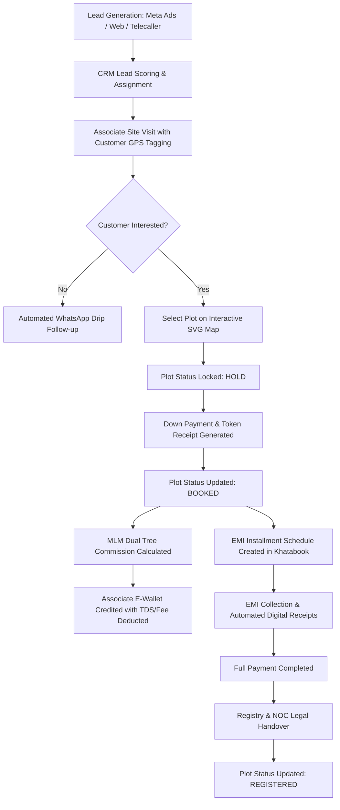
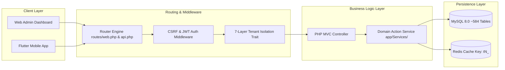

# 🗺️ Software Team Roles, Feature Inventory & System Flowcharts Blueprint
> **Document Type:** Team Responsibilities, Comprehensive Feature Matrix & System Flowcharts  
> **Platform:** APS Dream Home (Real Estate ERP, CRM, MLM & Multi-Tenant White-Label SaaS)  
> **Prepared By:** Senior Lead Software Developer & Chief Architect  

---

## 👥 1. Team Roles & Responsibilities Matrix (Kiska Kya Kaam Hai?)

Enterprise software development me har team member ka role aur responsibility clearly defined hoti hai:

```
┌─────────────────────────────────────────────────────────────────────────────────────────────┐
│                                 TEAM ROLES & RESPONSIBILITIES                               │
│                                                                                             │
│  🎨 UI/UX & CSS Designer  ──► Wireframes, Design System Tokens, Modern CSS & Layout Aesthetics│
│  💻 Frontend Developer    ──► Dynamic Web Views, Interactive SVG Plot Map, JS Functionality │
│  ⚙️ Backend Developer     ──► MVC Controllers, 454 Services, API Routes, Business Logic       │
│  🗄️ Database Specialist   ──► 584 Tables Schema, Indexing, FK Constraints, Query Tuning     │
│  📱 Mobile Developer (Dart)──► 147 Flutter App Screens, State Management, APK Build          │
│  🧪 QA & Test Engineer    ──► Playwright E2E Master Test Suite (153+ Pass), Syntax Audits   │
│  🔐 DevOps & Security     ──► Multi-Tenant 7-Layer Isolation, Server Security, SSL & Cron   │
│  👔 Senior Architect / PM ──► System Blueprint, Code Audits, Task Allocation & Client Review │
└─────────────────────────────────────────────────────────────────────────────────────────────┘
```

### Detailed Responsibility Table:

| Role | Core Responsibilities | Deliverables in Project |
| :--- | :--- | :--- |
| **👔 Senior Architect / PM** | Architecture design, technical strategy, code quality audit, team coordination, risk management. | Project Blueprint, SRS, Task Sprints, Code Review. |
| **🎨 UI/UX & CSS Designer** | Wireframes, color palettes, glassmorphism aesthetics, Bootstrap 5 custom CSS, responsive layouts. | `public/assets/css/`, `theme-tokens.css`, Figma/Mockup designs. |
| **💻 Frontend Web Developer** | HTML5/JS views, interactive plot layout SVG viewer, AJAX requests, DOM manipulation, Admin dashboards. | `app/views/`, `public/assets/js/admin/`, Interactive Plot Map JS. |
| **⚙️ Backend Developer** | Custom PHP 8.3 MVC controllers, 454 business services, REST APIs, payment gateway & WhatsApp integrations. | `app/Http/Controllers/`, `app/Services/`, `routes/web.php & api.php`. |
| **🗄️ Database Specialist (DBA)** | Database schema design, ~584 tables management, 263 FK constraints, MLM dual-tree sync, query indexing. | `database/migrations/`, SQL schema tuning, Indexing scripts. |
| **📱 Mobile Developer (Flutter)** | Multi-role Android/iOS app screens (147 Dart pages), state management, JWT auth, offline caching. | `mobile/apsdreamhome_app_v2/`, Debug/Release APK builds. |
| **🧪 QA & Test Engineer** | Automated integration tests, Playwright E2E test scripts, edge case validation, PHP syntax verification. | `testing/visual_tests/E2E_MASTER_TEST.mjs` (153+ pass tests). |
| **🔐 DevOps & Security Specialist** | 7-layer tenant isolation enforcement, SSL certificates, Cron job schedulers, server security, Redis cache. | `config/bootstrap.php`, Cron scripts, Server deployment scripts. |

---

## 📑 2. Complete Feature Inventory (Software Me Kya Kya Hoga?)

Software ke andar kya-kya features hain, inka complete inventory module-wise structured hai:

### Module 1: Admin & Tenant Control Panel
- Multi-Tenant White-Label Dashboard (`tenant.apsdreamhome.com`).
- Custom Domain Routing & Custom Branding (Logo, Favicon, Brand Theme Colors).
- Role-Based Access Control (RBAC) for Superadmin, Admin, Employee, Associate, Customer, Farmer.

### Module 2: Land Acquisition & Farmer Management
- Khasra/Khatauni land parcel tracking & acreage records.
- Farmer Payment Schedule & Milestone Cash/Bank Ledger.
- Agreement Generation & Legal NOC Approval Workflow.

### Module 3: Colony, Layout & Interactive SVG Plotting Engine
- Colony → Sector / Block → Plot Number Hierarchy.
- **Interactive SVG Plot Map:** Color-coded status map (Green = Available, Red = Booked, Yellow = Hold, Blue = Registered, Purple = Resell).
- PLC (Preferential Location Charge) & Corner Plot Premium Calculator.

### Module 4: Property Sales, Booking & EMI Khatabook Engine
- Plot Booking Wizard with Down Payment calculation.
- Flexible EMI Installment Scheduler (Monthly/Quarterly).
- Instant SMS/WhatsApp Digital Receipts & Khatabook Ledger.
- GST Invoicing & Legal Sale Agreement Documents.

### Module 5: Hybrid Matrix MLM Commission Engine
- **Hybrid Plan:** Matrix Width/Depth control + Binary Leg Spillover + Unilevel Direct Bonus.
- **Dual Tree Synchronization:** `network_tree` (visual UI tree) + `mlm_network_tree` (fast commission calculations).
- E-Wallet Payout Engine with automatic TDS & Admin Fee deduction.

### Module 6: Enterprise CRM, AI Telephony & WhatsApp Drip
- Omnichannel Lead Capture (Facebook Ads, Google Ads, Web Forms).
- Gemini AI Voice Assistant & Telecaller Auto-Dialer Queue.
- Associate Site Visit Tracking with GPS Location Tagging.

### Module 7: Future Builder & Construction ERP (Phase 3 Ready)
- Construction Milestone Tracking (Foundation → Structure → Finishing → Possession).
- Bill of Quantities (BOQ) & Vendor Purchase Orders.
- Farmhouse, Villa & Interior Design Package Catalog.

### Module 8: Multi-Role Mobile App (147 Flutter Screens)
- Role-specific Flutter app dashboards for Admin, Associate, Customer, Employee, and Farmer.
- Offline data sync, push notifications, and live plot status check.

---

## 🔄 3. Complete System Flowcharts

### 📐 Diagram 1: End-to-End Business Lifecycle Flowchart



---

### 🏛️ Diagram 2: Technical Multi-Tenant Data Flowchart


