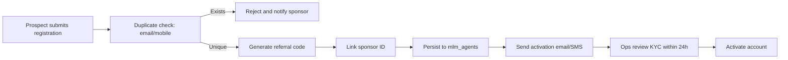

# Associate Operations Playbook

Operational guide for running the APS associate/MLM network on a daily basis.
Adapted from `docs/archive/ASSOCIATE_SYSTEM_SUMMARY.md` and focused on reproducible
procedures, controls, and responsibilities.

## Roles & Responsibilities

- **Associate Operations Lead** – Oversees onboarding, compliance, hierarchy integrity, and
  KPI reviews.
- **Field Trainers** – Support registration, KYC, and dashboard orientation for new associates.
- **Finance & Payroll** – Verify commission payouts, monitor advances, and reconcile earnings.
- **Engineering** – Maintain registration/auth flows, dashboard widgets, and `mlm_agents`
  schema.
- **Support Desk** – Handle associate tickets, escalate system issues, and monitor service
  health.

## System Overview

- **Registration** (`associate_registration.php`)
  - Generates referral codes, links sponsors, checks duplicates, and hashes passwords.
- **Authentication** (`associate_login.php`)
  - Email/mobile login, status enforcement (active/pending), session management.
- **Dashboard** (`associate_dashboard.php`)
  - Surfaces business metrics, team structure, level progress, and quick actions.
- **Database Schema** (`mlm_agents` table & related scripts)
  - Stores personal, financial, hierarchy, and performance details for each associate.
- **Security Controls**
  - Input validation, parameterized queries, secure session handling, status gating.

## Daily Operations Checklist

1. **Authentication Health Check**
   - Attempt sample logins (active & pending associates); verify session state and redirects.
2. **New Registrations Review**
   - Validate KYC fields, confirm sponsor assignments, ensure duplicate detector flagged none.
3. **Dashboard Metrics Audit**
   - Compare business totals, team size, and level progress with prior day; investigate anomalies.
4. **Compliance & Security Sweep**
   - Confirm password hashing settings, review login attempt logs for brute-force patterns.
5. **Support Queue**
   - Triage open tickets related to associates; escalate urgent access issues to engineering.

## Onboarding Workflow

### Key Actions

- Ensure sponsors exist before linking (referential integrity).
- If KYC incomplete, leave status `pending` and notify applicant with required docs.
- Maintain a log of rejected duplicates for audit.

## Login & Access Management

| Scenario | Expected Behaviour | Action |
| -------- | ----------------- | ------ |
| Active associate | Successful login → dashboard | No action. |
| Pending associate | Login denied with pending message | Ops to review KYC queue. |
| Suspended associate | Redirect to contact support | Trigger compliance review. |
| Incorrect credentials | Error + rate limiting | Monitor for brute-force attempts. |

Session lifetime conforms to platform defaults; adjust in config when security policy changes.

## Dashboard Metrics & KPIs

| KPI | Target/Threshold | Monitoring Method |
| --- | ---------------- | ----------------- |
| New registrations processed | Within 24 hours | Queue report from admin panel. |
| Duplicate detection success | ≥ 98% | Weekly review of duplicate merge logs. |
| Active vs total associates | ≥ 85% active | Dashboard summary. |
| Average team size growth | Track vs monthly targets | Dashboard trend chart. |
| Ticket closure time | < 8 business hours | Support ticket system. |

## Security & Compliance

- **Password hashing**: Confirm `password_hash()` usage; rotate cost factor annually.
- **Session security**: Validate session hijacking protections; enforce secure cookies in
  production.
- **Input validation**: Maintain sanitization on registration; update regex rules as
  policy changes.
- **Audit trail**: Log sponsor changes, status updates, and commission adjustments for
  traceability.

## Testing & Verification

1. Run automated verification scripts (if available) after code deployments.
2. Manual test plan:
   - Register new associate via browser using provided test data.
   - Login with sample credentials (`9123456789` / `password123`), navigate dashboard.
   - Create sponsor hierarchy and ensure stats update in real-time.
3. Database checks: `SELECT COUNT(*) FROM mlm_agents WHERE status='pending';` to track onboarding backlog.

## Incident Response

- **Registration failures**
  - Immediate: Check logs, validate database connectivity, notify engineering.
  - Follow-up: Document the root cause and update this runbook with remediation steps.
- **Sponsor mismatch**
  - Immediate: Freeze affected accounts, audit the hierarchy, correct mappings.
  - Follow-up: Improve validation logic and review recent sponsor changes.
- **Dashboard data stale**
  - Immediate: Flush caches, verify cron and background jobs, sync analytics sources.
  - Follow-up: Schedule remediation with engineering and add monitoring alerts.
- **Auth brute-force detected**
  - Immediate: Temporarily block the IP/user, enforce CAPTCHA, inform the security lead.
  - Follow-up: Enhance rate limiting, review the IP allowlist, and update security checks.

## Future Enhancements

- Implement salary/compensation plan reporting linked to MLM performance.
- Integrate associate portal with colonizer operations for project visibility.
- Add multilingual support to onboarding flows.

## References

- Source archive: `docs/archive/ASSOCIATE_SYSTEM_SUMMARY.md`
- Related guides: `docs/operations/crm.md`, `docs/archive/COLONIZER_SYSTEM_COMPLETE.md`
- Infrastructure alignment: `docs/deployment/README.md`
