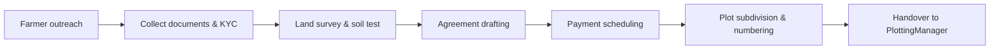
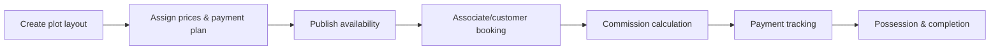

# Colonizer & Land Operations Playbook

Operational handbook for running the APS colonizer/plotting business workflow. Derived from `docs/archive/COLONIZER_SYSTEM_COMPLETE.md` and related modules to provide actionable procedures, ownership, and controls.

## Roles & Responsibilities

| Role | Responsibilities |
| ---- | ---------------- |
| Land Acquisition Lead | Manages farmer outreach, agreements, and legal/Khasra documentation. |
| Plot Development Manager | Oversees subdivision, numbering, pricing, and availability status. |
| Commission & Associate Lead | Maintains 7-level commission rules, payout schedules, and team performance dashboards. |
| Payroll & HR | Processes salaries, advances, bonuses, and attendance for field and office staff. |
| Operations Analyst | Monitors analytics dashboards, reconciles workflow automation, and coordinates with CRM/associate teams. |
| Engineering | Maintains `FarmerManager.php`, `PlottingManager.php`, `MLMCommissionManager.php`, `SalaryManager.php`, and `colonizer_system.php` integrations. |

## System Overview

- **Farmer Management** (`includes/FarmerManager.php`)
  - Kisan profiles with KYC (Aadhar, PAN), bank details, land holdings, support tickets, credit scoring.
- **Land Acquisition & Plotting** (`includes/PlottingManager.php`)
  - Acquisition records, plot subdivision with numbering (A-001), status tracking (available/booked/sold), payment schedules.
- **Commission Engine** (`includes/MLMCommissionManager.php`)
  - 7-level payout structure, bonuses, overrides, TDS deductions, associate hierarchy.
- **Employee Payroll** (`includes/SalaryManager.php`)
  - Salary structure, attendance, advances/loans, incentives, statutory deductions (PF/ESI/TDS).
- **Unified Interface** (`colonizer_system.php`)
  - Role-based dashboards, analytics, workflow automation, integrations with CRM/associate modules.
- **Database Assets** (`database/colonizer_complete_setup.sql`)
  - 25+ normalized tables for farmers, plots, commissions, payroll, transactions, and support.

## Daily Operations Checklist

1. **Dashboard Review** (`colonizer_system.php` dashboard)
   - Validate land bank metrics, plot inventory status, commission summaries, pending support items.
2. **Land Acquisition Queue**
   - Confirm new farmer records include KYC docs, verify land survey data, schedule legal review.
3. **Plot Inventory Audit**
   - Update plot status based on latest bookings, ensure pricing and payment plans reflect approvals.
4. **Commission & Associate Sync**
   - Recalculate payouts for closed deals, resolve discrepancies with associate operations.
5. **Payroll & Attendance Check**
   - Approve attendance adjustments, monitor salary run blockers, track advances granted.
6. **Support Escalations**
   - Triage farmer/support requests; escalate urgent issues (e.g., legal disputes, payment delays) to leadership.

## Core Workflows

### Land Acquisition Lifecycle

Key Actions:

- Maintain scanned agreements and Khasra details in the farmer record for audit.
- Payment schedules must sync with finance; overdue alerts escalate to Land Acquisition Lead.

### Plot Development & Sales

Key Actions:

- Ensure plots cannot transition to "booked" without upfront booking amount recorded.
- Commission runs trigger automatically post-booking; manual overrides require documented approval.

### Commission Distribution

- Level payouts follow the rule: Direct 10%, Level 1 5%, Level 2 3%, Level 3 2%, Level 4 1%, Level 5 0.5%.
- `MLMCommissionManager::processCommission()` must run nightly; reconcile output with finance ledger weekly.
- Bonus triggers (performance/team building) require operations sign-off before payroll integration.

### Payroll Run

1. Confirm `employee_attendance` entries for the month are locked.
2. Execute `SalaryManager::processMonthlySalary($employeeId, $month, $year)` for each eligible employee.
3. Validate statutory deductions; export salary slips for HR distribution.
4. Sync payroll totals with finance, update advances/loan balances.

## KPIs & Monitoring

| KPI | Target/Threshold | Monitoring Method |
| --- | ---------------- | ----------------- |
| Land acquisition cycle time | ≤ 30 days from outreach to agreement | Acquisition pipeline report. |
| Plot availability accuracy | 100% status parity with bookings | Daily inventory audit. |
| Commission payout timeliness | Within 7 days of booking confirmation | Commission ledger vs bookings. |
| Payroll completion | Monthly run completed by Day 3 | Payroll schedule checklist. |
| Farmer support resolution | < 48 hours average | Support ticket reports. |
| Legal compliance issues | Zero outstanding | Legal review dashboard. |

## Security & Compliance Controls

- **Role-Based Access**: Enforce permissions per role (admin, manager, associate, farmer, employee).
- **Audit Trails**: Log land agreement edits, plot status changes, commission overrides, payroll adjustments.
- **Data Retention**: Retain farmer and financial records per regulatory requirements; coordinate with compliance.
- **Legal Docs**: Store scanned agreements securely; integrate with document management if available.
- **Payment Compliance**: All payouts processed through approved finance channels; TDS/PF/ESI filings tracked.

## Incident Response

| Incident | Immediate Actions | Follow-up |
| -------- | ---------------- | --------- |
| Land ownership dispute | Freeze related plots, notify legal team, inform acquisition lead. | Conduct legal audit, update records. |
| Plot status mismatch | Lock sales for affected plots, reconcile bookings/payments. | Improve synchronization scripts, add monitoring. |
| Commission miscalculation | Halt payouts, run diagnostic, coordinate with associate ops. | Patch commission logic, document remediation. |
| Payroll processing failure | Stop salary run, check attendance/loan data, notify HR & finance. | Update payroll scripts, perform post-mortem. |
| Support backlog spike | Redirect staff, prioritize farmers/customers impacted. | Review staffing plan, adjust escalation policy. |

## Maintenance Tasks

- Review commission rate tables quarterly with business leadership.
- Audit farmer land records for expired documents bi-annually.
- Validate cron jobs for commission and payroll processing after deployments.
- Coordinate with CRM and associate teams to ensure customer-to-plot linkages remain intact.
- Backup large media/KYC assets; ensure database snapshots follow disaster recovery policy.

## Roadmap & Enhancements

- Integrate GIS/visual plot layout tooling for field teams.
- Add automated reminders for payment installments and possession milestones.
- Extend analytics to combine CRM lead sources with colonizer sales conversion data.
- Localize farmer portal communications in additional regional languages.

## References

- Source archive: `docs/archive/COLONIZER_SYSTEM_COMPLETE.md`
- Related guides: `docs/operations/associate.md`, `docs/operations/crm.md`
- Deployment & ops alignment: `docs/deployment/README.md`
- Database assets: `database/colonizer_complete_setup.sql`
