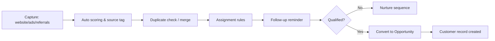

# CRM Operations Playbook

Authoritative runbook for operating the APS CRM stack day to day. Derived from the historical transformations captured in `docs/archive/APS_CRM_COMPLETE.md` with focus on reproducible procedures, KPIs, and ownership.

## Scope & Roles

| Role | Responsibilities |
| ---- | ---------------- |
| CRM Operations Lead | Oversees lead pipeline health, coordinates with sales and support teams, owns KPI reviews. |
| Sales Managers | Shepherd opportunities through the 6-stage pipeline, monitor win/loss reasons, maintain forecasts. |
| Customer Success | Maintain customer 360° records, manage VIP tiers, ensure support SLAs are met. |
| Marketing Automation | Configure nurture sequences, email templates, and campaign tracking. |
| Engineering | Maintain `includes/CRMManager.php`, `includes/CRMAnalyticsManager.php`, and integrations. |

## System Overview

- **Lead Management** (`includes/CRMManager.php`)
  - Automatic IDs (`LEADyyyyMMNNN`), scoring (0–100), duplicates merge, assignment rules.
- **Opportunity Tracking** (`includes/CRMManager.php`)
  - Six pipeline stages, probability % and expected value, competitor notes.
- **Customer Management** (`includes/CRMManager.php`)
  - Customer IDs, segmentation, lifetime value, VIP flag, purchase history.
- **Communication & Nurture** (`includes/CRMManager.php`)
  - Email templates, call scripts, follow-up schedule, SMS/WhatsApp-ready hooks.
- **Support & Ticketing** (`includes/CRMManager.php`)
  - SLA levels, multi-channel tickets, satisfaction surveys, assignments.
- **Analytics & Reporting** (`includes/CRMAnalyticsManager.php`)
  - Funnel metrics, team performance, campaign ROI, export to CSV/PDF.
- **Integrations** (`aps_crm_system.php`)
  - Syncs with property/plot modules, MLM commissions, employee systems via workflow triggers.

## Daily Operations Checklist

1. **Dashboard Review** (`/admin/enhanced_dashboard.php` CRM widgets)
   - Check lead counts, new leads today, conversion rate, sales pipeline distribution.
2. **Lead Queue Triage**
   - Run duplicate detection (`CRMManager::mergeDuplicateLeads()`), assign unowned leads, verify follow-up timestamps.
3. **Opportunity Hygiene**
   - Advance stalled opportunities or mark lost with reason. Ensure probability/forecast values updated.
4. **Support Ticket SLA Audit**
   - Review open tickets by priority; escalate any approaching SLA breach. Confirm follow-up communications logged.
5. **Campaign Performance Snapshot**
   - Compare active campaign ROI vs target; adjust nurture sequences if conversion dips.
6. **Data Quality Sweep**
   - Spot-check new customers for required segmentation fields and communication opt-ins.

## Lead Lifecycle Procedure

- **Capture**: all inbound forms and imports must populate `lead_sources` for analytics.
- **Scoring**: marketing automation reviews thresholds monthly (default >=70 auto qualifies).
- **Assignment**: route rules reside in `CRMManager::assignLeadToOwner()`; update when team structure changes.
- **Follow-up cadence**: Day 0 (auto email), Day 1 (call), Day 3 (email), Day 7 (call) until stage change.

## Opportunity Management

| Stage | Definition | Required Actions |
| ----- | ---------- | ---------------- |
| Lead | Imported or captured; not yet qualified | Ensure lead scoring complete, schedule intro call. |
| Qualification | Need/budget/timeline vetted | Record discovery notes, attach documents. |
| Proposal | Proposal/quote sent | Upload proposal ID, set expected value & close date. |
| Negotiation | Objections handling | Log negotiation summary each interaction. |
| Closed Won | Deal finalized | Trigger customer onboarding workflow, notify finance for invoicing. |
| Closed Lost | Deal ended without win | Capture loss reason, competitor if applicable, schedule recycle task if warranted. |

- Probability defaults: 10%, 25%, 50%, 75%, 100% (won). Adjust within analytics manager if the sales motion changes.
- Forecasting: run `CRMAnalyticsManager::generateForecastReport()` weekly; distribute to leadership.

## Customer 360° Management

- **Profile upkeep**: verify contact info, segmentation (individual/business/investor), and preferences.
- **Lifetime value (LTV)**: ensure transactions sync from `customer_ledger`; anomalies escalate to finance.
- **VIP tiering**: when VIP status toggled, add to targeted campaigns and concierge queue.
- **Communication timeline**: every touchpoint (emails, calls, meetings) should be logged to maintain compliance.

## Support & Ticket Handling

1. **Intake**: tickets created via call/email/portal auto-generate IDs (`TICKETyyyyNNN`).
2. **Categorize**: property, plot, booking, technical, CRM-specific—affects routing.
3. **Prioritize**: use SLA matrix—urgent (4h), high (8h), medium (24h), low (48h).
4. **Assign**: CRM assigns based on skill tags; manual override allowed with justification.
5. **Resolve & Follow-up**: capture resolution summary, schedule satisfaction call/email, record rating.
6. **Escalation**: unresolved tickets after SLA escalate to CRM Ops Lead and relevant manager.

## Reporting & KPIs

| KPI | Target | Source |
| --- | ------ | ------ |
| Lead-to-customer conversion | ≥ 18% monthly | Funnel report (CRMAnalyticsManager) |
| Average response time | < 2 hours | Support ticket timestamps |
| Pipeline coverage | ≥ 3× quota | Opportunity forecast report |
| Customer satisfaction | ≥ 4.3/5 | Ticket closure survey |
| Duplicate lead rate | < 3% | Duplicate merge logs |
| Forecast accuracy | ±10% of actual | Monthly forecast vs revenue |

Schedule: weekly team review (sales + marketing + success), monthly exec review.

## Integrations & Data Sync

- **Property/Plot modules**: ensures opportunity-to-property linkage; maintain property IDs in opportunity records.
- **MLM/Associates**: for deals triggering commission, confirm `CRMManager::syncWithMLM()` executes post-close.
- **Employee system**: sales rep performance data flows to HR analytics; keep employee IDs consistent.
- **Automation hooks**: `aps_crm_system.php` triggers cross-system updates—validate after releases.

## Maintenance Tasks

- Review email/call templates quarterly for accuracy.
- Update assignment rule matrix when team changes.
- Validate analytics exports (CSV/PDF) after reporting library upgrades.
- Run database health report (see `docs/database/README.md`) before major campaigns.
- Coordinate with DevOps for backups and rollback drills; CRM tables are high-priority.

## Incident Response

| Incident | Immediate Actions | Follow-up |
| -------- | ---------------- | --------- |
| Lead import failure | Pause imports, inspect logs, re-run with sample, notify marketing. | Document root cause, update runbook. |
| Duplicate surge > threshold | Execute manual merge batch, audit capture sources. | Adjust forms/API validation. |
| Pipeline data mismatch | Cross-check with finance ledger, verify opportunities status. | Reconcile records, update automation scripts. |
| Ticket SLA breach | Escalate to manager, contact customer proactively. | Review staffing/triage rules. |

## References

- Archived source report: `docs/archive/APS_CRM_COMPLETE.md`
- Related systems: `docs/archive/ASSOCIATE_SYSTEM_SUMMARY.md`, `docs/archive/COLONIZER_SYSTEM_COMPLETE.md`
- Deployment/ops alignment: `docs/deployment/README.md`
